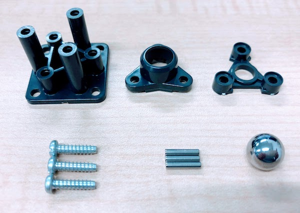
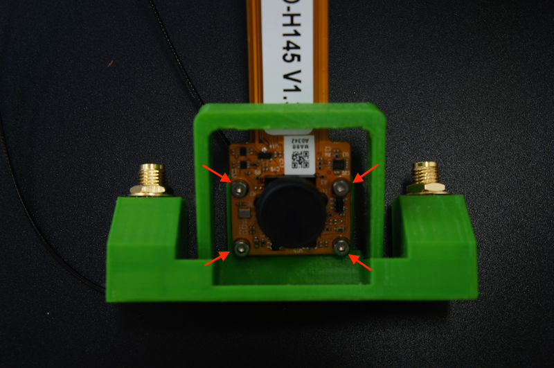
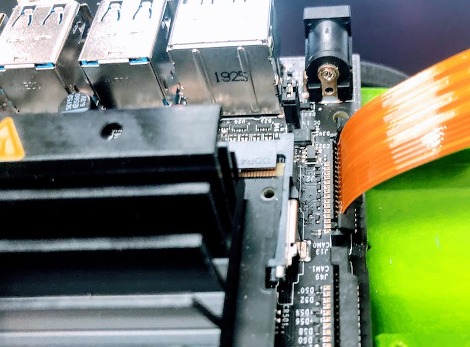
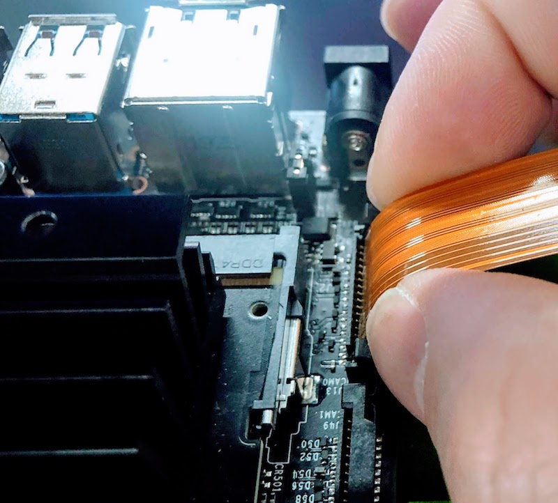
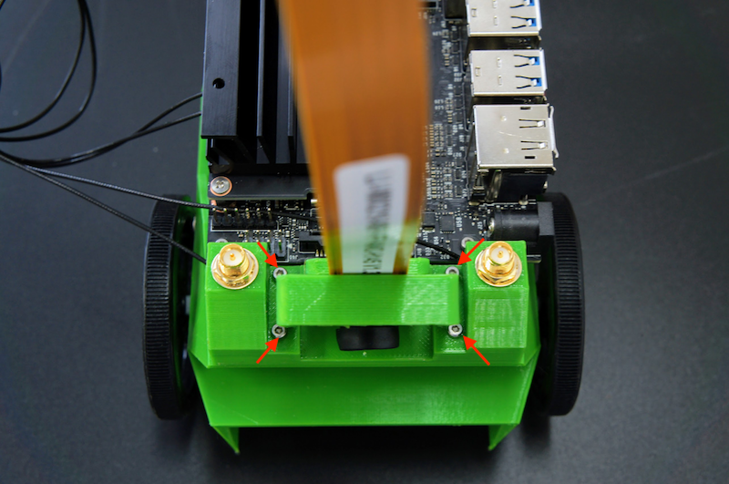
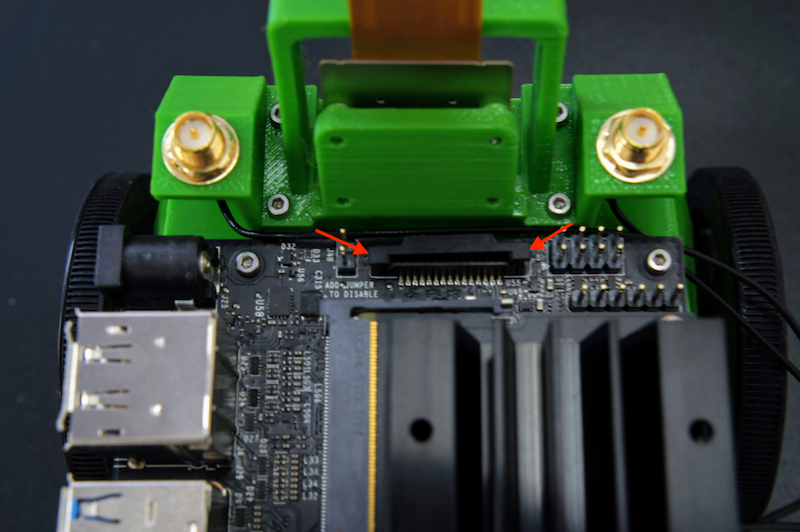

# 組み立てマニュアル(前半)

## 0. BOM

|部品|個数|
|:--|:--|
|Jetson Nano|1枚|
|LI-IMX219-MIPI-FF-NANO|1個|
|CPU Fan|1個|
|JetBot Body|1個|		
|JetBot CameraMount　|1個|	
|JetBot GearMotor　|2個|		
|JetBot タイヤ　|2個|		
|ボールキャスター　（70144）| 1箱|		
|バッテリー　（BI-B3）| 1個|		
|M2x6 タッピングネジ|12本|
|M3x10 六角ネジ|4本|
|M3x24 六角ネジ|4本|
|M3ナット|8個|
|M2.5x14 六角ネジ|4本|
|M2.5ナット|4個|		
|JetBot　ControllerBoard　（FaBo #611）	|1枚|	
|SD Card（64GB）　（64　EVO Plus）|1枚|		
|WiFi PCI-Express（Intel 8265）|1個|
|Jumperピン|1個|
|モーター用USB Cable|1本|
|DC-USBケーブル|1個|
|転送用USBケーブル(3m)|1本|
|両面テープ|2枚|
|スパナ(ミニ)|1本|
|六角レンチ|2本|
|プラスドライバー|2本|
|箱（ワンタッチ式60サイズ）|1個|

## 1. ボールキャスター組み立て

説明書を参考に高さ35mmで組み立てます。

!!!Info "ネジの選定のポイント"
	説明書にはM3-15mmタッピングネジでボールを固定すると書いてありますが、12mmの方が付け易いです。

## 2. ボールキャスター取り付け

|写真|種類|個数|
|:--|:--|:--|
||六角ネジ　M３−10mm|4| 
||M3ナット|4|

Bodyにボールキャスターを取り付けます。

## 3. ギヤモーター取り付け

|写真|種類|個数|
|:--|:--|:--|
||六角ネジ　M3−24mm|4| 
||M3ナット|4|

Bodyにギヤモーターを取り付けます。

まず、ギヤモーターの配線を留めている結束バンドの出っ張りを反対側に移動します。

ギヤモーターの取り付けをおこないます。

!!!warning "ネジの回し過ぎに注意"
	ネジを強く締めすぎると、ギアモーターのプラスチックが歪み、ギアが空転する可能性があります。ネジの回しすぎに注意してください。

ギヤモーターの線を穴を経由して外側に出しておきます。

## 4. タイヤ取り付け

|写真|種類|個数|
|:--|:--|:--|
||タイヤ|2セット| 
||タッピングネジ|2|

## 5. Wifi Moduleの取り付け

Wifi Moduleを取り付けるために、Jetson Nano Moduleを取り外します。

両サイドの留め具を外に開き、Jetson Nano Moduleを取り外します。

Wifi Moduleを取り付けるために、真ん中のネジを外しておきます。

Wifi Moduleは、Intel DESKTOP WIRELESS M.2KIT(8265)を取り付けます。

箱から取り出し、スパナで金色のアンテナ固定ネジをゆるめ、銀色のプレートから取外しておきます。

外したアンテナ固定ネジは、カメラマウントのパーツに取り付けておきます。

Wifi Moduleの取り付けが完了したら、Jetson Nano Moduleを再び取り付けます。

## 6. Jetson Nano取り付け

|写真|種類|個数|
|:--|:--|:--|
||M2-6mmタッピング|4| 

## 7. カメラの装着

|写真|種類|個数|
|:--|:--|:--|
||M2-6mmタッピング|8| 

カメラマウントにカメラを取り付けます。

両サイドを指で掴んで持ち上げます。

!!!warning  "注意点"
	強く持ち上げすぎるとプラスチックが破損するので注意してください。

カメラのコネクターを差し込み、コネクターを押し込み固定します。
          

カメラマウントをBodyに取り付けます。

## 8. CPUファンの取り付け

|写真|種類|個数|
|:--|:--|:--|
||M2.5-14mmネジ|4|
||M2.5ナット|4| 

ネジを透明のアクリルで作成された`ネジとりつけジグ`の上にはめます。

`ネジとりつけジグ`をJetson Nanoの放熱板の上板の下に入れます。

上から六角ネジで締めます。下の`ネジとりつけジグ`に取り付けたナットにネジが刺さるように調整し、ネジを締めます。

ケーブルをJetson Nanoに接続します。

