# 組み立てマニュアル(前半)

## 1. ボールキャスター組み立て

説明書を参考に高さ35mmで組み立てます。

!!!Info "ネジの選定のポイント"
	説明書にはM3-15mmタッピングネジでボールを固定すると書いてありますが、12mmの方が付け易いです。

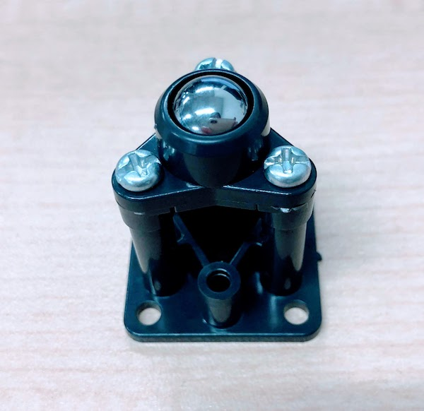

## 2. ボールキャスター取り付け

|写真|種類|個数|
|:--|:--|:--|
||六角ネジ　M３−10mm|4| 
||M3ナット|4|

Bodyにボールキャスターを取り付けます。

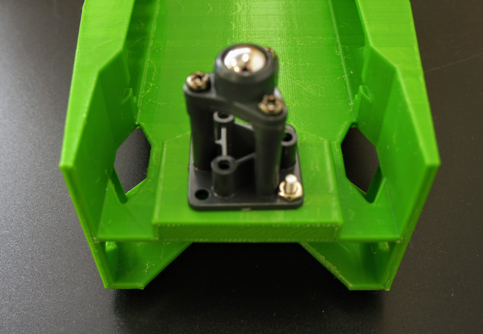

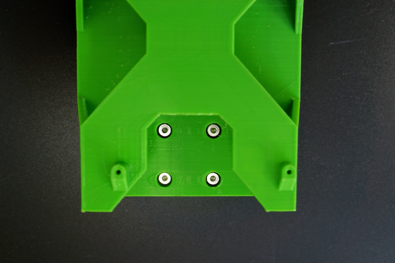

## 3. ギヤモーター取り付け

|写真|種類|個数|
|:--|:--|:--|
||六角ネジ　M3−24mm|4| 
||M3ナット|4|

Bodyにギヤモーターを取り付けます。

まず、ギヤモーターの配線を留めている結束バンドの出っ張りを反対側に移動します。

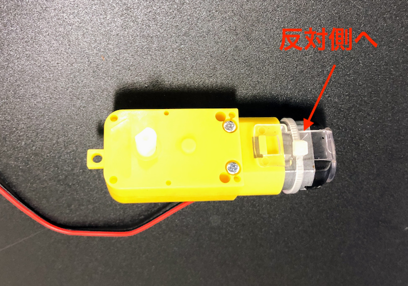

ギヤモーターの取り付けをおこないます。

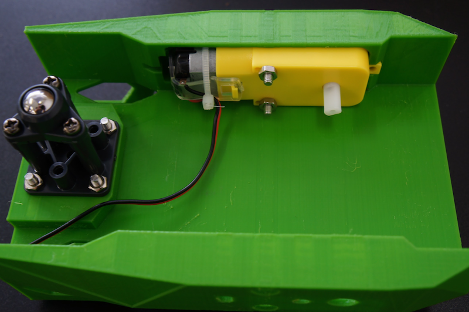

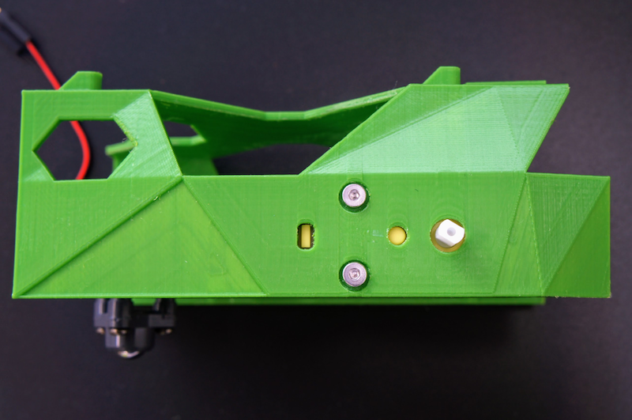

!!!warning "ネジの回し過ぎに注意"
	ネジを強く締めすぎると、ギアモーターのプラスチックが歪み、ギアが空転する可能性があります。ネジの回しすぎに注意してください。

ギヤモーターの線を穴を経由して外側に出しておきます。

## 4. タイヤ取り付け

|写真|種類|個数|
|:--|:--|:--|
||タイヤ|2セット| 
||タッピングネジ|2|

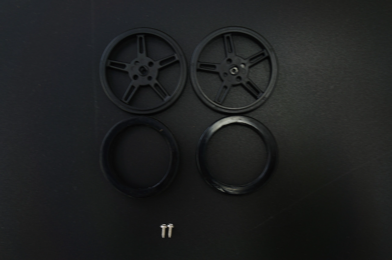

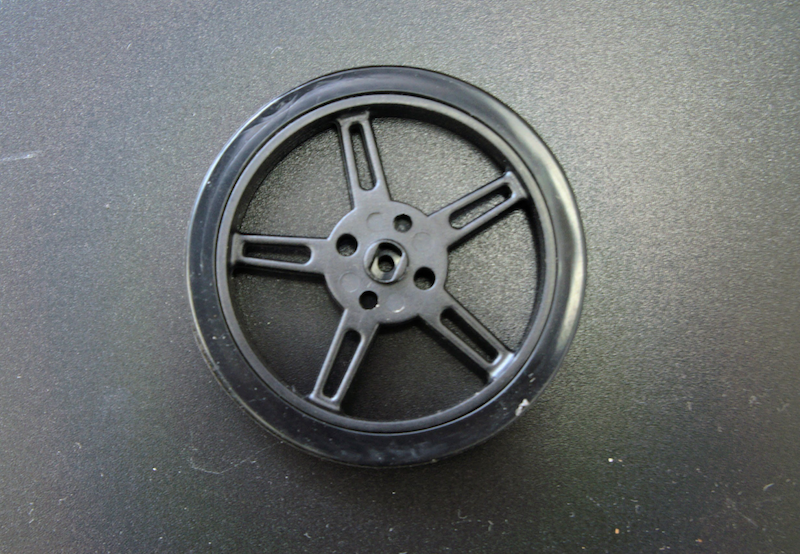

## 5. Wifi Moduleの取り付け

Wifi Moduleを取り付けるために、Jetson Nano Moduleを取り外します。

両サイドの留め具を外に開き、Jetson Nano Moduleを取り外します。

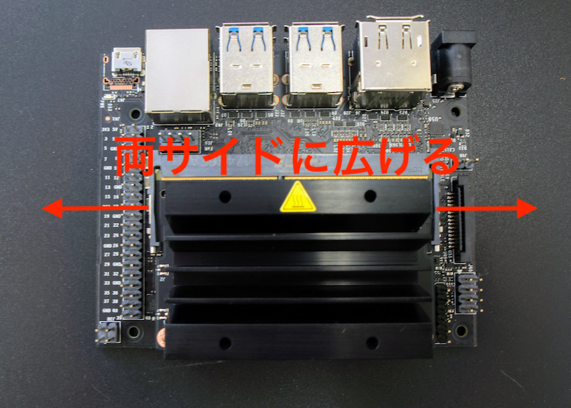

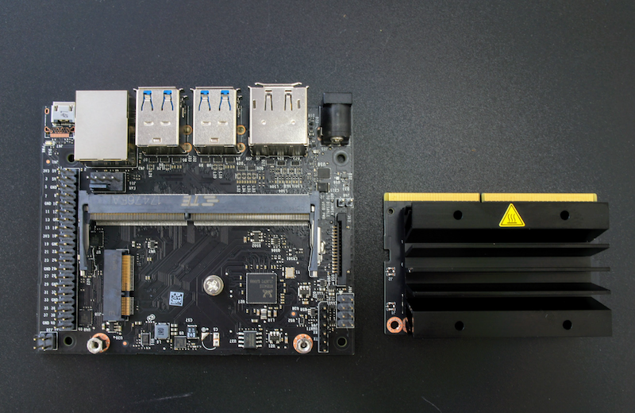

Wifi Moduleを取り付けるために、真ん中のネジを外しておきます。

Wifi Moduleは、Intel DESKTOP WIRELESS M.2KIT(8265)を取り付けます。

箱から取り出し、スパナで金色のアンテナ固定ネジをゆるめ、銀色のプレートから取外しておきます。

外したアンテナ固定ネジは、カメラマウントのパーツに取り付けておきます。

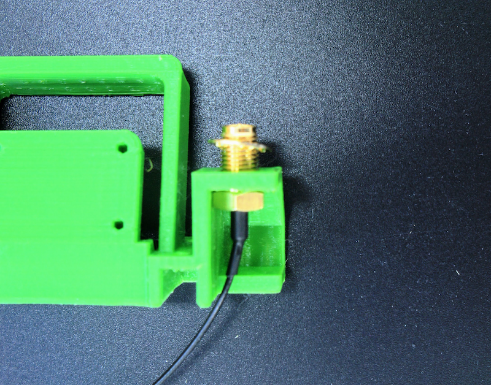

Wifi Moduleの取り付けが完了したら、Jetson Nano Moduleを再び取り付けます。

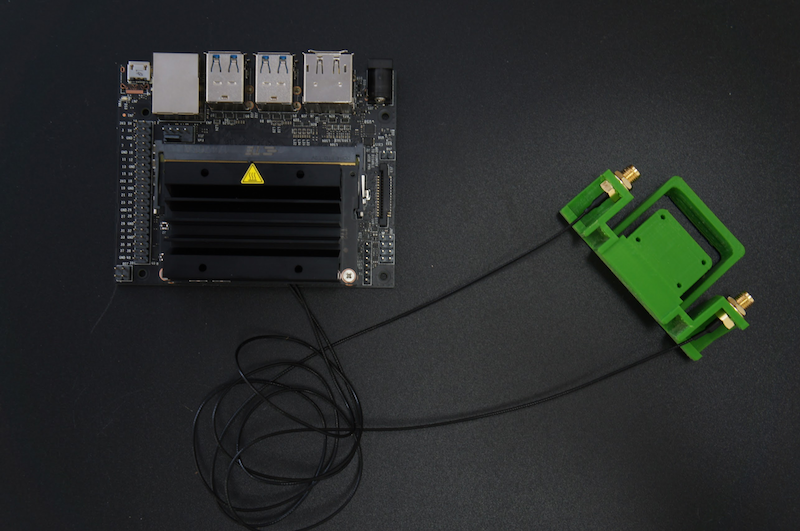

## 6. Jetson Nano取り付け

|写真|種類|個数|
|:--|:--|:--|
||M2-6mmタッピング|4| 

