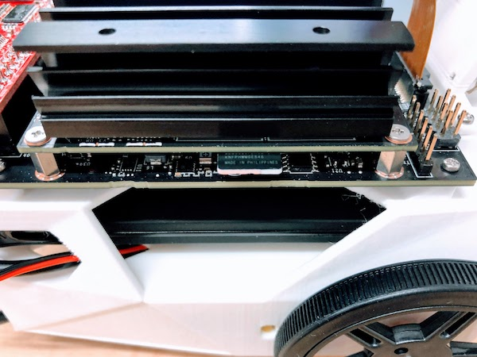

# 組み立てマニュアル(後半)

## 7. カメラの装着

|写真|種類|個数|
|:--|:--|:--|
||M2-6mmタッピング|8| 

カメラマウントにカメラを取り付けます。

両サイドを指で掴んで持ち上げます。

!!!warning  "注意点"
	強く持ち上げすぎるとプラスチックが破損するので注意してください。

カメラのコネクターを差し込み、コネクターを押し込み固定します。
          

カメラマウントをBodyに取り付けます。

## 8. CPUファンの取り付け

|写真|種類|個数|
|:--|:--|:--|
||M2.5-14mmネジ|4|
||M2.5ナット|4| 

ネジを透明のアクリルで作成された`ネジとりつけジグ`の上にはめます。

`ネジとりつけジグ`をJetson Nanoの放熱板の上板の下に入れます。

上から六角ネジで締めます。下の`ネジとりつけジグ`に取り付けたナットにネジが刺さるように調整し、ネジを締めます。

ケーブルをJetson Nanoに接続します。

## 9. Mobile Batteryの取り付け

|写真|種類|個数|
|:--|:--|:--|
||両面テープ|2|

## 10. Controller Board

!!!Warining "再確認"
	PINの位置づれがないか、確認してください。
	位置づれがある場合、基板がショートする場合がありますので、入念なチェックをお願いします。

## 11. モーターの配線

## 12. モーターのUSB 配線

!!!warning  "注意点"
	メイン電源がOffになっている事を確認します。

## 13. メイン電源の配線

!!!warning "注意点"
	メイン電源がOffになっている事を確認します。

## 14. Wifiの整理

ビニールタイでWifiケーブルをまとめておきます。

Wifiアンテナを接続します。

## 15. SDカード

## 16. 完成

