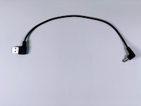
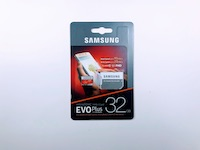

# 組み立てマニュアル(その3)

## 9. Mobile Batteryの取り付け

|写真|種類|個数|
|:--|:--|:--|
||両面テープ|2|
||モバイルバッテリ|1|

両目テープをバッテリーの裏面に貼り付けます。

JetBotにバッテリーを取り付けます。取り付ける際に、向きに気をつけてください。

## 10. Controller Board

|写真|種類|個数|
|:--|:--|:--|
||Controller Board|1|

!!!Warining "再確認"
	PINの位置づれがないか、確認してください。
	位置づれがある場合、基板がショートする場合がありますので、入念なチェックをお願いします。

次にモーターの配線をします。右から[赤][黒][赤][黒]の順に差し込み固定します。差し込む際は、白い部分を親指で強くおし、隙間ができたところに、線を差し込みます。

## 12. モーターのUSB 配線

|写真|種類|個数|
|:--|:--|:--|
||USBケーブル|1|

!!!warning  "注意点"
	メイン電源がOffになっている事を確認します。

まず、モバイルバッテリーをOffにしておきます。下図の部分が電源のOn/Offをするボタンです。1回タップでOn, 2回タップでOffになります。

電源のOn/Offはバッテリー残量の数値のところを確認します。

## 13. メイン電源の配線

|写真|種類|個数|
|:--|:--|:--|
||USB-DCケーブル|1|

!!!warning "注意点"
	モバイルバッテリの電源がOffになっている事を確認します。

## 14. Jumperピンの設定

使用するJetson Nanoが``Rev.A02``か、``Rev.B01``かを確認します。

DC電源からの給電を有効にするために、``Rev.A02``、``Rev.B01``の場合で、下記の箇所のJumperPinの設定をおこないます。

## 15. Wifiアンテナ

## 16. SDカード

|写真|種類|個数|
|:--|:--|:--|
||SDカード(32GB)|1|

## 完成

