# 組み立てマニュアル(その3)

## 9. Mobile Batteryの取り付け

|写真|種類|個数|
|:--|:--|:--|
||両面テープ|2|

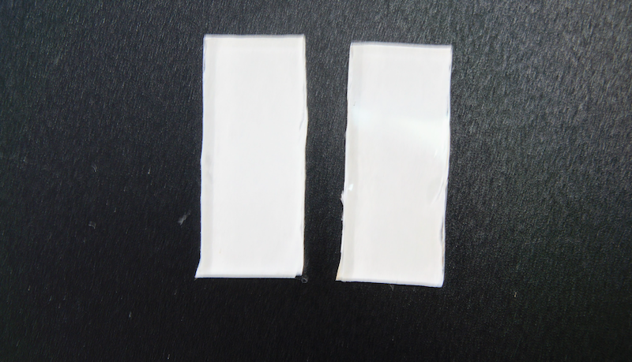

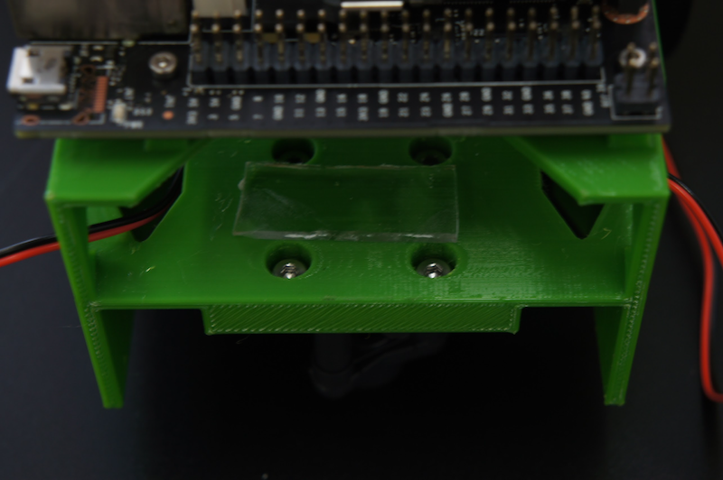

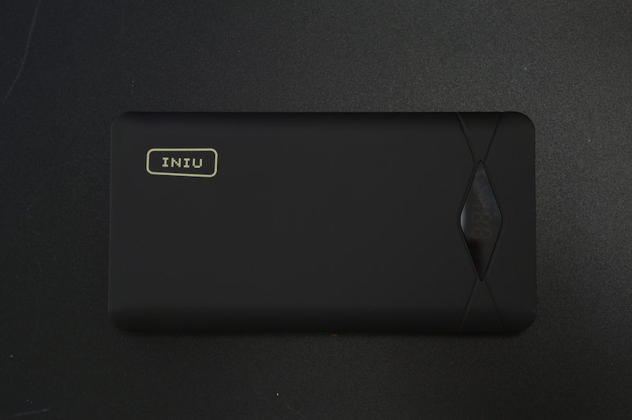

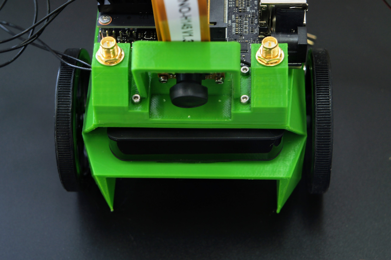

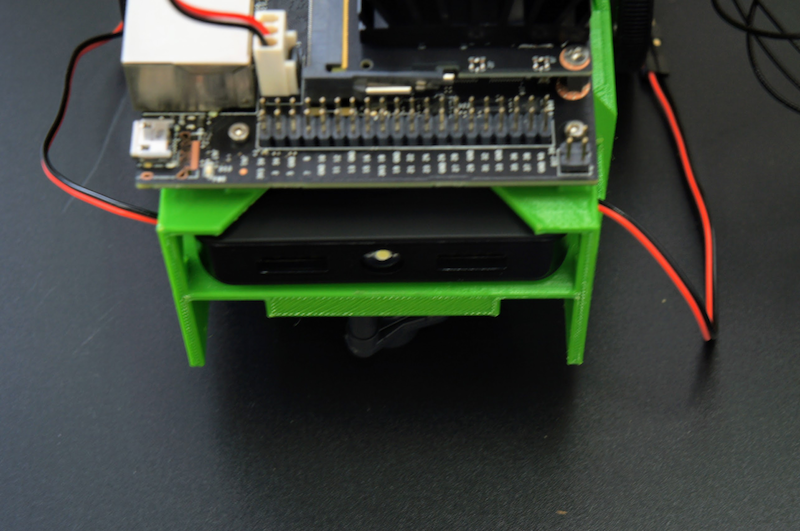

## 10. Controller Board

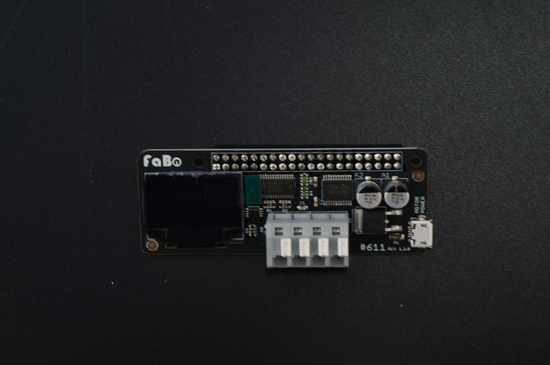

!!!Warining "再確認"
	PINの位置づれがないか、確認してください。
	位置づれがある場合、基板がショートする場合がありますので、入念なチェックをお願いします。

## 11. モーターの配線

## 12. モーターのUSB 配線

!!!warning  "注意点"
	メイン電源がOffになっている事を確認します。

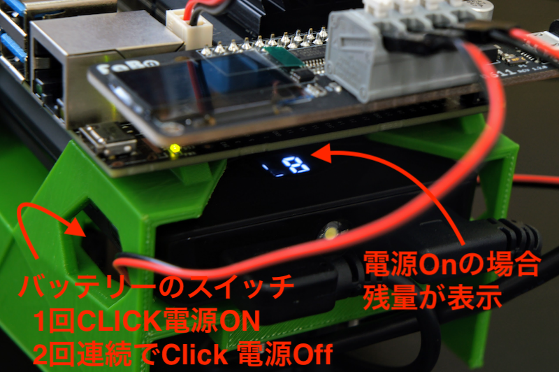

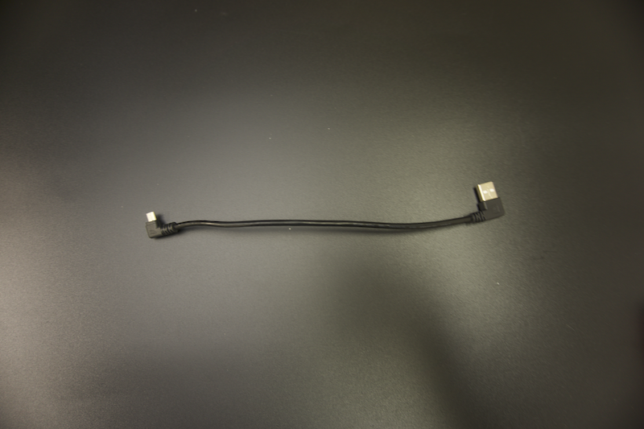

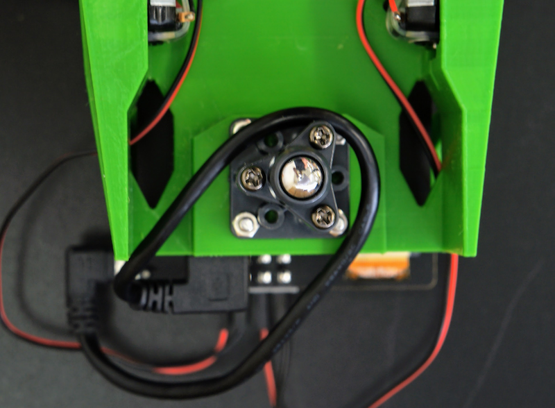

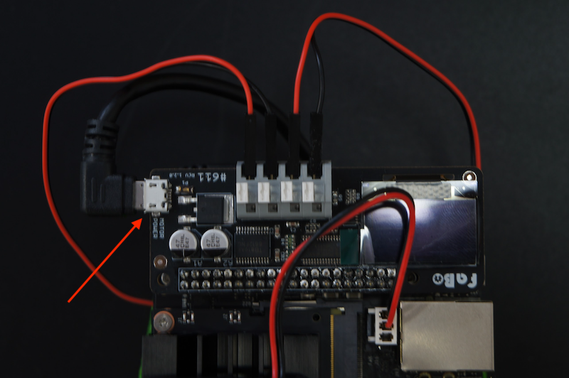

## 13. メイン電源の配線

!!!warning "注意点"
	メイン電源がOffになっている事を確認します。

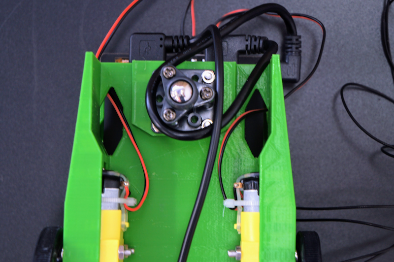

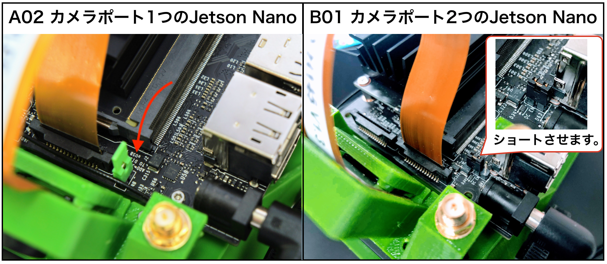

## 14. Wifiの整理

ビニールタイでWifiケーブルをまとめておきます。

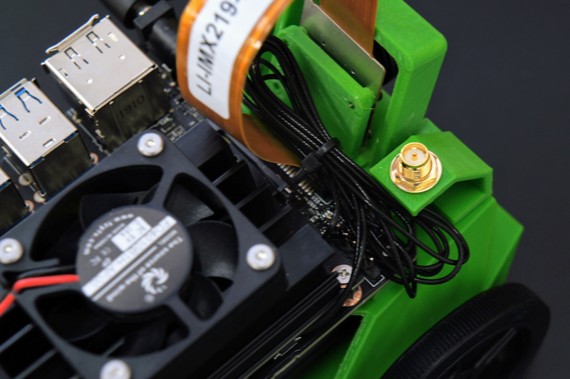

Wifiアンテナを接続します。

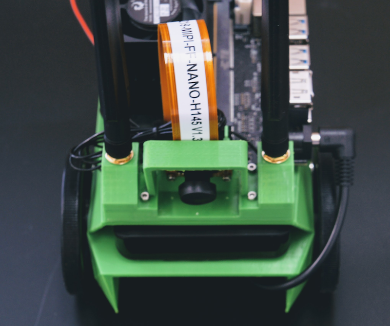

## 15. SDカード

## 16. 完成

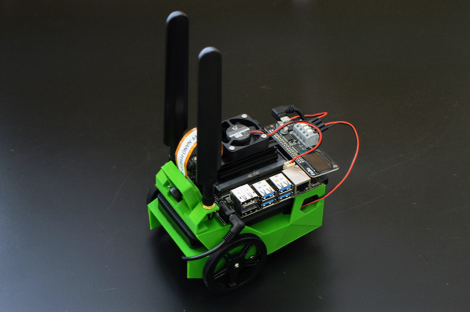

