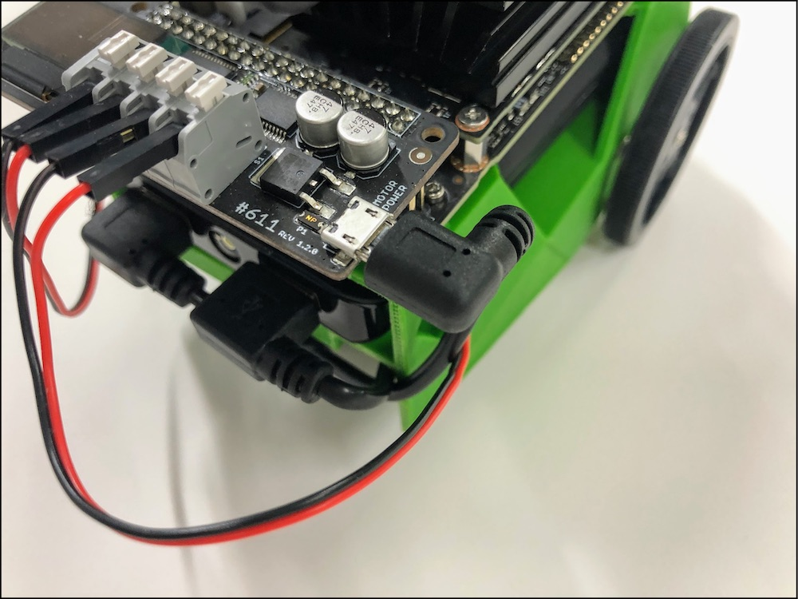
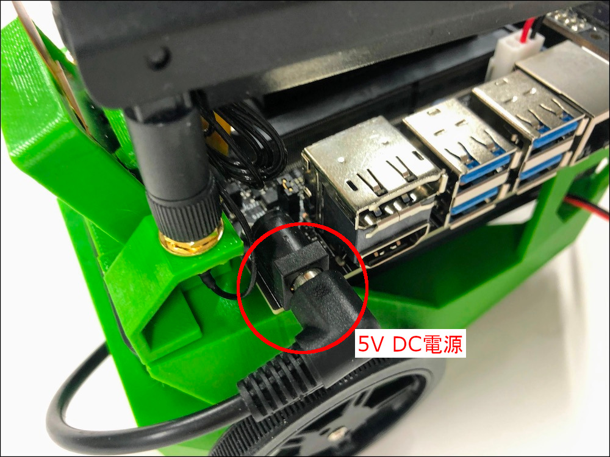
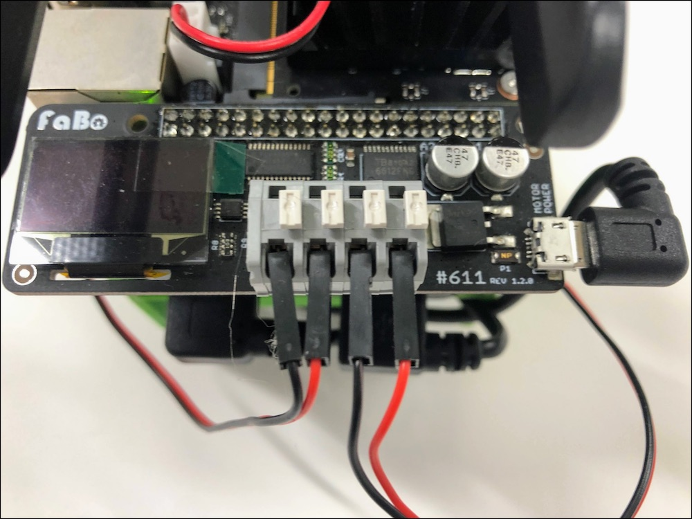
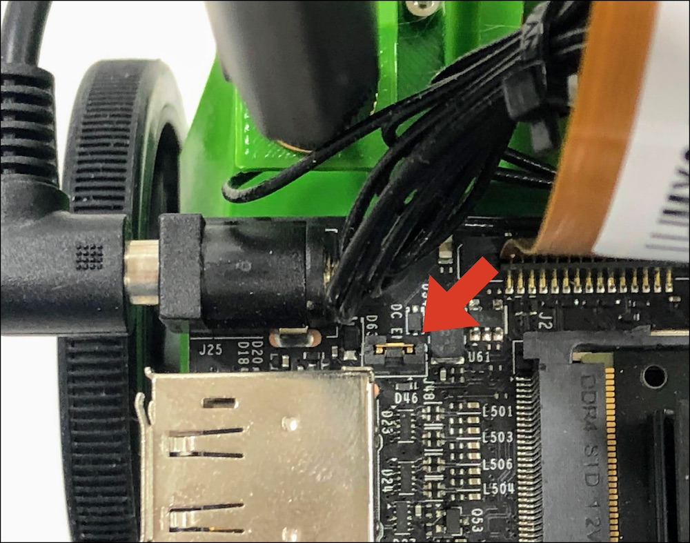
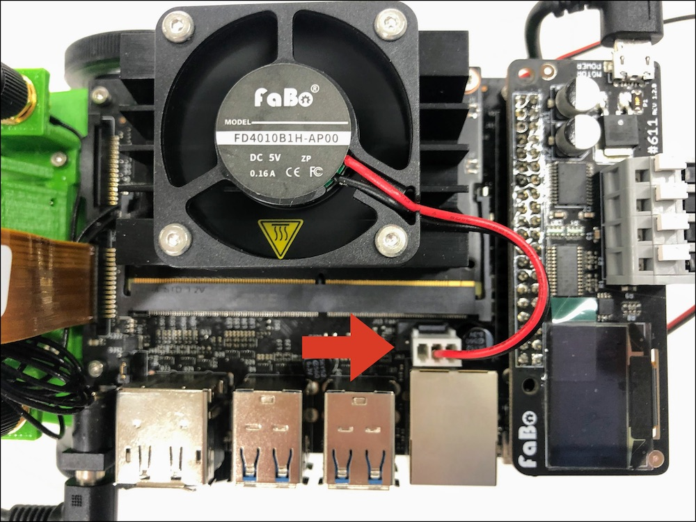

# チェックポイント

## Checkpoint 1

JetBotのモーター制御用のUSBはささっていますか？

## Checkpoint 2

Jetson用のDCケーブルはささっていますか？

## Checkpoint 3

Motorのケーブルは黒、赤、黒、赤の順にささっていますか？

## Checkpoint 4 

Rev B02のボード(カメラ端子2個)を使用している場合、Junperが写真のようにささっていますか？

## Checkpoint 5

CPU Fanのケーブルはささってますか？　

