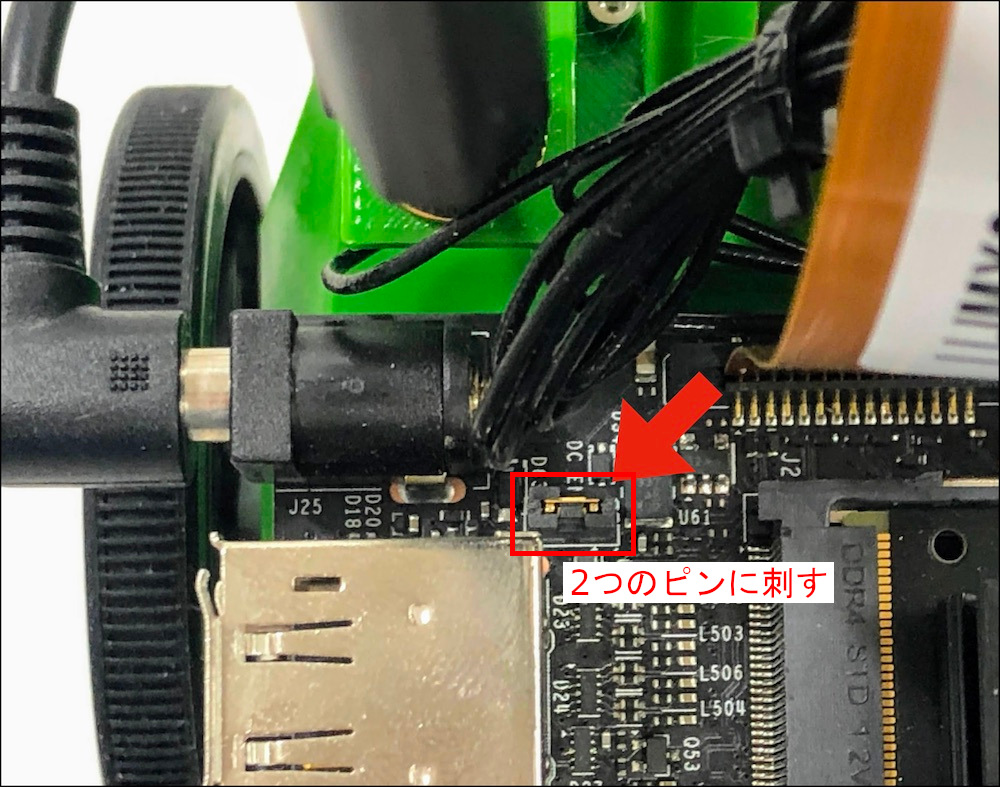
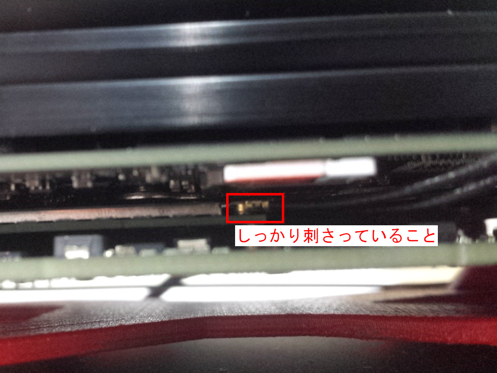
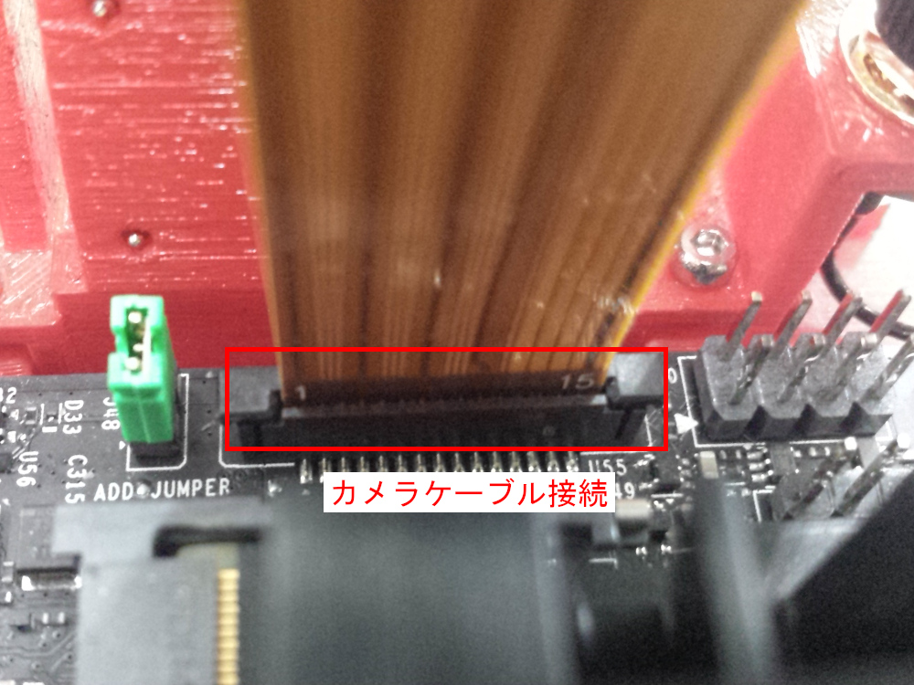
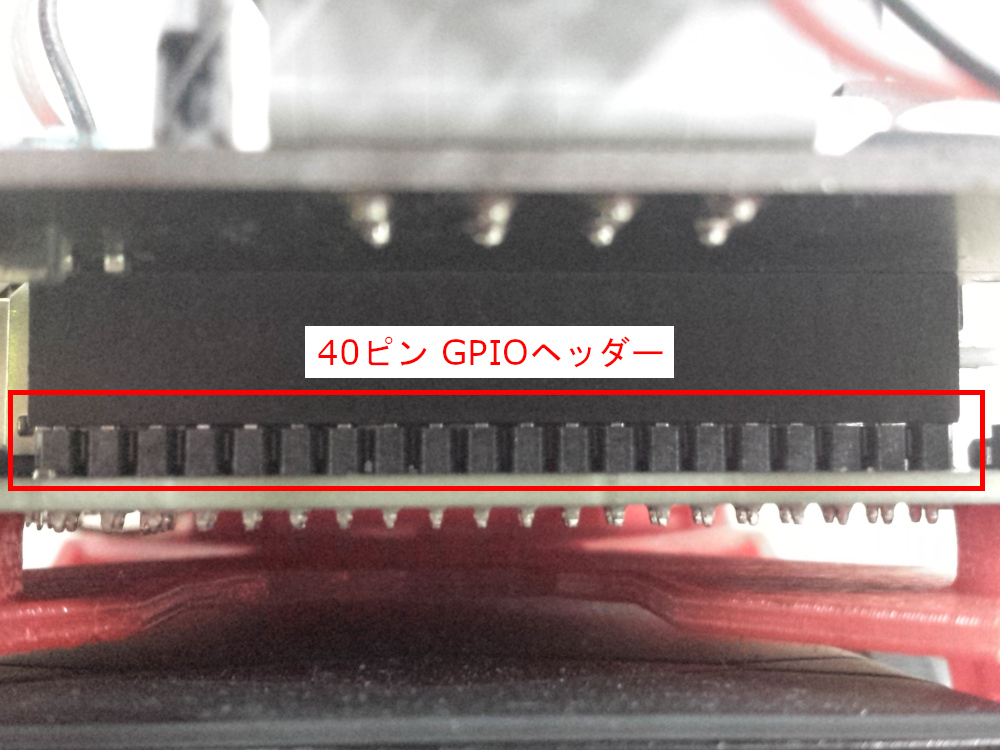

# チェックポイント

## Checkpoint 1

JetBotのモーター制御用のUSBはささっていますか？

## Checkpoint 2

Jetson用のDCケーブルはささっていますか？

## Checkpoint 3

モーターのケーブルは黒、赤、黒、赤の順にささっていますか？

## Checkpoint 4 

Rev B02のボード(カメラ端子2個)を使用している場合、Jumperピンが写真のようにささっていますか？

## Checkpoint 5

CPUファンのケーブルはささっていますか？　

## Checkpoint 6

Wi-Fi アンテナケーブルはしっかりささっていますか？

## Checkpoint 7

カメラケーブルはしっかりささっていますか？

## Checkpoint 8

FaBo #611 JetBot基板はずれていませんか？

