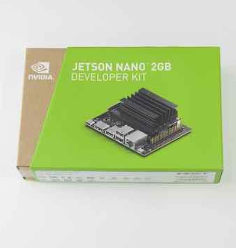
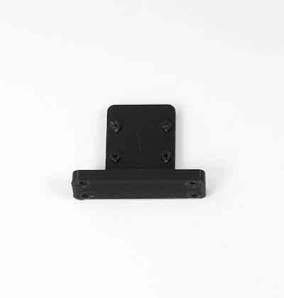
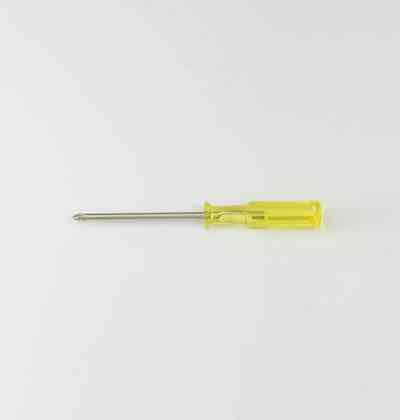

# BOM(部品表)

## 0. BOM(JetBot Kit Carbon Edition ２GBモデル)

{: style="height:210px;width:200px"}

※箱の側面に記載されている型番をご確認ください。

対象モデル

|コード番号|
|:--|
|JB-2GB-Carbon-S|
|JB-2GB-Carbon-B|
|JB-2GB-Carbon-S-WR|
|JB-2GB-Carbon-B-WR|

 
 

|写真|部品|個数|
|:--|:--|:--|
||Jetson Nano ２GB 開発者キット  (JetBot Kit ２GBモデルに付属) ※ベアボーンキット（Jetson Nanoなし）は付属しません。 ※BootROMアップデートのため開封済みの場合がございます。|１枚|
||CAM026 IMX219-160°  ※フレキシブルケーブルは白または黒になります。|１個|
||カーボン TOP  ※上または下のパネルになります。|１枚|
||カーボン MIDDLE|１枚|    
||カーボン BOTTOM|１枚|
||カーボン プレート　 ※もしくは下のスペーサーになります。 ※製造時期により異なります。|４枚|
||ボールキャスタースペーサー軽量タイプ 材質：アルミ ※製造時期により異なります。|1個|
||JetBot カメラマウント　|１個|
||USB Wi-Fi A600 無線LAN 子機（２GBモデルの場合）　|１個|
||USB Wi-Fi A600ハイパワー 無線LAN 子機（２GBワイドレンジモデルの場合）　|１個|
||JetBot ギヤモーター　|２個|    
||JetBot タイヤ,タイヤ取り付けネジ　|２袋|
||ボールキャスター　（70144）| １箱|
||モバイルバッテリー SMP-JV53W 05-1196 定格容量 DC5V/6300mAh 繰り返し充電回数　約５００回 ※もしくは、下のモバイルバッテリーのいづれか| １個|		
||モバイルバッテリー　（BI-B3） ※新パッケージの場合| １個|
||モバイルバッテリー　（BI-B3） ※旧パッケージの場合| １個|
| |マイクロUSBケーブルまたは、DCプラグケーブル  DCプラグケーブル FaBo JetBotkコントロールボードRev1.2.8の場合 USB 右向き 外径5.5mm,内径2.1mm         マイクロUSBケーブル FaBo JetBotkコントロールボードRev1.2.5の場合 ※このケーブルでは充電できません。モバイルバッテリー付属の充電ケーブルをお使いください。 | １本|
| |USB TypeCケーブル（２GBモデルのみ）  ※上または、下のケーブルのいづれかになります。| １本|
||転送用USBケーブル(3m)|１本|
||SDカード(64GB),SDカードケース SanDisk|１個|
| |JetBot コントローラーボード　（FaBo #611） ※上(Rev1.2.8)または下(Rev1.2.5)のいづれか    |１枚|
||CPUファン  FD4010BH-AP00 DC5V 0.16A|１個|
||ファン取り付けジグ|１個|
|motor_kotei_lower001.jpg)|１．モーター固定部品  モーター固定金具 ・・・・2 皿ネジ M3×10・・・・4 ナットM3・・・・4 なべネジM3×30・・・・4 ※予備ねじ各1個付属|１袋|
|_caster_kotei001.jpg)|２．キャスター固定部品  皿ネジM3×15・・・・4 ナットM3・・・・4 ※予備ねじ各1個付属|１袋|
|_carbon_kotei001.jpg) |３．カーボン連結（下）部品  六角スペーサーM3×24・・・・4 皿ネジM3×5・・・・4  または、  六角スペーサー（樹脂：黒）M3×24・・・・4 皿ネジM3×5・・・・4 ※予備ねじ各1個付属|１袋|
|carbon_kotei_upper001.jpg) |４．カーボン連結（上）部品  六角スペーサーM3×20（白）・・・・4 ナットM3・・・・4  または、  六角スペーサーM3×20（樹脂：黒）・・・・4 ナットM3・・・・4 ※予備ねじ各1個付属|１袋|
|camerakotei001.jpg) |５．カメラ固定部品  皿ネジM3×10・・・・4 ナットM3・・・・4 六角穴付きボルトセルフタッピングネジ M2.0×5・・・・4  または、  皿ネジM3×12・・・・4 ナットM3・・・・4 六角穴付きボルトセルフタッピングネジ M2.0×5・・・・4 ※予備ねじ各1個付属|１袋|
|jetson_kotei001.jpg) |６．Jetson固定部品  樹脂六角スペーサー（白色）M2.6×10・・・・4 皿ネジM2.6×5・・・・4 なべネジM2.6×5・・・・4  または、  樹脂六角スペーサー（黒色）M2.6×10・・・・4 皿ネジM2.6×5・・・・4 なべネジM2.6×5・・・・4 ※予備ねじ各1個付属|１袋|
||ファン固定ネジ  M2.5×14・・・・4 ナットM2.5・・・・4 ※予備ねじ各1個付属|１袋|
||六角レンチ 1.5|１本|
||両面テープ|２枚|
||プラスドライバー +2×100|１本|
||精密ドライバー　P柄|１本|
||ナットドライバー ５．５|１本|
||精密ドライバーセット　ED−20|１セット|

※ベアボーンモデルはJetson Nano開発者キットは付属しません。

※開封後はすぐ欠品がないかご確認お願いいたします。
