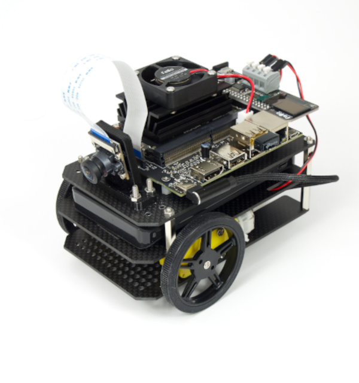
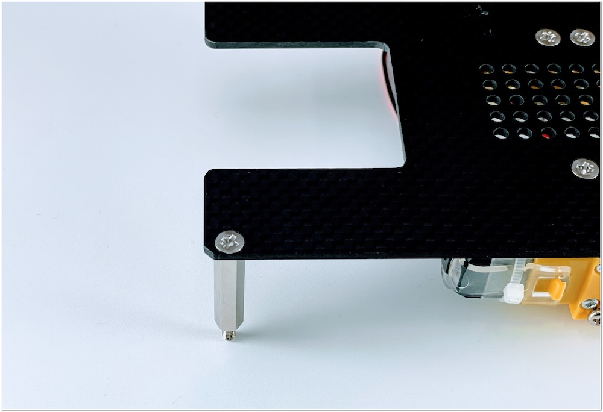
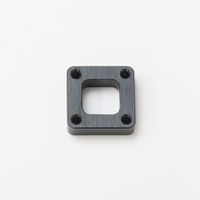
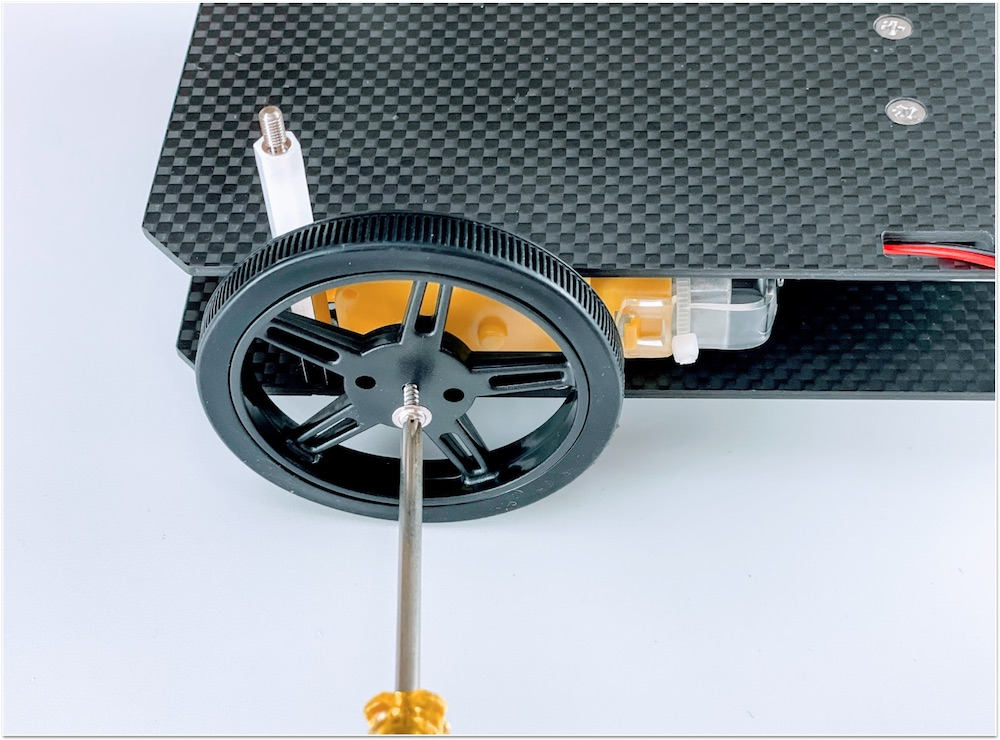
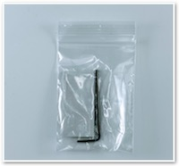
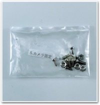
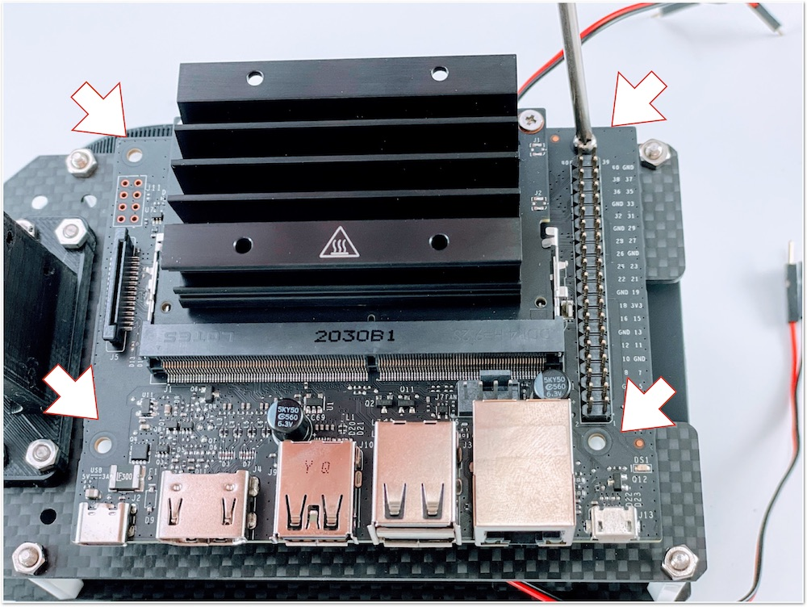
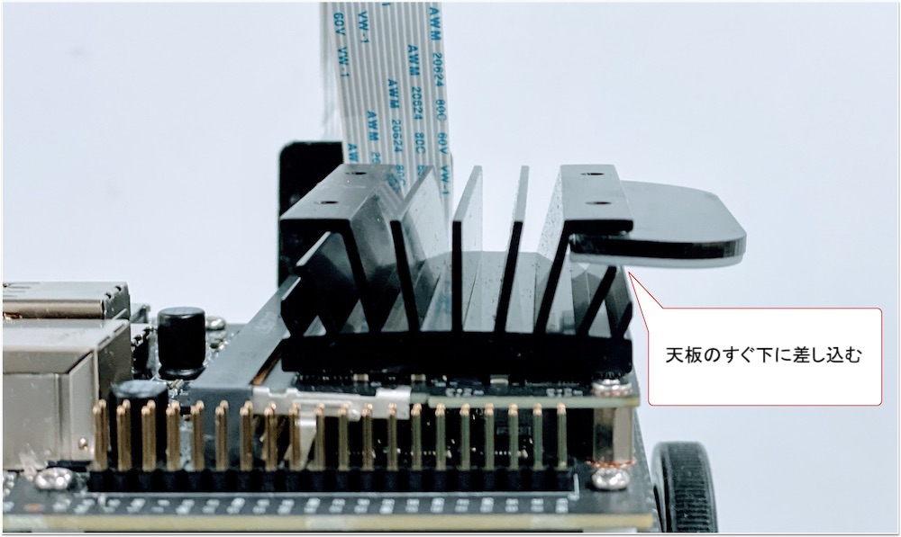
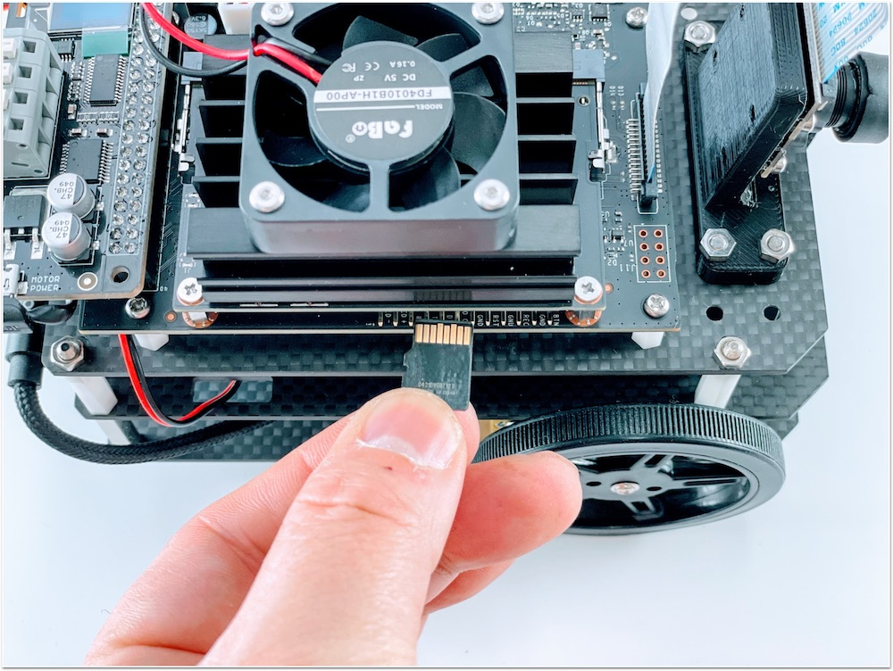
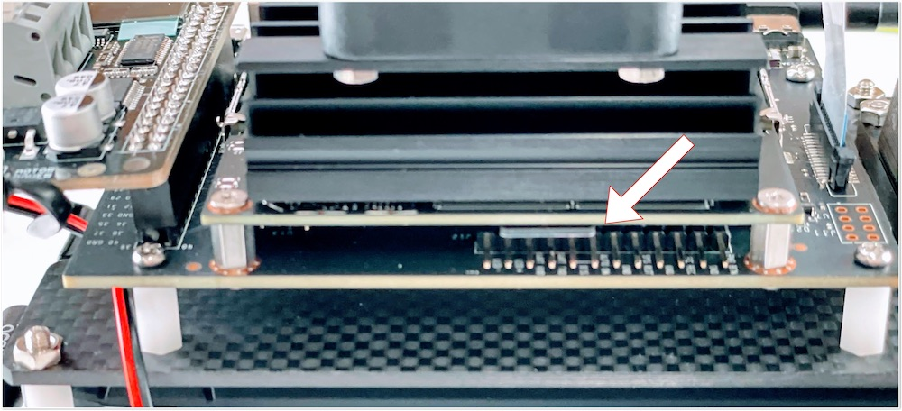

# 組み立てマニュアル(初期型)

{: style="height:210px;width:200px"}{: style="height:210px;width:200px"}

※箱の側面に記載されている型番をご確認ください。

対象モデル

|コード番号|
|:--|
|JB-2GB-Carbon-S|
|JB-2GB-Carbon-B|
|JB-2GB-Carbon-S-WR|
|JB-2GB-Carbon-B-WR|

## 1. ギヤモーターの取り付け

|写真|種類|個数|
|:--|:--|:--|
||ギヤモーター|2|
||1.ギヤモーター固定ネジ袋|1|

ギヤモーターに固定金具を取り付けていきます。

固定金具を取り付けネジで固定します。

金具は内側にそれぞれ対になる向きに取り付けます。

|写真|種類|個数|
|:--|:--|:--|
|{: style="height:210px;width:200px"}|カーボン BOTTOM|1|

カーボンプレートに、ギヤモーターを接続します。

## 2. カーボン連結ネジの取り付け

|写真|種類|個数|
|:--|:--|:--|
||3.カーボン連結ネジ袋（下）|1|

カーボン連結用のスペーサーを接続します。

## 3. ボールキャスターの組み立て

|写真|種類|個数|
|:--|:--|:--|
||ボールキャスター ２セットのうち、使用するのは１セットのみとなります。|1|
||ニッパー ※恐れ入りますが、ニッパーは、お客様の方でご準備ください。|1|

ボールキャスターの組み立てをおこないます。タッピングビスはボールキャスター付属の３*１５mmの物（黒）を使用します。

まず、ボールを取り付けます。

3本の棒をボールのうえに配置します。

プラスチック部品を取り付けます。

長い方（高さ３５ミリ）に取り付け、ネジで固定します。

## 4. ボールキャスターの取り付け

|写真|種類|個数|
|:--|:--|:--|
||2.ボールキャスター固定ネジ袋|1|
||ボールキャスタースペーサー(軽量タイプ)|1|
||ボールキャスター固定カーボン ※または、下のスペーサーになります。 ※旧タイプ|4|
||カーボンMIDDLE|1|

ボールキャスターをカーボンMIDDLEに取り付けます。

ボールキャスターのスペーサを1個取り付けます。旧タイプは、ボールキャスター固定カーボン4枚を重ねて取り付けます。

※出荷時期により異なります。

カーボンMIDDLEの表裏を注意して、皿ネジM3*15で固定します。

前の章で組み立てたボールキャスターとボールキャスタースペーサーで挟み、４ヶ所ナットを締めて付属のドライバーでボールキャスターを固定します。

旧タイプ固定カーボンスペーサー4枚の場合。

## 5. カーボンの取り付け

|写真|種類|個数|
|:--|:--|:--|
||4.カーボン固定ネジ袋(上) ※スペーサーの色は白か黒になります。|1|

カーボンBOTTOMとカーボンMIDDLEを連結します。

モーターの線も穴から出しておきます。

白いスペーサーで、四隅を固定します。

## 6. タイヤの取り付け

|写真|種類|個数|
|:--|:--|:--|
|{: style="height:210px;width:200px"}|タイヤ  ※固定ねじ付き　各1本|2|

タイヤを装着します。

## 7. モバイルバッテリーの取り付け

|写真|種類|個数|
|:--|:--|:--|
||両面テープ袋|1|
|{: style="height:210px;width:200px"} |モバイルバッテリー  ※上または、下のいずれか|1|

モバイルバッテリーを両面テープで装着します。

モバイルバッテリー（SMP-JV53W)の場合

モバイルバッテリー（BI-B3)の場合

## 8. カーボンTOPの取り付け

|写真|種類|個数|
|:--|:--|:--|
||6.Jetson固定ネジ袋 ※スペーサーの色は白か黒になります。|1|
|{: style="height:210px;width:200px"} |カーボンTOP ※上または下のいずれか。|1|

Jetson固定ネジを取り付けます。

## 9. カメラの取り付け

|写真|種類|個数|
|:--|:--|:--|
||5.カメラ固定ネジ袋|1|
||カメラ  ※使用する時は、レンズキャップは外します。|1|
||カメラマウント|1|

## 10. 本体に結合

4.カーボン固定連結（上）のナットを使用して、取り付けます。

## 11. Jetsonの取り付け

|写真|種類|個数|
|:--|:--|:--|
||Jetson ※Jetson Nanoなし版は付属しません。|1|

## 12. カメラケーブルの取り付け

## 13. CPUファンの取り付け

|写真|種類|個数|
|:--|:--|:--|
||CPUファンと取り付けジグ|1セット|
||CPUファン取り付け用ネジ袋  ※ネジの種類がプラスネジの場合と六角ネジの場合がございます。|1|

取り付けねじがプラスのネジだった場合は、精密ドライバーにて締め付けます。

取り付けねじが六角のネジだった場合は、六角レンチにて締め付けます。

## 14. コントローラーボードの取り付け

|写真|種類|個数|
|:--|:--|:--|
||コントローラーボード|1|

Jetson Nano 40Pinヘッダーピンにコントローラボードを取り付けます。

確実にずれないように取り付けます。最後まで刺します。

ギアモーターのケーブルを端子台に刺します。下記の写真のように下斜め方向に軽い力で挿入できます。もし軽い力で入らない場合は、端子台の白いボタンを推しながら挿入します。

!!!Warning "端子台へのピン挿入について"
  強い力でピンを挿入するとピンが折れてしまう場合がございます。折れないように注意しましょう。

左右のギアモーター計４本確実に端子台に挿入します。左から黒・赤・黒・赤の順番です。

## 15. USBケーブルの取り付け

|写真|種類|個数|
|:--|:--|:--|
|{:style="height:200px;width:210px"}|DCプラグケーブルまたはマイクロUSBケーブル  コントローラボードがRev1.2.8の場合はDCプラグケーブルになります。|1|
|{: style="height:210px;width:200px"} |USB Type-C Cable  ※上（ストレートタイプ）または下（L字タイプ）のいずれか。モバイルバッテリーがSMP-JV53Wの場合は、上側|1|

### モバイルバッテリー（SMP-JV53Wの場合）かつ　611 JetBot コントローラボード　Rev1.2.8の場合

DCプラグケーブルとUSB typeCケーブルを用意します。

DCプラグケーブルをボールキャスターに巻き付け、コントローラボードのDCジャックに接続します。

コントロールボードのDCジャックにDCプラグを挿入します。

USBタイプCケーブルもボールキャスターに巻きつけます。Jetson Nanoへはまだ接続しません。

次章、16. Wi-Fiの取り付けへ

### モバイルバッテリー（SMP-JV53Wの場合）かつ　611 JetBot コントローラボード　Rev1.2.5の場合

次章、16. Wi-Fiの取り付けへ

### モバイルバッテリー（BI-B3の場合）

次章、16. Wi-Fiの取り付けへ

## 16. Wi-Fiの取り付け

|写真|種類|個数|
|:--|:--|:--|
||USB Wi-Fiドングル|1|
||USB Wi-Fiドングル ハイパワー（JB-2GB-Carbon-S-WR、JB-2GB-Carbon-B-WRの場合）|1|

USB Wi-FiドングルをUSB端子に挿します。

ワイドレンジ版の場合

Wi-FiドングルをUSB端子に取り付けます。

## 17. SDカードの差し込み

## 18. JetsonNanoへの電源投入

JetsonNanoのUSBタイプCコネクタに接続します。しばらくすると、コントロールボードのOLEDが表示されます。

電源が入らない場合は、モバイルバッテリーはスリープの状態になっているのでボタンを押します。

組み立ては以上になります。
