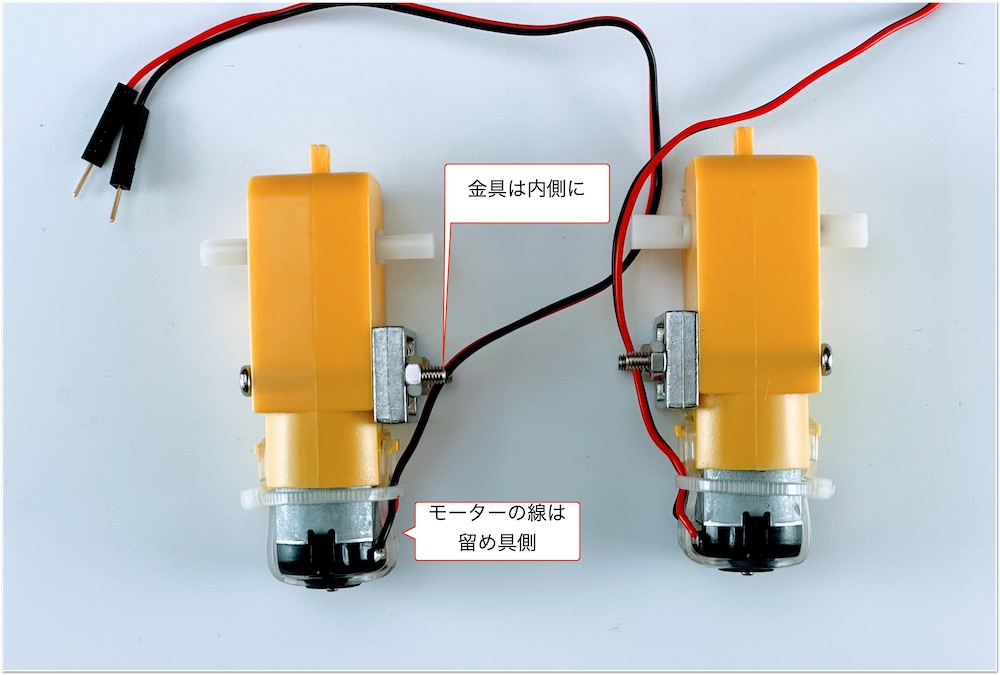
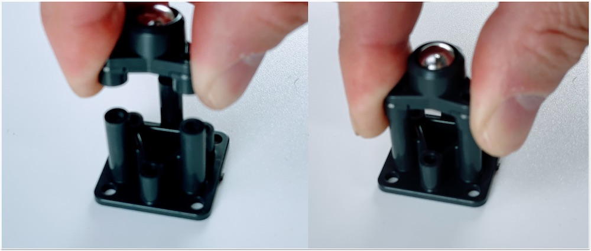
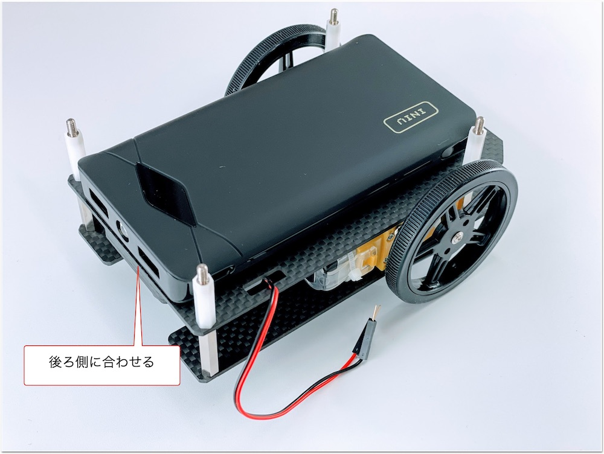
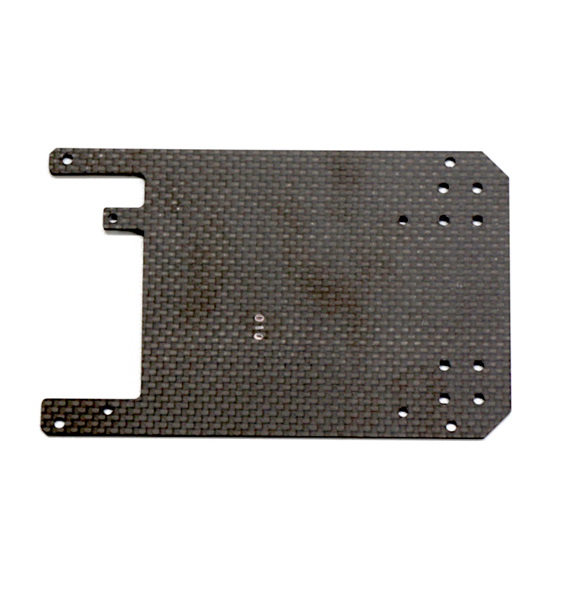
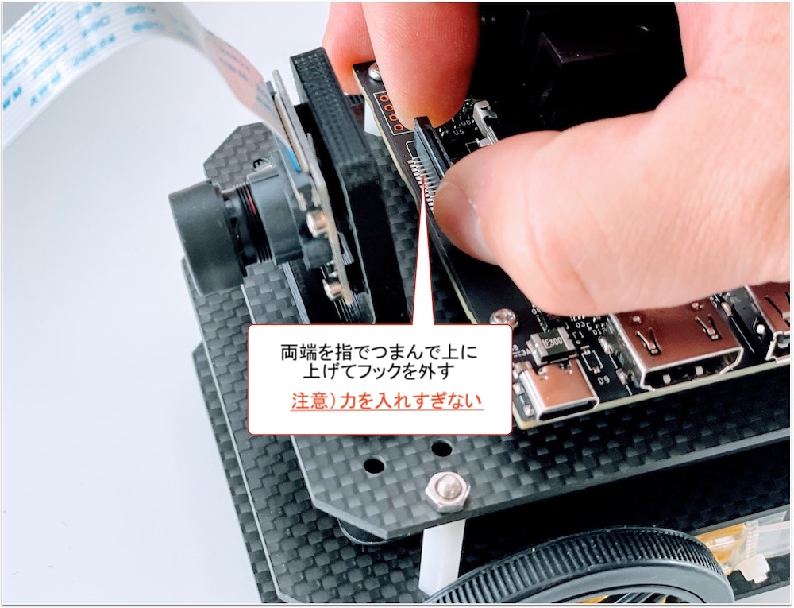
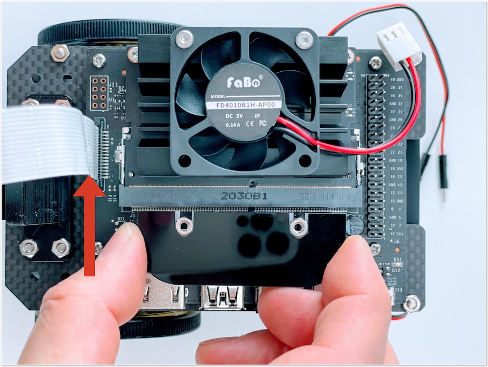
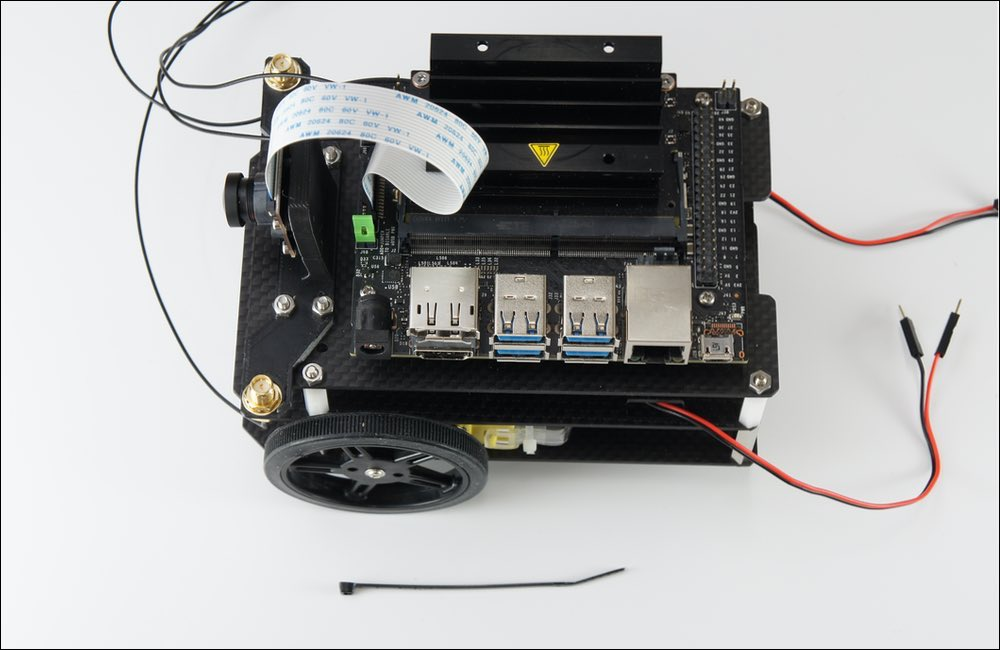
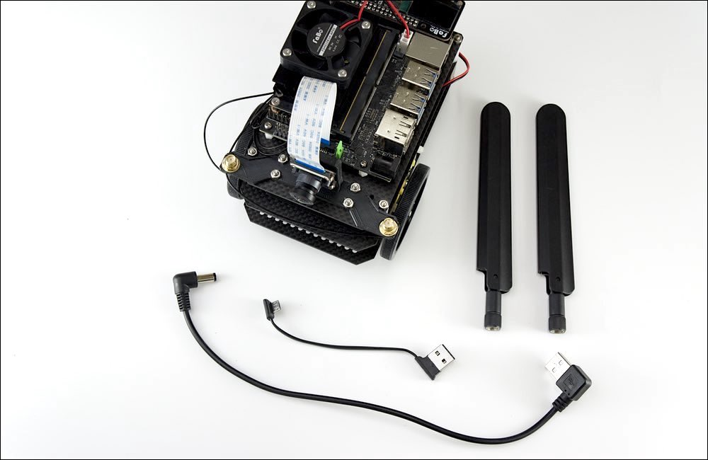
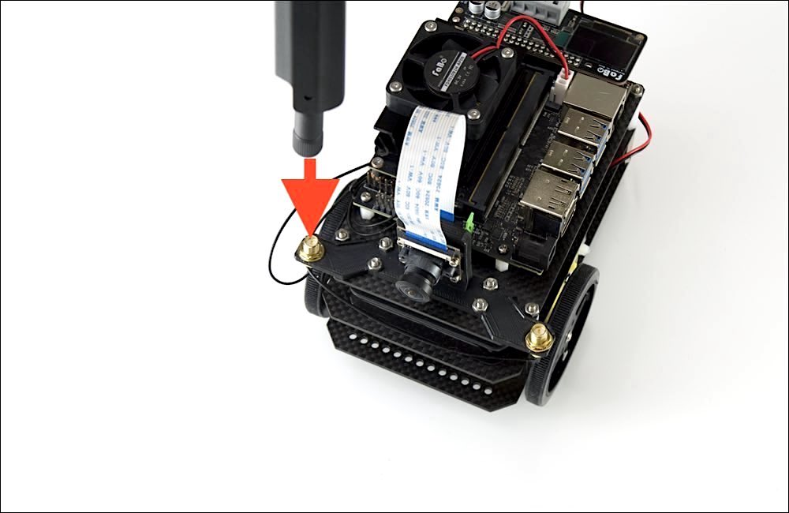

# 組み立てマニュアル（Dタイプ）

{: style="height:210px;width:200px"}
 
 

対象モデル

|コード番号|
|:--|
|JB-4GB-Carbon-S-D（標準）|
|JB-4GB-Carbon-B-D（ベアボーン）|

<主な変更点>

Wi-Fi支持パーツ素材の変更

2022年8月以降出荷より、コントローラ基板をUSBマイクロコネクタからDCジャックへの変更。

2023年10月以降出荷より、パーツ入手困難のため、Wi-Fiモジュールの変更をしました。（Intel８２６５からIntelAX200へ変更　ドライバーインストール済み）

2023年10月以降出荷より、回転速度が調節できるPWMのDCファンに変更いたしました。

## 1. ギヤモーターの取り付け

|写真|部品または工具|個数|
|:--|:--|:--:|
|{: style="height:210px;width:200px"}|1.ギヤモーター固定ネジ(袋)|1|
|{: style="height:210px;width:200px"}|ギヤモーター|2|
|{: style="height:210px;width:200px"}|プラスドライバー +2×100|１本|

ギヤモーターに固定金具を取り付けていきます。

固定具を取り付けネジで固定します。

金具は内側にそれぞれ対になる向きに取り付けます。

カーボンプレートに、ギヤモーターを接続します。

## 2. カーボン連結ネジの取り付け

|写真|部品または工具|個数|
|:--|:--|:--:|
|{: style="height:210px;width:200px"}|3.カーボン連結ネジ袋（下）|1|
|{: style="height:210px;width:200px"}|プラスドライバー +2×100|１本|

カーボン連結用のスペーサーを接続します。

## 3. ボールキャスター組み立て

|写真|部品または工具|個数|
|:--|:--|:--:|
|{: style="height:210px;width:200px"}|ボールキャスター|1|
|_caster_kotei001.jpg){: style="height:210px;width:200px"}|２．ボールキャスター固定ネジ|１袋|
|{: style="height:210px;width:200px"}|プラスドライバー +2×100|１本|

ボールキャスターの組み立てをおこないます。タッピングビスはボールキャスター付属の３*１５mmの物（黒）を使用します。

まず、ボールを取り付けます。

3本の棒をボールのうえに配置します。

プラスチック部品または工具を取り付けます。

長い方に取り付け、ネジで固定します。

## 4. ボールキャスターの固定

|写真|部品または工具|個数|
|:--|:--|:--:|
|{: style="height:210px;width:200px"}|2.キャスター固定ネジ袋|1|
|{: style="height:210px;width:200px"}|ボールキャスタースペーサー 材質：アルミ ※または、下のスペーサーになります。|1枚|
|{: style="height:210px;width:200px"}|ボールキャスタースペーサー軽量タイプ 材質：アルミ|1枚|
|{: style="height:210px;width:200px"}|カーボンMIDDLE|1|
|{: style="height:210px;width:200px"}|プラスドライバー +2×100|１本|

ボールキャスターをカーボンMIDDLEに取り付けます。

スペーサーを挟み、ネジでボールキャスターを固定します。

M3ナットをはめて、ドライバーで４箇所締め付けます。

取り付け後　裏

表になります。ボールキャスターが固定できました。

## 5. カーボンBOTTOMとカーボンMIDDLEの取り付け

|写真|部品または工具|個数|
|:--|:--|:--:|
|{: style="height:210px;width:200px"}|4.カーボン固定ネジ(上)|1|

カーボンBOTTOMとカーボンMIDDLEを連結します。

モーターの線も穴から出しておきます。

白いスペーサーで、四隅を固定します。

## 6. タイヤの取り付け

|写真|部品または工具|個数|
|:--|:--|:--:|
|{: style="height:210px;width:200px"}|タイヤ  ※固定ねじ付き　各1本|2|
|{: style="height:210px;width:200px"}|精密ドライバー|1|

タイヤを装着します。

## 7. モバイルバッテリーの取り付け

|写真|部品または工具|個数|
|:--|:--|:--:|
|{: style="height:210px;width:200px"}|両面テープ|1|
|{: style="height:210px;width:200px"}|モバイルバッテリー（SMP-JV53W付属の場合）|1|
|{: style="height:210px;width:200px"}|モバイルバッテリー（旧パッケージの場合）|1|
|{: style="height:210px;width:200px"}|モバイルバッテリー（新パッケージの場合）|1|

モバイルバッテリーを両面テープで装着します。

モバイルバッテリー（SMP-JV53W)の場合

モバイルバッテリー（BI-B3)の場合

## 8. カーボンTOPの取り付け

|写真|部品または工具|個数|
|:--|:--|:--:|
|{: style="height:210px;width:200px"}|6.Jetson固定ネジ袋|1|
|{: style="height:210px;width:200px"} {: style="height:210px;width:200px"}|カーボンTOP ※上または下のもの。|1|
|{: style="height:210px;width:200px"}|精密ドライバーセット　ED−20|1|

Jetson固定ネジを取り付けます。

## 9. Wi-Fi モジュールの取り付け

|写真|部品または工具|個数|
|:--|:--|:--:|
|{: style="height:210px;width:200px"}|Jetson Nano 開発者キット B01,A02|1|
|{: style="height:210px;width:200px"} {: style="height:210px;width:200px"}|Intel　AX200.NGWG.DTK または、 Intel Dual Bandwireless-AC 8265 Desktop Kit|1|
|{: style="height:210px;width:200px"}|カメラマウント|１|
|{: style="height:210px;width:200px"}|Wi-Fiアンテナ支持|1|
|{: style="height:210px;width:200px"}|スパナ|1|
|{: style="height:210px;width:200px"}|精密ドライバーセット　ED−20|1|
|{: style="height:210px;width:200px"}|プラスドライバー +2×100|1|

Kitに搭載されているJetson Nanoが、``Rev.B01``か``Rev.A02``かを確認します。見分け方として、CSIカメラポートが2つ付いているのが``Rev.B01``で、1つしか付いていないのがRev.A02になります。

Wi-Fi モジュールを取り付けるために、Jetson Nano モジュールを取り外します。

両側のネジを外します。

両サイドの留め具を外に開き、Jetson Nano モジュールを取り外します。

両サイドに広げると、Jetson Nano モジュールがポップアップします。

Jetson Nano モジュールを取り外すと、ネジが見えます。

Wi-Fi モジュールを取り付けるために、真ん中のネジを外しておきます。

※ネジの山カケには注意しましょう。

Wi-Fi モジュールは、Intel　AX200.NGWG.DTK　または、　Intel Dual Bandwireless-AC 8265 Desktop Kitを取り付けます。

!!!Info "技適"

	Intel　AX200.NGWG.DTK

	箱の横に技適番号が記載されています。
	

	|項目|認証番号|
	|:--|:--|
	|R|003‐190022|
	|T|D190021003|

!!!Info "技適"

	Intel Dual Bandwireless-AC 8265 Desktop Kit

	箱の横に技適番号が記載されています。
	

	|項目|認証番号|
	|:--|:--|
	|R|003‐160104|
	|T|D160055003|

箱から取り出し、スパナで金色のアンテナ固定ネジをゆるめ、銀色のプレートから取外しておきます。

モジュールの端子と接続します。

取り外したアンテナ端子をWi-Fiアンテナ支持に取り付けます。

Wi-Fiアンテナ支持に穴確認し端子を通るようにまわしアンテナ端子を貫通させます。

外したアンテナ固定ネジは、カメラマウントのパーツに取り付け替えます。

スパナで締めます。

Wi-Fiアンテナ支持の左右に取り付けます。

Wi-Fi モジュールの端子に２本のアンテナケーブルを接続します。

以下のようになります。

Wi-Fi モジュールをJetson Nano 開発者ボードにドライバーで取り付けます。

Wi-Fi モジュールの取り付けが完了したら、Jetson Nano モジュールを再び取り付けます。

Wi-Fiアンテナケーブルの配線

Jetson Nano モジュールを再び装着し、２箇所ネジ止めします。

できあがりとなります。

## 10. カメラの取り付け

|写真|部品または工具|個数|
|:--|:--|:--:|
|{: style="height:210px;width:200px"}|CAM026 IMX219-160°|1|
|{: style="height:210px;width:200px"}|５．カメラ固定ネジ（袋）|1|
|{: style="height:210px;width:200px"}|六角レンチ|1|

カメラモジュールを用意します。

カメラモジュールをカメラマウントに取り付けます。カメラモジュールの４つの穴に六角レンチを使いM2.0のタッピンングビスでカメラを取り付けます。

カメラの取り付けは終了となります。

## 11. 本体に結合

|写真|部品または工具|個数|
|:--|:--|:--:|
|{: style="height:210px;width:200px"}|５．カメラマウント固定ネジ（袋）|1|
|{: style="height:210px;width:200px"}|プラスドライバー +2×100|1|
|{: style="height:210px;width:200px"}|ナットドライバー 5.5mm|1|

カメラマウントとWi-Fiアンテナ支持をカーボンTOPに固定します。

カーボンTOPの裏から４箇所、皿ネジで固定します。

カメラマウントは４箇所、M3のナットを使用し、ナットドライバーで固定します。

カメラマウントとカーボン上部の取り付け完了です。

カーボンTOPとカーボンMIDDLEを結合します。

カーボンTOPとカーボンMIDDLEを結合します。M3ナットで四隅を固定します。

ナットドライバーでナットを締めます。

## 12. Jetson取り付け

|写真|部品または工具|個数|
|:--|:--|:--:|
|{: style="height:210px;width:200px"}|Jetson Nano 開発者キット B01,A02|１枚|
|{: style="height:210px;width:200px"}|精密ドライバーセット　ED−20|1|

Jetson Nanoをカーボン上部に取り付けます。

スクリューねじでJetson Nanoを４箇所のネジで固定します。

## 13. カメラケーブルの取り付け

!!!Info "カメラのコネクタ"
	Jetson Nano 開発者キット B-01は、カメラのコネクタ（CSI)は２つあります（CAM0、CAM1）どちらかに接続します。
	※ご注意　写真は、Jetson Nano 開発者キット　2GBです。

## 14. CPUファンの取り付け

###　DCファン（回転速度制御あり　FAN-4020-PWM-5V）付属の場合

|写真|部品または工具|個数|
|:--|:--|:--:|
|{: style="height:210px;width:200px"}|PWM調整DCファン　FAN-4020-PWM-5V、ねじパック|1セット|

PWM調整DCファンを用意します。

ビスセットは５本のねじが入っており、１本は予備となります。

ファンをヒートシンクに載せます。

ケーブルをファーンとヒートシンクに挟まないようケーブルの位置を調整します。

ドライバーにてビスを４箇所締め付けます。

ファンのコネクタをJetsonNanoのコネクタに接続します。

!!!Info "回転速度方法"
	回転速度調整ができます。状況に合わせて回転速度を調整していただくか、設定により回転速度調整できます。
	制御方法に関してましてこちらをご覧ください。
	[CPU FAN制御方法](https://faboplatform.github.io/JetbotDocs/10.%E3%81%9D%E3%81%AE%E4%BB%96/11.funcontrol/)

### DCファン（回転速度制御なし　FD401B1H-AP00）　付属の場合

※PWM調整DCファンを取り付けた方はスキップしてください。

|写真|部品または工具|個数|
|:--|:--|:--:|
|{: style="height:210px;width:200px"}|CPUファンと取り付けジグ|1セット|
|{: style="height:210px;width:200px"}|CPUファン取り付け用ネジ|1|
|{: style="height:210px;width:200px"}|六角レンチ|1|

## 15. コントローラーボードの取り付け

|写真|部品または工具|個数|
|:--|:--|:--:|
|{: style="height:210px;width:200px"}|コントローラーボード|1|

ロックを押しながら、ギヤモータのピンを挿入します。
挿入したら、ロックを離すとピンが固定されます。

## 16. SDカードの差し込み

|写真|部品または工具|個数|
|:--|:--|:--:|
|{: style="height:210px;width:200px"}|SD Card(64GB),SDカードケース SunDisk|１個|

## 17. Jumperピンの設定

|写真|部品または工具|個数|
|:--|:--|:--:|
|{: style="height:210px;width:200px"}|Jumperピン（Jetson Nano 開発者キットB01は標準で付属）|１個|

使用するJetson Nanoが``Rev.A02``か、``Rev.B01``かを確認します。

DC電源からの給電を有効にするために、``Rev.A02``、``Rev.B01``の場合で、下記の箇所のJumperピンの設定をおこないます。

## 18. その他

|写真|部品または工具|個数|
|:--|:--|:--:|
|{: style="height:210px;width:200px"}|結束バンド|1|

Wi-Fiアンテナのケーブルを結束バンドを使用してケーブルを収納します。

結束バンドでWi-Fiケーブル2本を束ねます。

束ねたケーブルは、Jetson Nano 開発者キットの基板の下へ格納します。

## 19. 完成

|写真|部品または工具|個数|
|:--|:--|:--:|
|{: style="height:210px;width:200px"}|DCプラグ-USBケーブル 右向き|1|
|{: style="height:210px;width:200px"}|DCプラグ-USBケーブル 左向き  ※2022年8月出荷以降|1|
|{: style="height:210px;width:200px"}|マイクロUSBケーブル   ※2022年7月出荷以前| 1|
|{: style="height:210px;width:200px"}|Intel Dual Bandwireless-AC 8265 Desktop Kit|1|

いよいよ完成です。電源接続します。モバイルバッテリーからJetson NanoのDCジャックとコントローラー基板に接続します。

2022年8月以降出荷

2022年７月以前出荷

Wi-Fiアンテナを立てます。アンテナを回してねじ込みます。

左右にWi-Fiアンテナを２つ立てます。

## 2022年8月出荷以降の場合（JetBot コントローラ基板　Rev１.２.８）

!!!Info "コントロールボード"
	コントロールボード　Rev1.2.8の場合は、モーターの電源がDCジャック入力タイプになります。

USBケーブル左向きをモバイルバッテリー左側に刺します。USBケーブルのDCプラグ側を本体下段にケーブルを通します。

DCプラグを通した様子。

DCプラグをJetson NanoのDCジャックへ接続します。(Jetson Nanoに給電が始まります。)

次にモバイルバッテリー左側にUSBケーブル右向きを刺します。

以下の写真のように、ボールキャスターに巻きつけコントローラー基板のDCジャックに繋ぎます。（モータードライバーに給電が始まります。）

※給電が始まらない時は、モバイルバッテリーの側面にありますボタンを押してください。

## 2022年７月出荷以前の場合

!!!Info "コントロールボード"
	モーターの電源入力は、マイクロUSB入力タイプになります。

モバイルバッテリー（SMP-JV53W）の場合は、マイクロUSBケーブルは下記のようにコントローラーボードと繋ぎます。

モバイルバッテリー（INIU　BI-B3)の場合は、マイクロUSBケーブルは下記のようにコントローラーボードと繋ぎます。

モバイルバッテリー（SMP-JV53W）の場合は、DCプラグケーブルをモバイルバッテリーに刺し、DCプラグ側は、モーターの間を前方にケーブルを通します。

モバイルバッテリー（INIU　BI-B3)の場合は、DCプラグケーブルをモバイルバッテリーに刺し、DCプラグ側は、モーターの間を前方にケーブルを通します。

DCプラグがボディの間を通過した様子。

DCプラグをJetson Nano 開発者キットのDCジャックへ接続します。Jetson Nanoの電源が入ります。

## 組立て完了

おめでとうございます。JetBotの完成です。カメラモジュールのレンズキャップを装着している場合は外します。

