# BOM

## 0. BOM(JetBot Kit Carbon Edition ４GBモデル　Dタイプ)

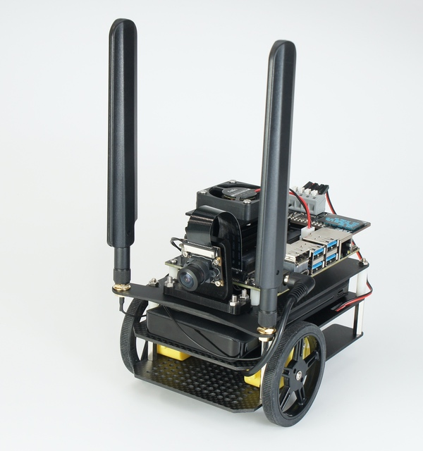{: style="height:210px;width:200px"}
 
 

※箱の側面に記載されている型番をご確認ください。

対象モデル

|コード番号|
|:--|
|JB-4GB-Carbon-S-D（標準）|
|JB-4GB-Carbon-B-D（ベアボーン）|

|写真|部品|個数|
|:--|:--|:--|
||Jetson Nano 開発者キット B01 (JetBot Kit ４GBモデルに付属) ※ベアボーンキットには付属しません。|１枚|
||CAM026 IMX219-160°|１個|
|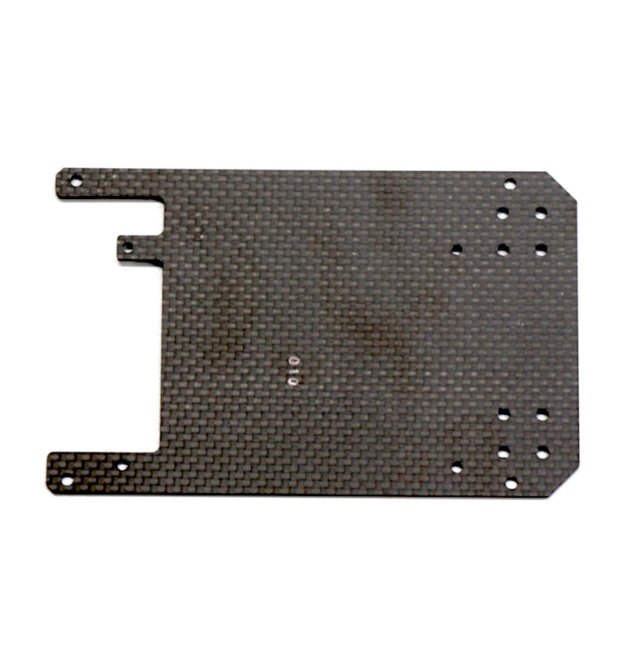 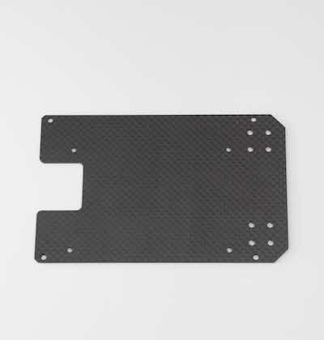|カーボン TOP ※上または、下になります。|１枚|
||カーボン MIDDLE|１枚|    
|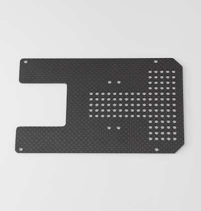|カーボン BOTTOM|１枚|
|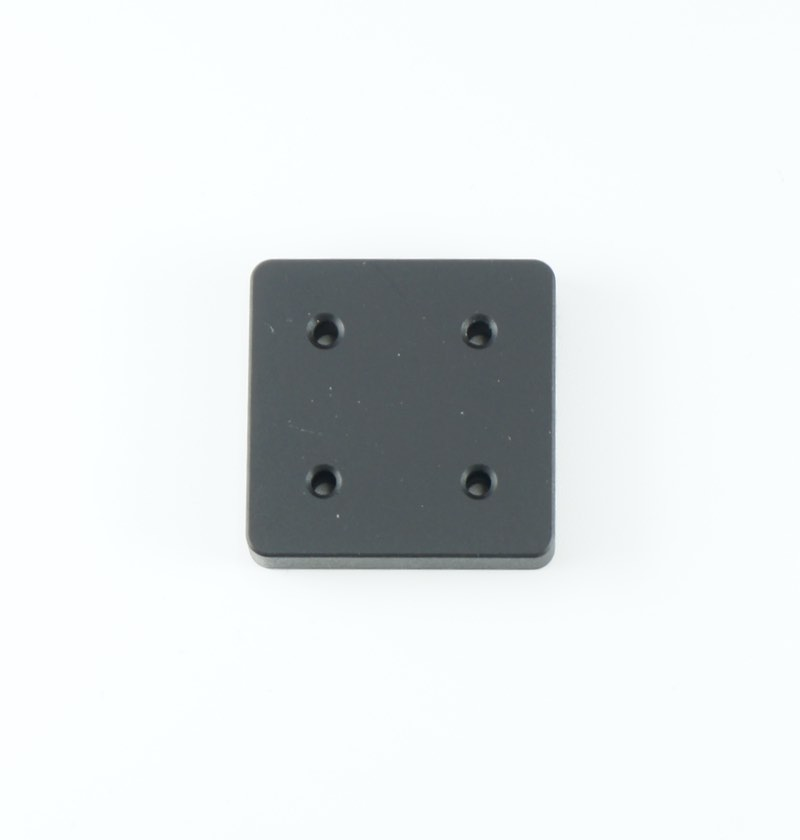|ボールキャスタースペーサー 材質：アルミ ※もしくは下のスペーサーになります。 ※製造時期により異なります。|１枚|
||ボールキャスタースペーサー軽量 材質：アルミ ※製造時期により異なります。|１枚|
|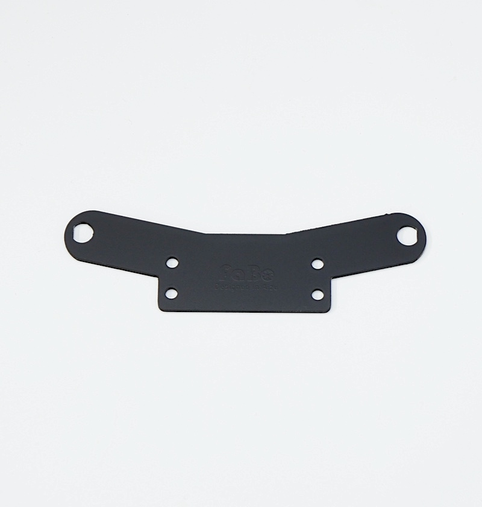|Wi-Fiアンテナ支持|１個|
||Intel Dual Bandwireless-AC 8265 Desktop Kit|１個|
|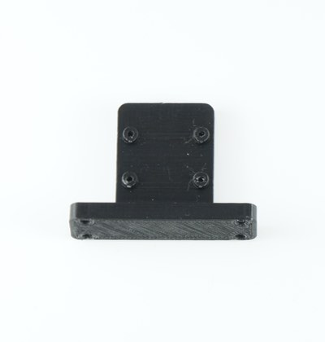|カメラマウント|１個|
|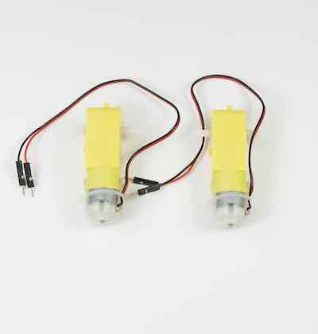|Jetbot GearMotor　|２個|    
|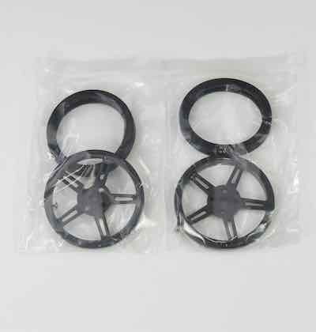|Jetbot タイヤ,タイヤ取り付けネジ　|２袋|
||ボールキャスター　（70144）| １箱|
|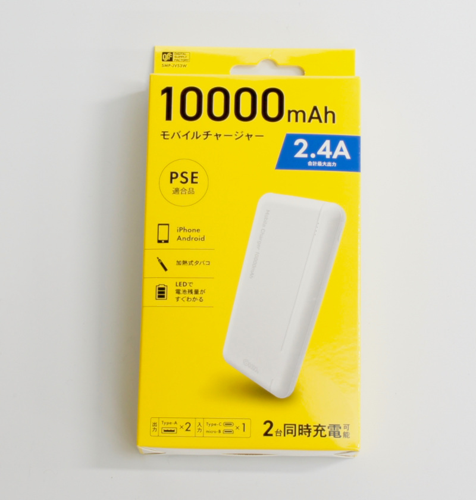|モバイルバッテリー SMP-JV53W 05-1196 定格容量 DC5V/6300mAh 繰り返し充電回数　約５００回 ※もしくは、下のモバイルバッテリーのいづれか| １個|		
||モバイルバッテリー　（BI-B3） ※新パッケージの場合| １個|
||モバイルバッテリー　（BI-B3） ※旧パッケージの場合| １個|
|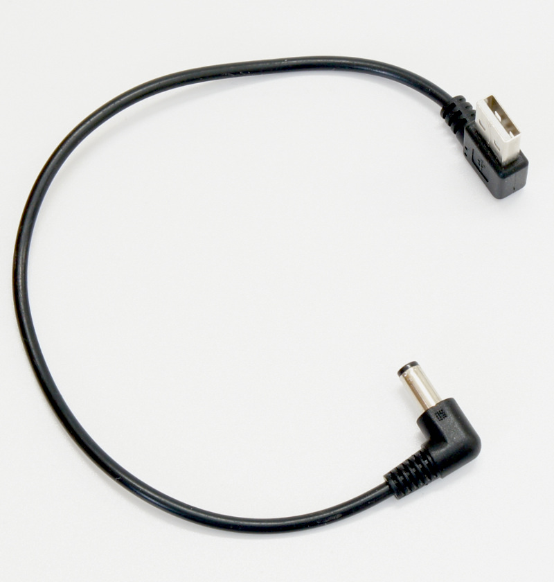|DCプラグ-USBケーブル 右向き|１本|
|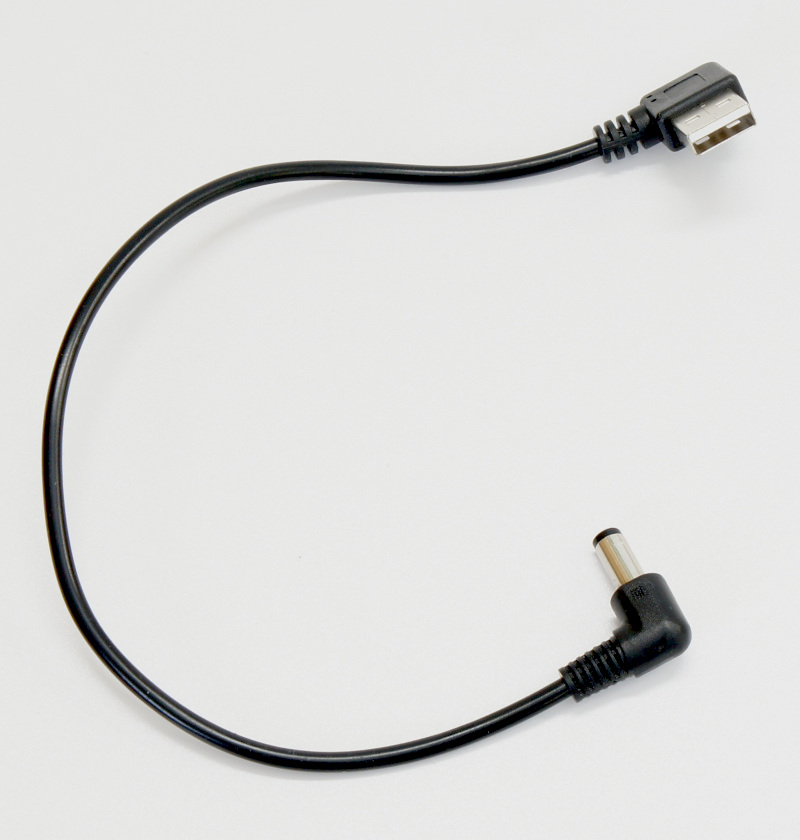|DCプラグ-USBケーブル 左向き  ※2022年8月出荷以降|１本|
||マイクロUSBケーブル  ※このケーブルでは充電できません。モバイルバッテリー付属の充電ケーブルをお使いください。   2022年7月以前|１本|
|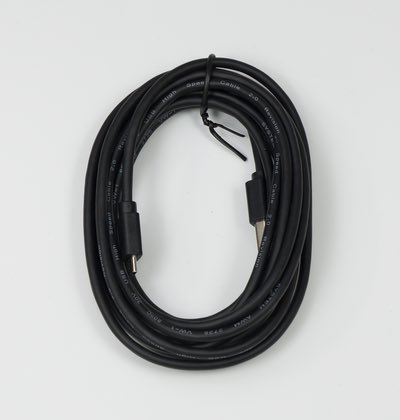|転送用USBケーブル(3m)|１本|
||SD Card(64GB),SDカードケース SunDisk|１個|
|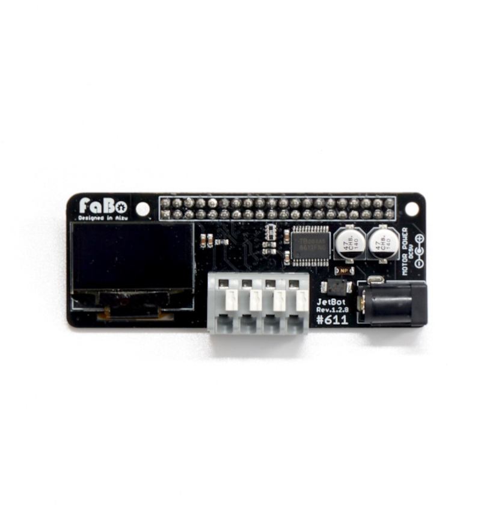 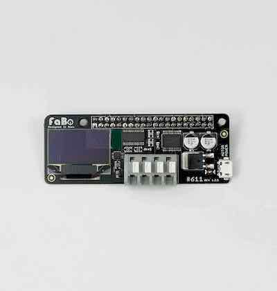|JetBot　ControllerBoard.JPG （FaBo #611） 上または下のの基板　 Rev1.2.8(上) Rev1.2.5(下)    |１枚|
||CPU Fan|１個|
||FAN取り付け用アクリル|１個|
|motor_kotei_lower001.jpg)|１．モーター固定部品  モーター固定金具 ・・・・2 皿ネジ M3×10・・・・4 ナット M3・・・・4 なべねじM3×30・・・・4|１袋|
|_caster_kotei001.jpg)|２．キャスター固定部品  皿ネジM3×15・・・・4 ナットM3・・・・4|１袋|
|_carbon_kotei001.jpg) 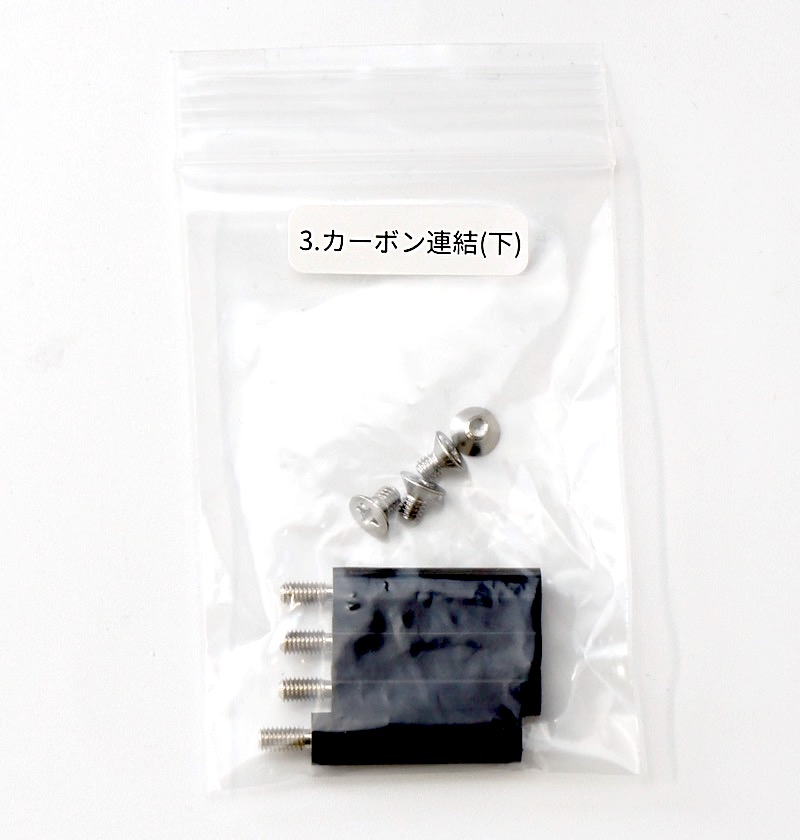|３．カーボン連結（下）部品  六角スペーサーM3×24・・・・4 皿ネジM3×5・・・・4 ※写真は、上または下のいずれかになります。|１袋|
|carbon_kotei_upper001.jpg) |４．カーボン連結（上）部品  六角スペーサーM3×20（白）・・・・4 ナットM3・・・・4 ※写真は、上または下のいずれかになります。|１袋|
||５．カメラ固定部品  六角穴付きボルトセルフタッピングねじ M2.0×5・・・・4 皿ねじ M3.0 × 15・・・・4 ナット M3.0・・・4  または、 六角穴付きボルトセルフタッピングねじ M2.0×5・・・・4 皿ねじ M3.0 × 12・・・・4 ナット M3.0・・・4 |１袋|
|jetson_kotei001.jpg) 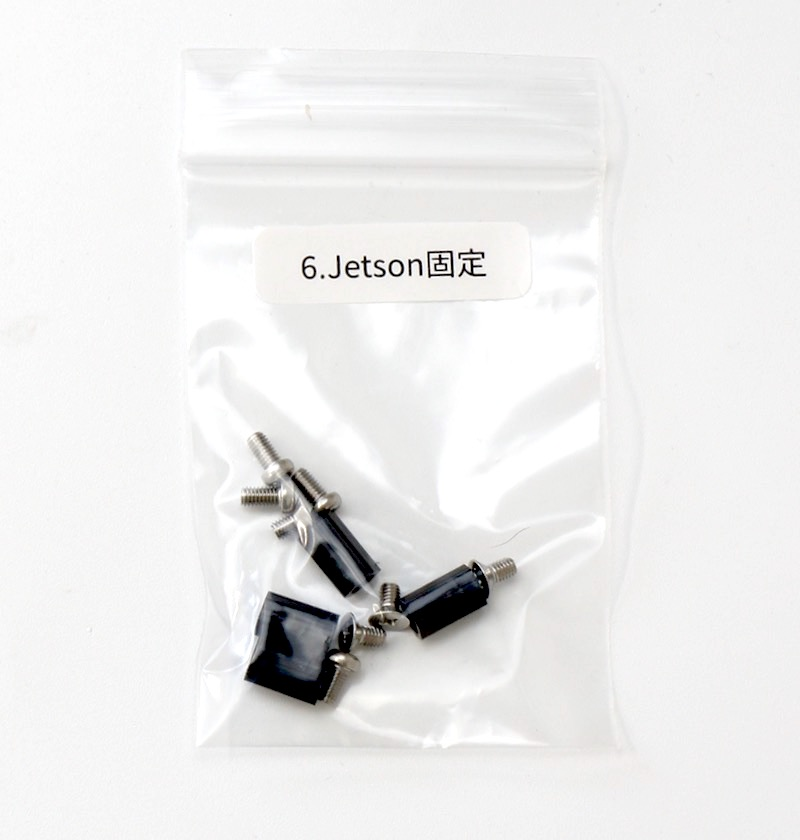|６．Jetson固定部品  六角スペーサー（両メネジ白10ミリ）・・・・4 皿ネジM2.6×5・・・・4 なべねじM2.6×5・・・・4  または、  六角スペーサー（両メネジ黒10ミリ）・・・・4 皿ネジM2.6×5・・・・4 なべねじM2.6×5・・・・4  ※写真は、上または下のいずれかになります。|１袋|
||ファンねじ  M2.5×14・・・・4 ナットM2.5・・・・5(ヨビ１)|１袋|
||六角レンチ 1.5|１本|
||両面テープ|２枚|
||プラスドライバー +2×100|１本|
|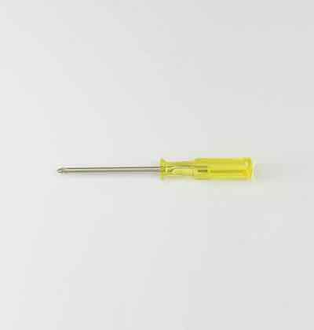|精密ドライバー　P柄|１本|
|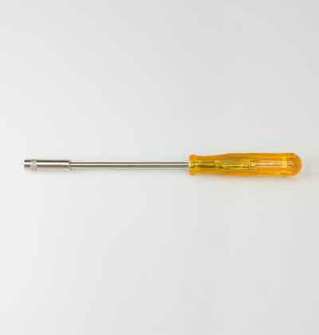|ナットドライバー ５．５|１本|
||精密ドライバセット　ED−２０|１セット|
||Jumperピン１個|
|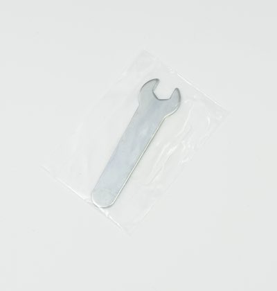|スパナ  ８平スパナ|１個|
||結束バンド|１本|

※ベアボーンモデルはJetson Nano開発者キットは付属しません。

※開封後はすぐ欠品がないかご確認お願いいたします。
