# 組み立てマニュアル(初期型、Bタイプ)

対象モデル

|コード番号|
|:--|
|JB-4GB-Carbon-S（初期型）|
|JB-4GB-Carbon-S-B（Bタイプ）|
|JB-4GB-Carbon-B（初期型ベアボーン）|

## 1. モーターの取り付け

|写真|部品または工具|個数|
|:--|:--|:--:|
|{: style="height:210px;width:200px"}|1.モーター固定ネジ(袋)|1|
|{: style="height:210px;width:200px"}|ギヤモーター|2|
|{: style="height:210px;width:200px"}|プラスドライバー +2×100|１本|

モーターに固定金具を取り付けていきます。

固定具を取り付けネジで固定します。

金具は内側にそれぞれ対になる向きに取り付けます。

カーボンプレートに、モーターを接続します。

## 2. カーボン連結ネジの取り付け

|写真|部品または工具|個数|
|:--|:--|:--:|
|{: style="height:210px;width:200px"}|3.カーボン連結ネジ袋|1|
|{: style="height:210px;width:200px"}|プラスドライバー +2×100|１本|

カーボン連結用のスペーサーを接続します。

## 3. ボールキャスター組み立て

|写真|部品または工具|個数|
|:--|:--|:--:|
|{: style="height:210px;width:200px"}|ボールキャスター|1|
|_caster_kotei001.jpg){: style="height:210px;width:200px"}|２．キャスター固定|１袋|
|{: style="height:210px;width:200px"}|プラスドライバー +2×100|１本|

キャスターの組み立てをおこないます。

まず、ボールを取り付けます。

3本の棒をボールのうえに配置します。

プラスチック部品または工具を取り付けます。

長い方に取り付け、ネジで固定します。

## 4. キャスターの固定

|写真|部品または工具|個数|
|:--|:--|:--:|
|{: style="height:210px;width:200px"}|2.キャスター固定ネジ袋|1|
|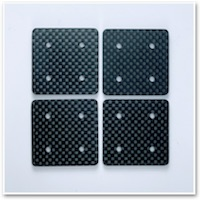{: style="height:210px;width:200px"}|キャスター固定カーボン|4|
|{: style="height:210px;width:200px"}|カーボン中段|1|
|{: style="height:210px;width:200px"}|プラスドライバー +2×100|１本|

ボールキャスターをカーボンに取り付けます。

キャスター固定カーボン4枚を重ねて取り付けます。

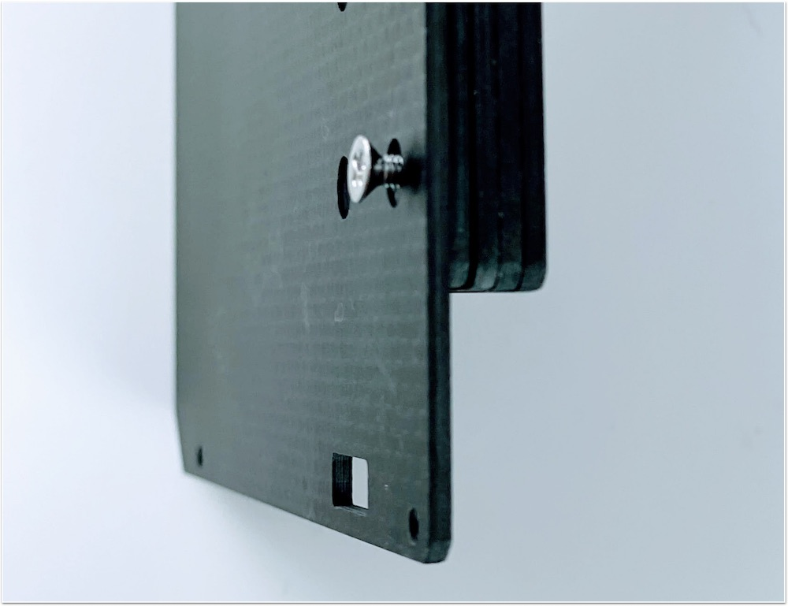

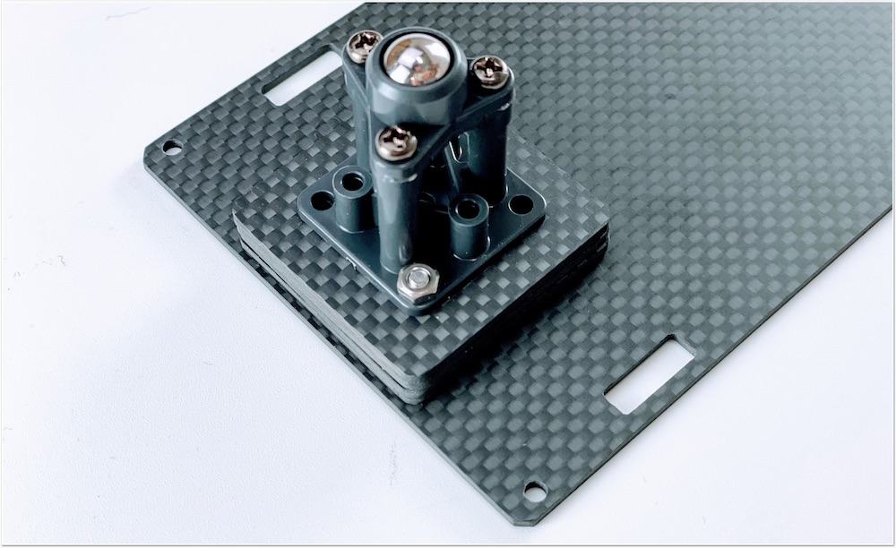

## 5. カーボンの取り付け

|写真|部品または工具|個数|
|:--|:--|:--:|
|{: style="height:210px;width:200px"}|4.カーボン固定ネジ(上)|1|

下段のカーボンと中段のカーボンを連結します。

モーターの線も穴から出しておきます。

白いスペーサーで、4隅を固定します。

## 6. タイヤの取り付け

|写真|部品または工具|個数|
|:--|:--|:--:|
|{: style="height:210px;width:200px"}|タイヤ|2|
|{: style="height:210px;width:200px"}|精密ドライバー|1|

タイヤを装着します。

## 7. バッテリーの取り付け

|写真|部品または工具|個数|
|:--|:--|:--:|
|{: style="height:210px;width:200px"}|両面テープ|1|
|{: style="height:210px;width:200px"}|モバイルバッテリー（旧パッケージの場合）|1|
|{: style="height:210px;width:200px"}|モバイルバッテリー（新パッケージの場合）|1|

バッテリーを両面テープで装着します。

## 8. カーボン上段の取り付け

|写真|部品または工具|個数|
|:--|:--|:--:|
|{: style="height:210px;width:200px"}|6.Jetson固定ネジ袋|1|
|{: style="height:210px;width:200px"}|カーボン上段|1|
|{: style="height:210px;width:200px"}|精密ドライバセット　ED−２０|1|

Jetson固定ネジを取り付けます。

## 9. Wi-Fi Moduleの取り付け

|写真|部品または工具|個数|
|:--|:--|:--:|
|{: style="height:210px;width:200px"}|Jetson Nano 開発者キット B01,A02|1|
|{: style="height:210px;width:200px"}|Intel Dual Bandwireless-AC 8265 Desktop Kit（４GBモデルのみ）|1|
|{: style="height:210px;width:200px"}|Jetbot CameraMount　（４GBモデル）|1|
|{: style="height:210px;width:200px"}|スパナ ※JB-4GB-Carbon-S-Bは、スパナ２枚付属|1|
|{: style="height:210px;width:200px"}|精密ドライバーセット　ED−２０|1|
|{: style="height:210px;width:200px"}|プラスドライバー +2×100|1|

Kitに搭載されているJetson Nanoが、``Rev.B01``か``Rev.A02``かを確認します。見分け方として、CSIカメラポートが2つ付いているのが``Rev.B01``で、1つしか付いていないのがRev.A02になります。

Wi-Fi Moduleを取り付けるために、真ん中のネジを外しておきます。

両側のネジを外します。

両サイドの留め具を外に開き、Jetson Nano Moduleを取り外します。

両サイドに広げると、Jetson Nano Moduleがポップアップします。

Jetson Nano Moduleを取り外すと、ネジが見えます。

Wifi Moduleを取り付けるために、真ん中のネジを外しておきます。

※ネジの山カケには注意しましょう。

Wi-Fi Moduleは、Intel Dual Bandwireless-AC 8265 Desktop Kitを取り付けます。

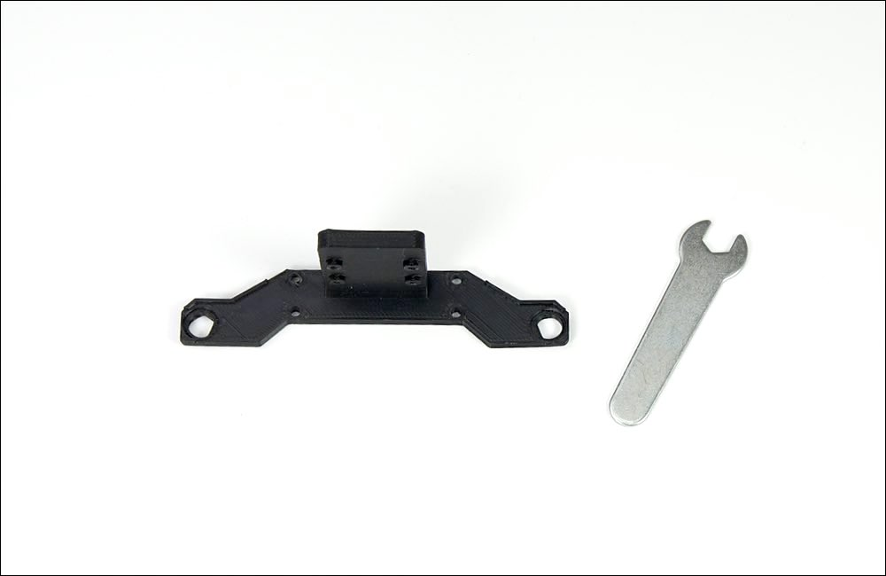

!!!Info "技適"
	箱の横に技適番号が記載されています。
	

	|項目|認証番号|
	|:--|:--|
	|R|003‐160104|
	|T|D160055003|

箱から取り出し、スパナで金色のアンテナ固定ネジをゆるめ、銀色のプレートから取外しておきます。

モジュールの端子と接続します。

外したアンテナ固定ネジは、カメラマウントのパーツに取り付けておきます。

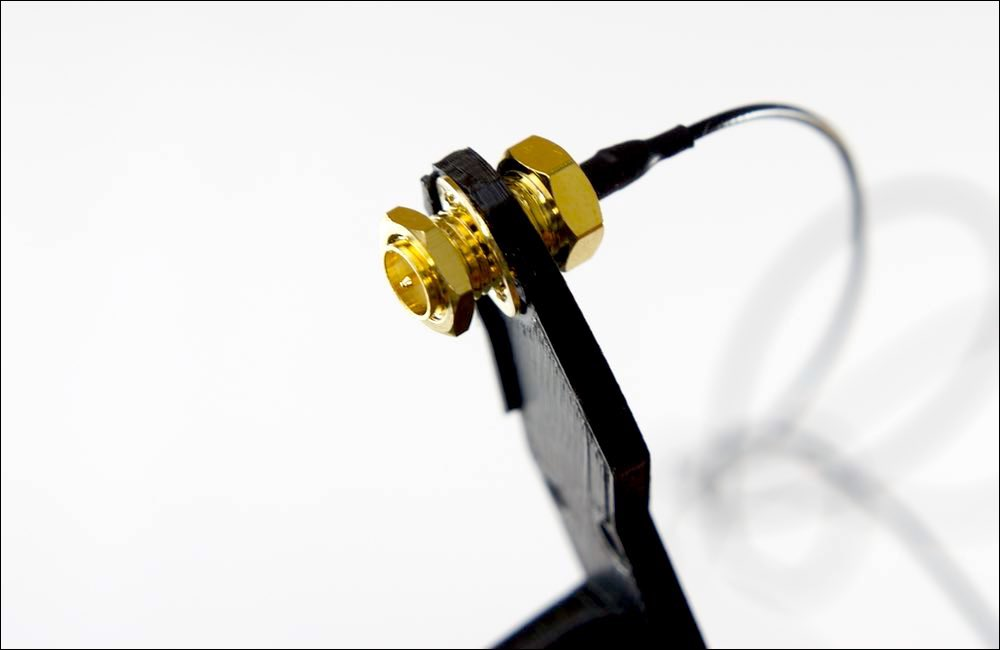

スパナで締めます。

※FaBo JetBot　コード番号：JB-4GB-Carbon-S-Bは、２枚のスパナを使って締めます。

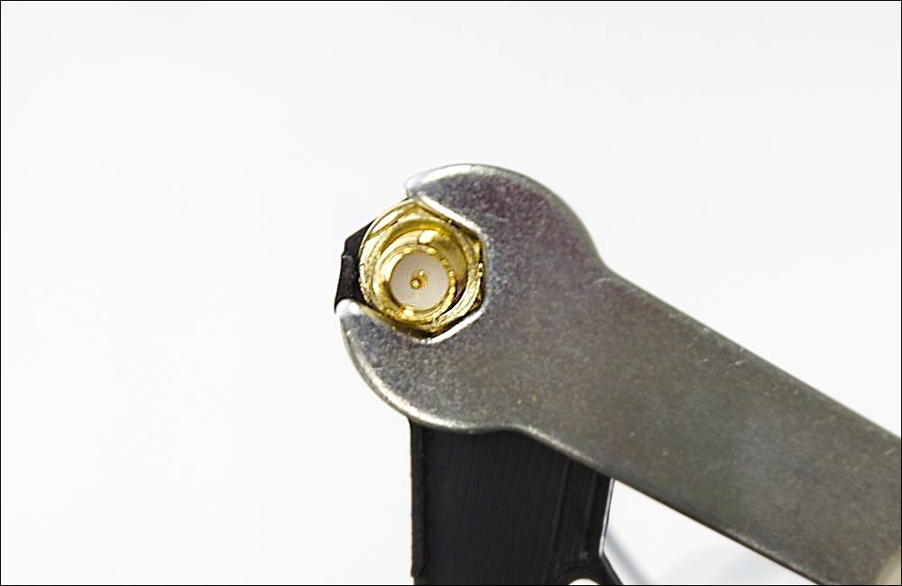

カメラマウントの左右に取り付けます。

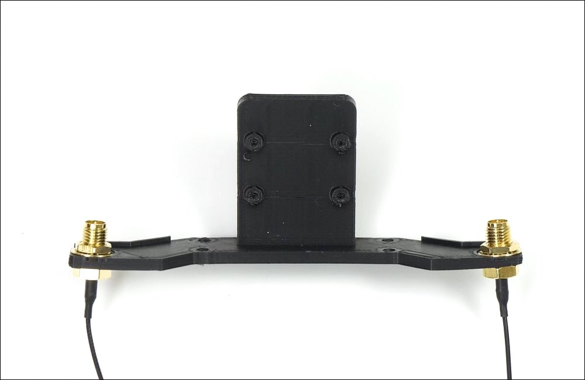

以下のようになります。

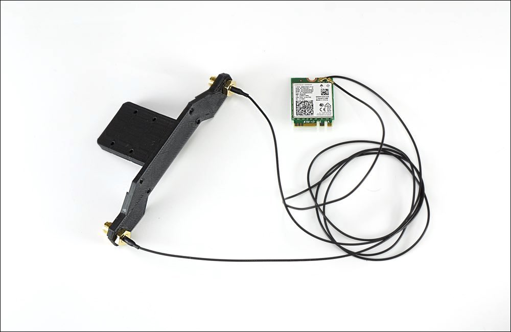

ドライバーで取り付けます。

Wi-Fi Moduleの取り付けが完了したら、Jetson Nano Moduleを再び取り付けます。

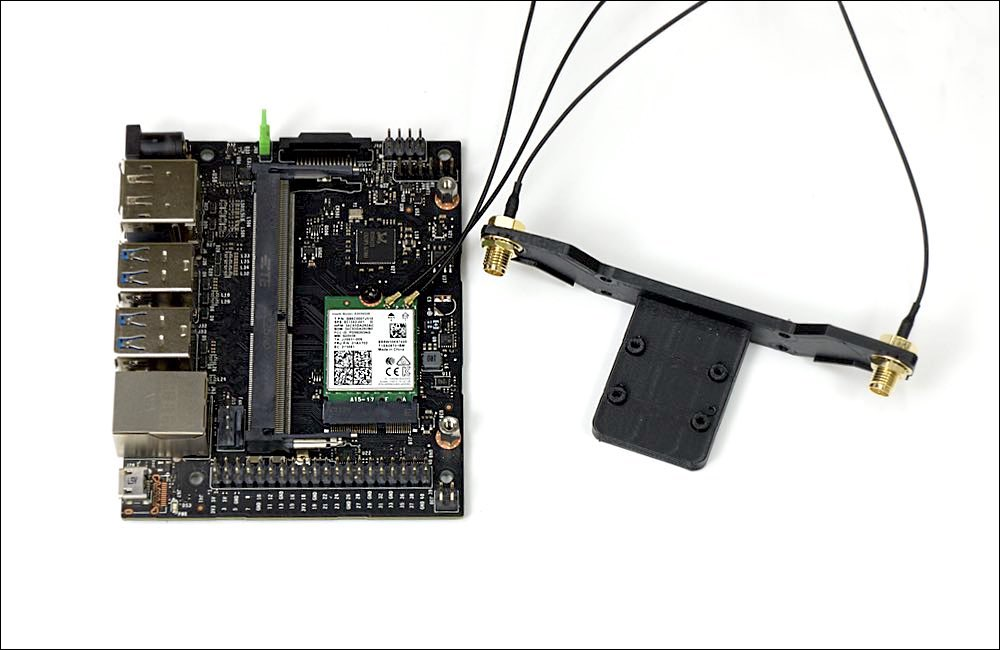

Jetson Nano Moduleを再び装着し、ネジ止めします。

## 10. カメラの取り付け

|写真|部品または工具|個数|
|:--|:--|:--:|
|{: style="height:210px;width:200px"}|CAM026 IMX219-160°|1|
|camerakotei001.jpg){: style="height:210px;width:200px"}|５．カメラ固定|1|
|{: style="height:210px;width:200px"}|六角レンチ|1|

カメラモジュールを用意します。

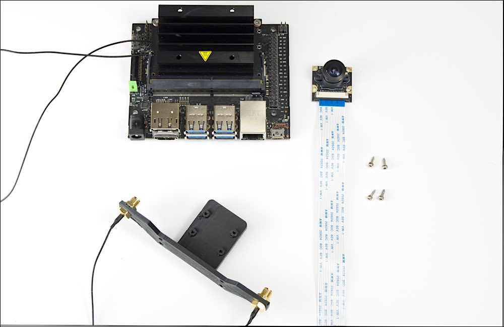

カメラモジュールの４つの穴に六角レンチ棒を使いM2.0のタッピンングビスでカメラを取り付けます。

カメラの取り付けは終了となります。

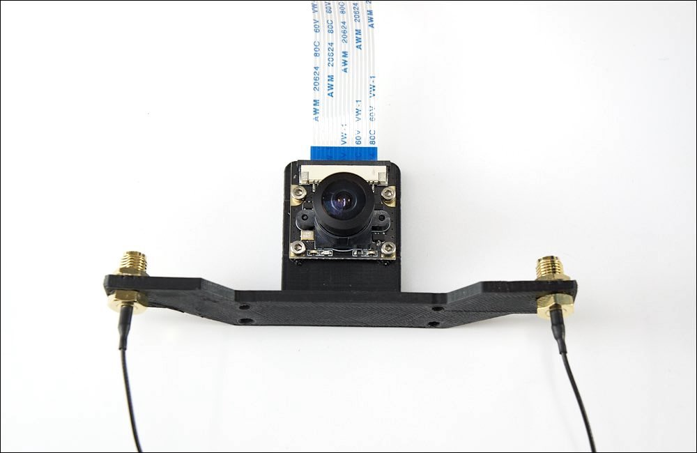

## 11. 本体に結合

|写真|部品または工具|個数|
|:--|:--|:--:|
|camerakotei001.jpg){: style="height:210px;width:200px"}|５．カメラ固定|1|
|{: style="height:210px;width:200px"}|プラスドライバー +2×100|1|
|{: style="height:210px;width:200px"}|ナットドライバー ５．５|1|

カメラマウントとシャーシと結合します。

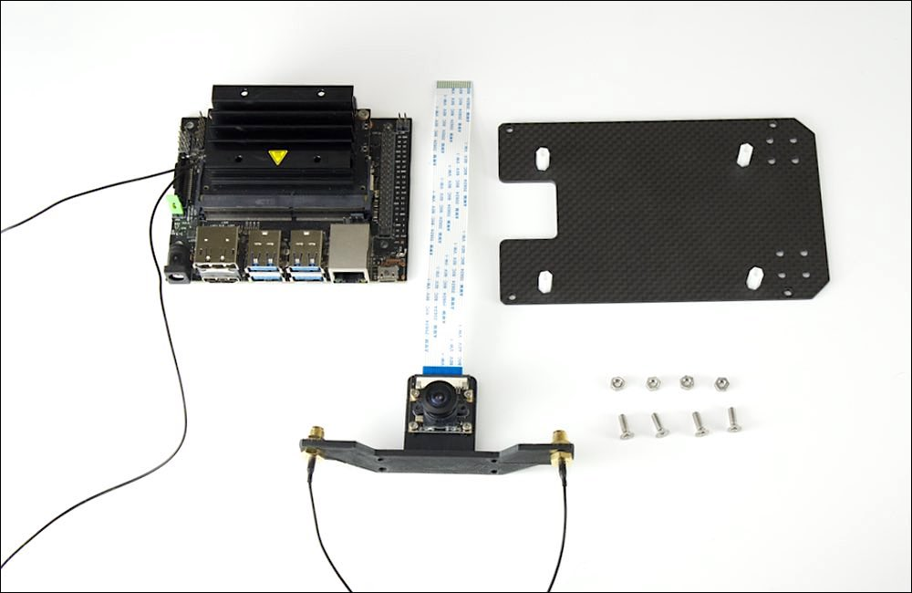

シャーシの裏には４箇所皿ネジを使用します。

カメラモジュールには４箇所、M３のナットを使用し、ナットドライバーでしっかり固定します。

カメラマウント取り付け完了。

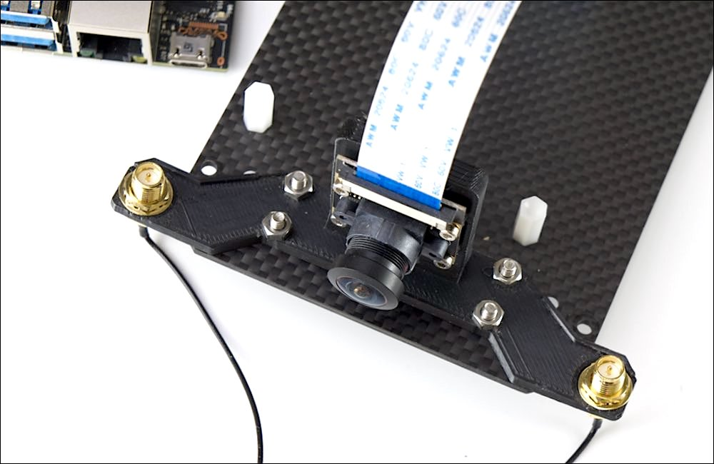

シャーシ最上部と真ん中のシャーシを結合します。

シャーシどおし結合します。M3ナットで4隅を固定します。

ナットドライバでナットを締めます。

## 12. Jetson取り付け

|写真|部品または工具|個数|
|:--|:--|:--:|
|{: style="height:210px;width:200px"}|Jetson Nano 開発者キット B01,A02|１枚|
|{: style="height:210px;width:200px"}|精密ドライバーセット　ED−２０|1|

Jetson Nanoとシャーシを取り付けます。

スクリューねじでJetsonNanoを４箇所のねじで固定します。

## 13. Cameraケーブルの取り付け

## 14. CPU Fanの取り付け

|写真|部品または工具|個数|
|:--|:--|:--:|
|{: style="height:210px;width:200px"}|CPU Fanと取り付けジグ|1セット|
|{: style="height:210px;width:200px"}|CPU Fan取り付け用ネジ|1|
|{: style="height:210px;width:200px"}|六角レンチ|1|

## 15. Controller Boardの取り付け

|写真|部品または工具|個数|
|:--|:--|:--:|
|{: style="height:210px;width:200px"}|コントローラーボード|1|

## 16. SDカードの差し込み

|写真|部品または工具|個数|
|:--|:--|:--:|
|{: style="height:210px;width:200px"}|SD Card(64GB),SDカードケース SunDisk|１個|

## 17. Jumperピンの設定

|写真|部品または工具|個数|
|:--|:--|:--:|
|{: style="height:210px;width:200px"}|Jumperピン（JetsonNano開発者キットB01は標準で付属）|１個|

使用するJetson Nanoが``Rev.A02``か、``Rev.B01``かを確認します。

DC電源からの給電を有効にするために、``Rev.A02``、``Rev.B01``の場合で、下記の箇所のJumperPinの設定をおこないます。

## 18. その他

|写真|部品または工具|個数|
|:--|:--|:--:|
|{: style="height:210px;width:200px"}|結束バンド|1|

Wi-Fiアンテナのケーブルを結束バンドを使用してケーブルを収納します。

結束バンドでWIFI2本のケーブルを束ねます。

束ねたケーブルは、Jetson Nano開発者キットの基板の下へ格納します。

## 19. 完成

|写真|部品または工具|個数|
|:--|:--|:--:|
|{: style="height:210px;width:200px"}|マイクロUSBケーブル | 1|
|{: style="height:210px;width:200px"}|DCプラグ-USBケーブル|1|
|{: style="height:210px;width:200px"}|Intel Dual Bandwireless-AC 8265 Desktop Kit アンテナ２つ|1|

いよいよ完成です。電源接続します。モバイルバッテリーからJetsonNanoのDCジャックとマイクロUSBに接続します。

Wi-Fiのアンテナを立てます。アンテナを回してねじ込みます。

左右にWi-Fiアンテナを２つ立てます。

マイクロUSBケーブルは下記のようにコントローラーボードと繋ぎます。

次に、DCプラグケーブルをモバイルバッテリーと刺し、DCプラグ側は、モータの間を前方にケーブルを通します。

DCプラグがボディの間を通過した様子。

DCプラグをJetsonNano開発者キットのDCジャックへ接続します。JetsonNanoの電源が入ります。

おめでとうございます。JetBotの完成です。カメラモジュールのレンズキャップを装着している場合は外します。

