# 組み立てマニュアル(その2)

## 5. Wi-Fi モジュールの取り付け

|写真|種類|個数|
|:--|:--|:--|
||Jetson Nano|1|
|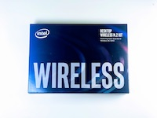|Intel Dual Bandwireless-AC 8265 Desktop Kit|1|
|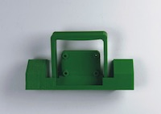|JetBot カメラマウント|1|

Kitに搭載されているJetson Nanoが、``Rev.B01``か``Rev.A02``かを確認します。見分け方として、CSIカメラポートが2つ付いているのが``Rev.B01``で、1つしか付いていないのがRev.A02になります。

Wi-Fi モジュールを取り付けるために、Jetson Nano モジュールを取り外します。

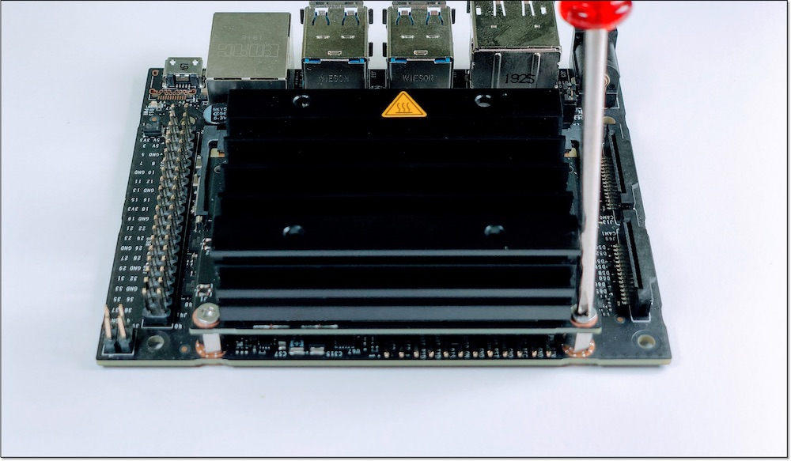

両サイドの留め具を外に開き、Jetson Nano モジュールを取り外します。

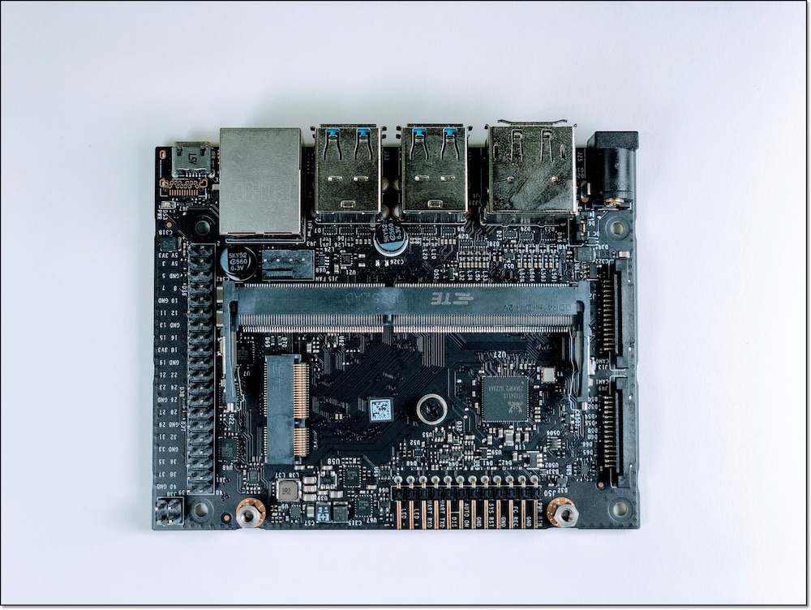

Wi-Fi モジュールを取り付けるために、真ん中のネジを外しておきます。

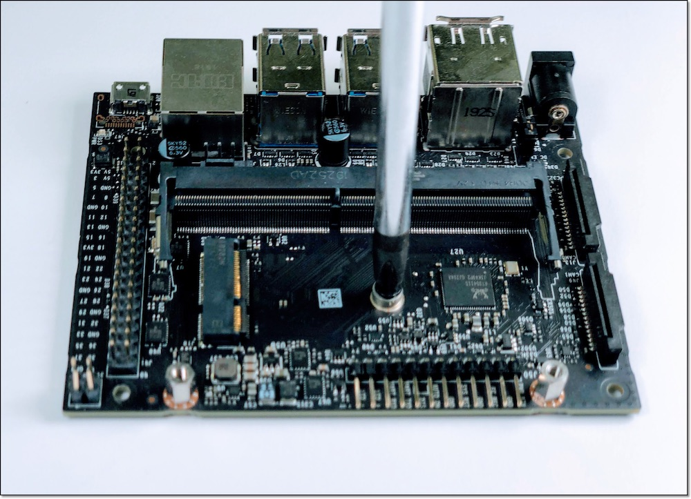

Wi-Fi モジュールは、Intel Dual Bandwireless-AC 8265 Desktop Kitを取り付けます。

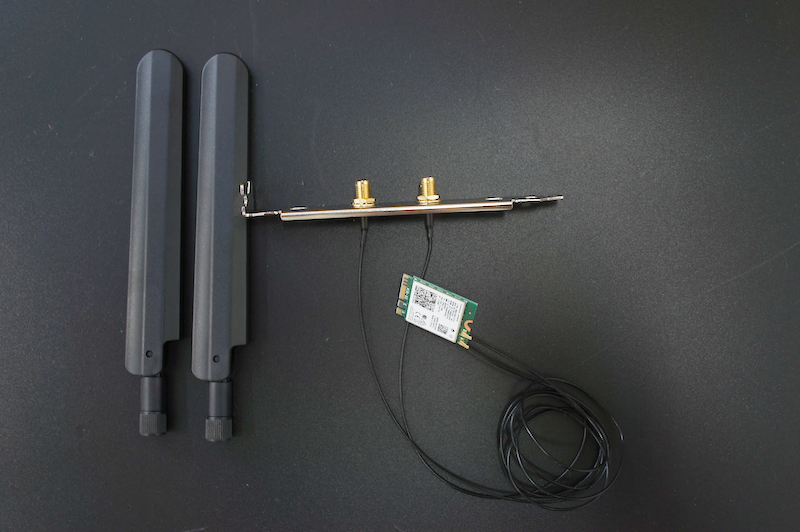

!!!Info "技適"
	箱の横に技適番号が記載されています。
	

	|項目|認証番号|
	|:--|:--|
	|R|003‐160104|
	|T|D160055003|

箱から取り出し、スパナで金色のアンテナ固定ネジをゆるめ、銀色のプレートから取外しておきます。

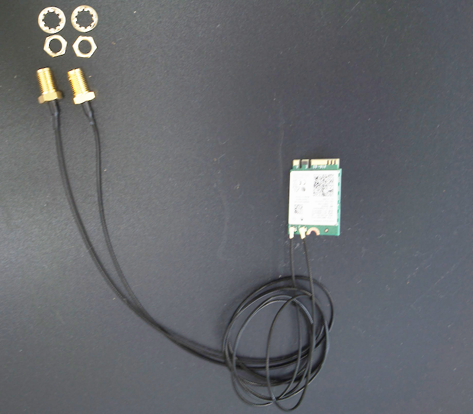

外したアンテナ固定ネジは、カメラマウントのパーツに取り付けておきます。

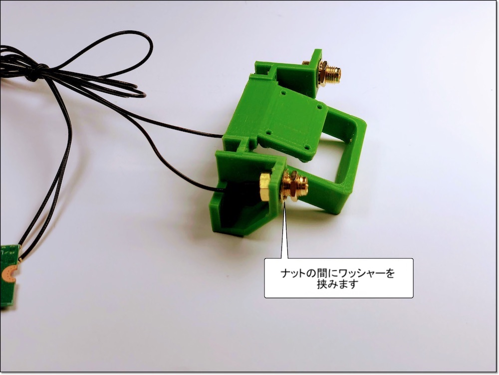

Wi-Fi モジュールの取り付けが完了したら、Jetson Nano モジュールを再び取り付けます。

Jetson Nano モジュールを再び装着し、ネジ止めします。

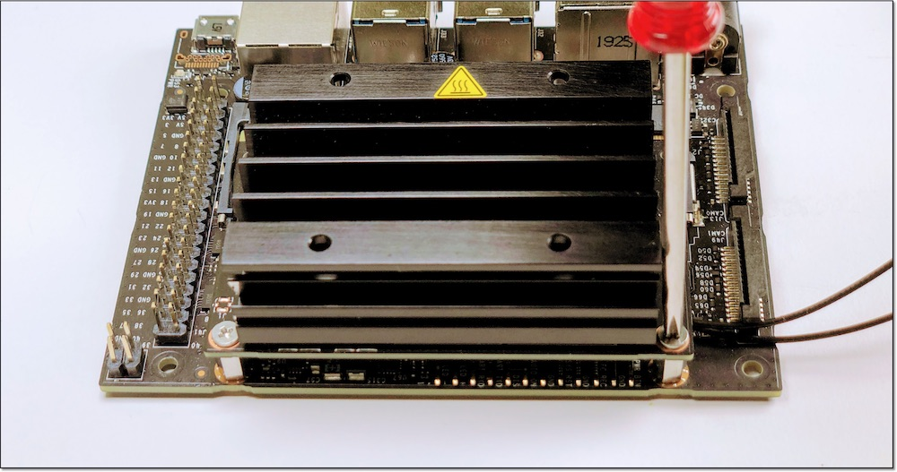

## 6. Jetson Nanoの取り付け

|写真|種類|個数|
|:--|:--|:--|
||M2-6mmタッピング|4|

## 7. カメラの装着

|写真|種類|個数|
|:--|:--|:--|
||LI-IMX219-MIPI-FF-NANO|1|
||M2-6mmタッピング|8|

カメラマウントにカメラを取り付けます。

両サイドを指で掴んで持ち上げます。

!!!warning  "注意点"
	強く持ち上げすぎるとプラスチックが破損するので注意してください。

カメラのコネクターを差し込み、コネクターを押し込み固定します。

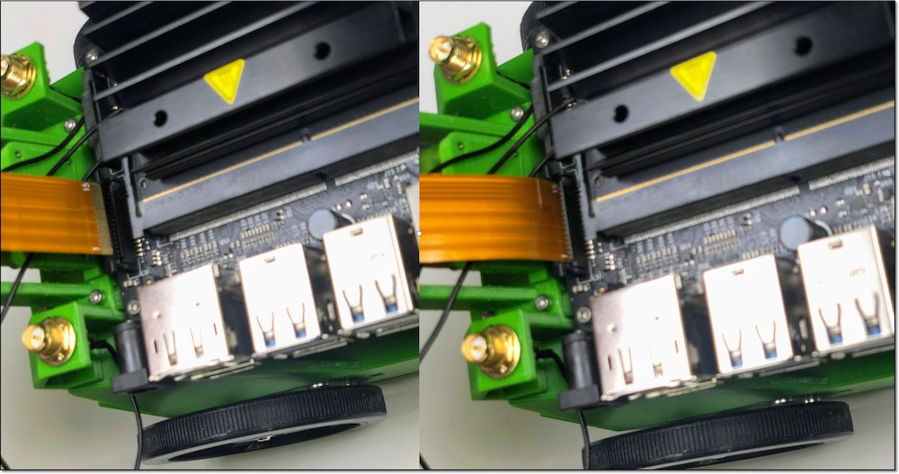

親指と人差し指の爪で、コネクタの両サイドを押し込み、ケーブルを固定します。

Wi-Fiのケーブルが長いために、下図のように結束バンドで束ね、カメラケーブルとカメラの間あたりに配置します。

## 8. CPUファンの取り付け

|写真|種類|個数|
|:--|:--|:--|
||CPUファン|1|
|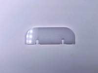|CPUファン取り付けジグ|1|
|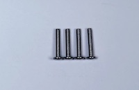|M2.5-14mmネジ|4|
||M2.5ナット|4|

ネジを透明のアクリルで作成された`CPUファン取り付けジグ`の上にはめます。

`CPUファン取り付けジグ`をJetson Nanoの放熱板の上板の下に入れます。

上から六角ネジで締めます。下の`CPUファン取り付けジグ`に取り付けたナットにネジが刺さるように調整し、ネジを締めます。

反対サイドも同様の手順で、ネジを締めます。

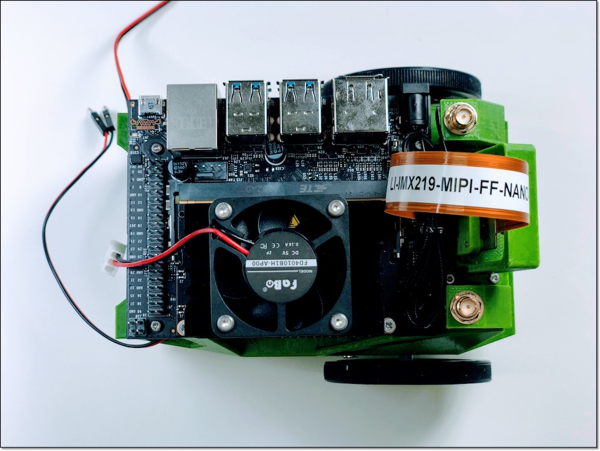

ケーブルをJetson Nanoに接続します。

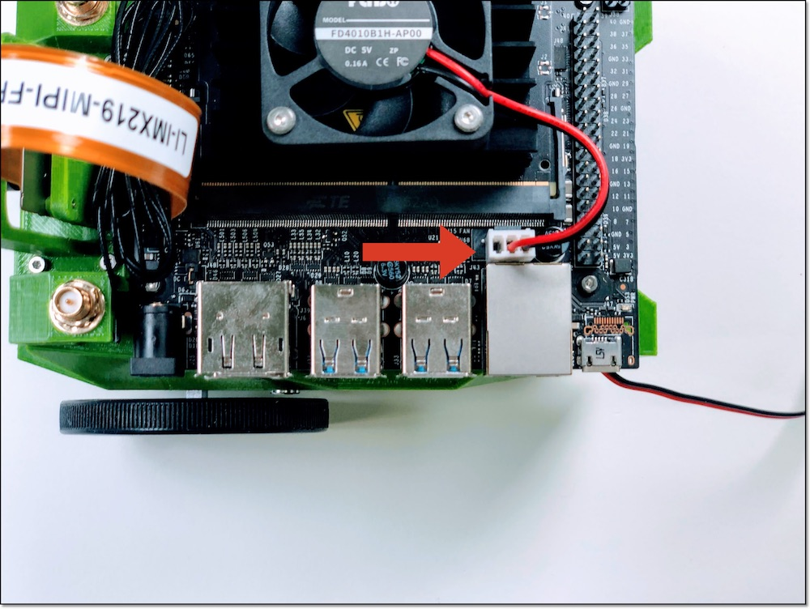

## ここまでの完成イメージ

