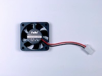
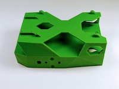
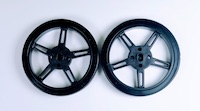
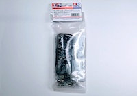
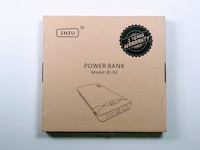
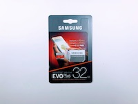
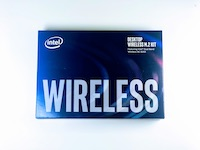
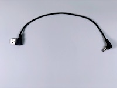

# BOM(Nano)

## 0. BOM

|写真|部品|個数|
|:--|:--|:--|
||Jetson Nano|1枚|
||LI-IMX219-MIPI-FF-NANO|1個|
||CPU Fan|1個|
||Jetbot Body|1個|		
||Jetbot CameraMount　|1個|	
||Jetbot GearMotor　|2個|		
||Jetbot タイヤ　|2個|
||Jetbot用ネジ　|2個|		
||ボールキャスター　（70144）| 1箱|		
||バッテリー　（BI-B3）| 1個|		
||M2x6 タッピングネジ|12本|
||M3x10 六角ネジ|4本|
||M3x24 六角ネジ|4本|
||M3ナット|8個|
||M2.5x14 六角ネジ|4本|
||M2.5ナット|4個|		
||JetBot　ControllerBoard　（FaBo #611）	|1枚|
||SD Card（32GB）　（32　EVO Plus）|1枚|		
||Intel Dual Bandwireless-AC 8265 Desktop Kit|1個|
||Jumperピン|1個|
||モーター用USB Cable|1本|
||DC-USBケーブル|1個|
||転送用USBケーブル(3m)|1本|
||両面テープ|2枚|
||スパナ(ミニ)|1本|
||六角レンチ|2本|
||プラスドライバー|2本|
||箱（ワンタッチ式60サイズ）|1個|
