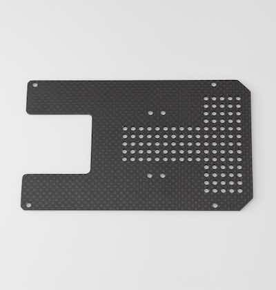
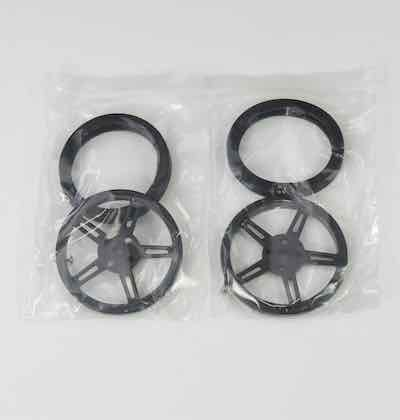

# BOM(Nano)

## 0. BOM

|写真|部品|個数|
|:--|:--|:--|
||Jetson Nano開発者キット２GB (JetBot Kit ２GBモデル)|１枚|
||Jetson NanoB01,A02 ４GB (JetBot Kit ４GBモデル)|１枚|
||CAM026 IMX219-160|１個|
||カーボン TOP|１枚|
||カーボン MIDDLE|１枚|    
||カーボン BOTTOM|１枚| 
||カーボン PLATE|４枚| 
||Jetbot CameraMount　（２GBモデル）|１個|	
||Jetbot CameraMount　（４GBモデル）|１個|    
||USB Wifi A600 無線LAN 子機（２GBモデルのみ）　|１個| 
||Jetbot GearMotor　|２個|    
||Jetbot タイヤ,タイヤ取り付けネジ　|２袋|	
||ボールキャスター　（70144）| １箱|		
||バッテリー　（BI-B3）| １個|
||マイクロUSBケーブル             | １個|
||USB TypeCケーブル                 | １個|
||転送用USBケーブル(3m)|１本|
||SD Card(64GB),SDカードケース|１個|
||JetBot　ControllerBoard　（FaBo #611）    |１枚|
||CPU Fan|１個|
||FAN取り付け用アクリル|１個|
|motor_kotei_lower001.jpg)|１．モーター固定部品|１袋|
|_caster_kotei001.jpg)|２．キャスター固定部品|１袋|
|_carbon_kotei001.jpg)|３．カーボン連結（下）部品|１袋|
|carbon_kotei_upper001.jpg)|４．カーボン連結（上）部品|１袋|
|camerakotei001.jpg)|５．カメラ固定部品|１袋|
|jetson_kotei001.jpg)|６．Jetson固定部品|１袋|
||ファンねじ|１袋|
||六角レンチ 1.5|１本|
||両面テープ|２枚|
||プラスドライバー +2*100|１本|
||ナットドライバー 5.5 |１本|
||精密ドライバー　P柄 |１本|
||精密ドライバセット　ED−２０|１セット|
||Intel Dual Bandwireless-AC 8265 Desktop Kit（４GBモデルのみ）|１個|
||Jumperピン　（４GBモデルのみ）|１個|
||スパナ　（４GBモデルのみ）|１本|
||結束バンド（４GBモデルのみ）|１本|

※ベアボーンモデルはJetson Nano開発者キットは付属しません。

