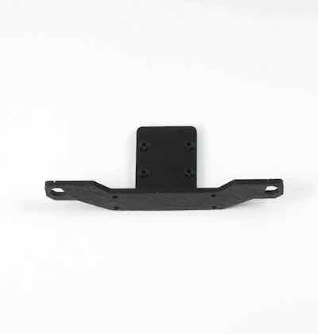

# BOM(部品表)

## 0. BOM(JetBot Kit Carbon Edition ２GBモデル及び４GBモデル)

※箱の側面に記載されている型番をご確認ください。

対象モデル

|コード番号|
|:--|
|JB-2GB-Carbon-S|
|JB-2GB-Carbon-B|
|JB-4GB-Carbon-S|
|JB-4GB-Carbon-S-B|
|JB-4GB-Carbon-B|

###その他のモデル 
※JB-4GB-Carbon-S-CおよびJB-4GB-Carbon-B-CのBOM（部品表）はこちらになります。 
[JB-4GB-Carbon-S-CおよびJB-4GB-Carbon-B-C　BOM](https://faboplatform.github.io/JetbotDocs/02.Building%28Carbon%29/4GB_model/C/JB_4GB-Carbon_X_C/)

※JB-4GB-Carbon-S-DおよびJB-4GB-Carbon-B-DのBOM（部品表）はこちらになります。 
[JB-4GB-Carbon-S-DおよびJB-4GB-Carbon-B-D　BOM](https://faboplatform.github.io/JetbotDocs/02.Building%28Carbon%29/4GB_model/D/JB_4GB_Carbon_X_D_BOM/)

 
 

|写真|部品|個数|
|:--|:--|:--|
||Jetson Nano ２GB 開発者キット  (JetBot Kit ２GBモデルに付属) ※ベアボーンキットには付属しません。|１枚|
||Jetson Nano 開発者キット B01 (JetBot Kit ４GBモデルに付属) ※ベアボーンキットには付属しません。|１枚|
||CAM026 IMX219-160°|１個|
||カーボン TOP|１枚|
||カーボン MIDDLE|１枚|    
||カーボン BOTTOM|１枚|
||カーボン PLATE|４枚|
||Jetbot CameraMount　（２GBモデル）|１個|
||Jetbot CameraMount　（４GBモデル）|１個|    
||USB Wifi A600 無線LAN 子機（２GBモデル）　|１個|
||Intel Dual Bandwireless-AC 8265 Desktop Kit（４GBモデル）|１個|
||Jetbot GearMotor　|２個|    
||Jetbot タイヤ,タイヤ取り付けネジ　|２袋|
||ボールキャスター　（70144）| １箱|		
||モバイルバッテリー　（BI-B3） ※新パッケージの場合| １個|
||モバイルバッテリー　（BI-B3） ※旧パッケージの場合| １個|
||マイクロUSBケーブル  ※このケーブルでは充電できません。モバイルバッテリー付属の充電ケーブルをお使いください。 | １本|
||USB TypeCケーブル（２GBモデルのみ）| １本|
||DCプラグ-USBケーブル（４GBモデルのみ）|１本|
||転送用USBケーブル(3m)|１本|
||SD Card(64GB),SDカードケース SunDisk|１個|
||JetBot　ControllerBoard　（FaBo #611）    |１枚|
||CPU Fan|１個|
||FAN取り付け用アクリル|１個|
|motor_kotei_lower001.jpg)|１．モーター固定部品  モーター固定金具 ・・・・2 皿ネジ M3×10・・・・4 ナット M3・・・・4 なべねじM3×30・・・・4|１袋|
|_caster_kotei001.jpg)|２．キャスター固定部品  皿ネジM3×15・・・・4 ナットM3・・・・4|１袋|
|_carbon_kotei001.jpg)|３．カーボン連結（下）部品  六角スペーサーM3×24・・・・4 皿ネジM3×5・・・・4|１袋|
|carbon_kotei_upper001.jpg)|４．カーボン連結（上）部品  六角スペーサーM3×20（白）・・・・4 ナットM3・・・・4|１袋|
|camerakotei001.jpg)|５．カメラ固定部品  皿ネジM3×10・・・・4 ナットM3・・・・4 六角穴付きボルトセルフタッピングねじ M2.0×5・・・・4|１袋|
|jetson_kotei001.jpg)|６．Jetson固定部品  六角スペーサー（両メネジ白10ミリ）・・・・4 皿ネジM2.6×5・・・・4 なべねじM2.6×5・・・・4|１袋|
||ファンねじ  M2.5×14・・・・4 ナットM2.5・・・・5(ヨビ１)|１袋|
||六角レンチ 1.5|１本|
||両面テープ|２枚|
||プラスドライバー +2×100|１本|
||精密ドライバー　P柄|１本|
||ナットドライバー ５．５|１本|
||精密ドライバセット　ED−２０|１セット|
||Jumperピン（４GBモデルのみ）|１個|
||スパナ　（４GBモデルのみ）  ８平スパナ  ※JB-4GB-Carbon-S-Bは、２個付属|１個|
||結束バンド（４GBモデルのみ）|１本|

※ベアボーンモデルはJetson Nano開発者キットは付属しません。

※開封後はすぐ欠品がないかご確認お願いいたします。
