# 組み立てマニュアル(Carbon 4GB)

## 1. モーターの取り付け

|写真|部品|個数|
|:--|:--|:--|
||1.モーター固定ネジ(袋)|1|
|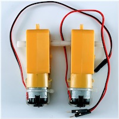|ギヤモーター|2|

モーターに固定金具を取り付けていきます。

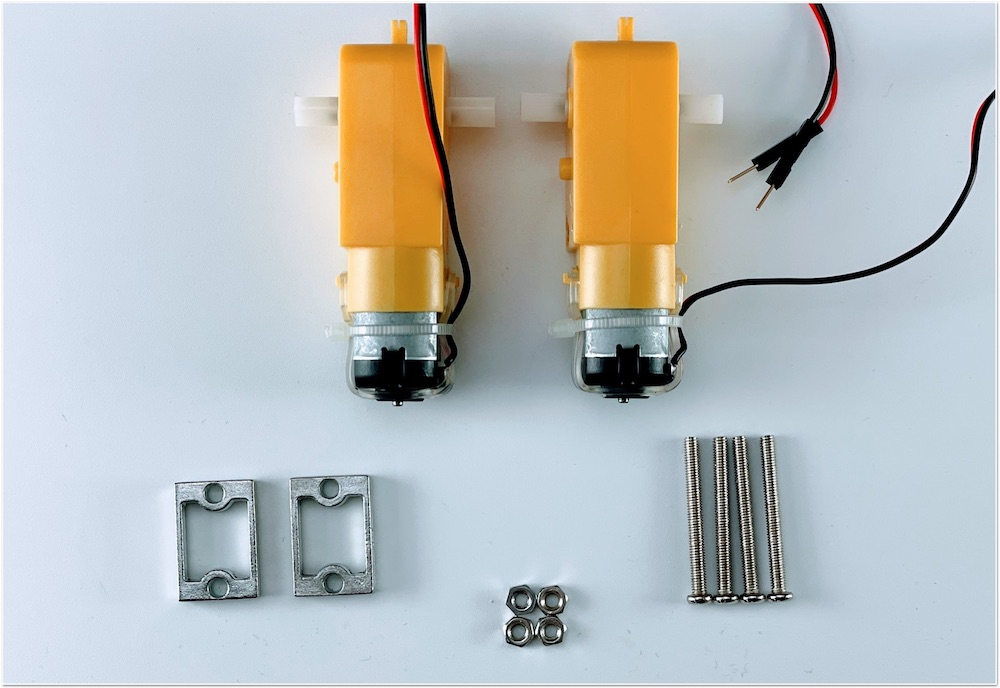

固定具を取り付けネジで固定します。

金具は内側にそれぞれ対になる向きに取り付けます。

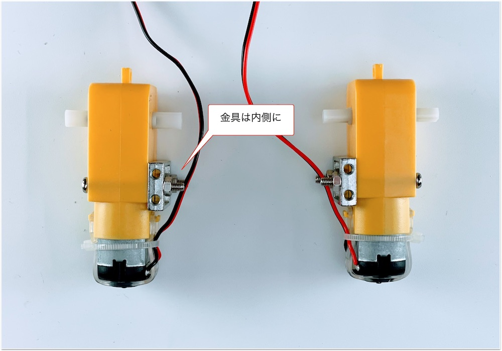

カーボンプレートに、モーターを接続します。

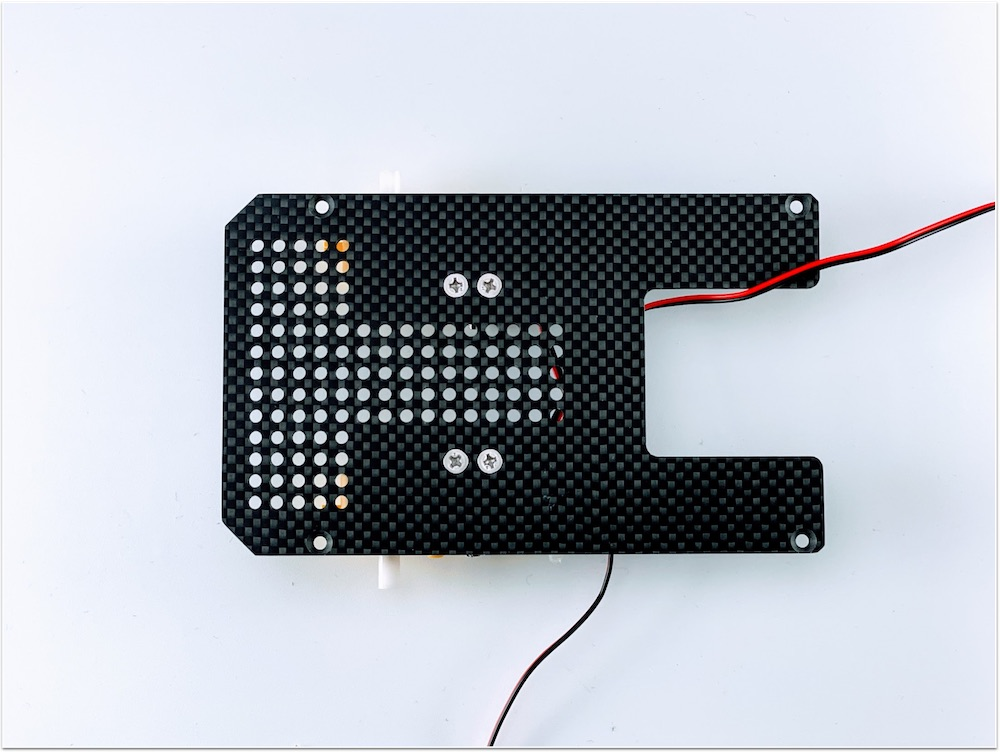

## 2. カーボン連結ネジの取り付け

|写真|部品|個数|
|:--|:--|:--|
||3.カーボン連結ネジ袋|1|

カーボン連結用のスペーサーを接続します。

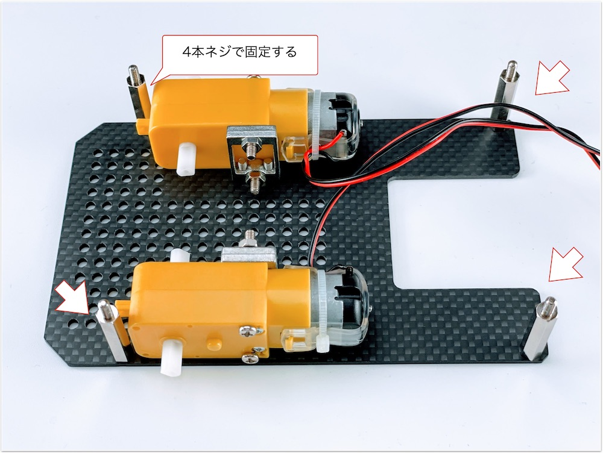

## 3. ボールキャスター組み立て

|写真|部品|個数|
|:--|:--|:--|
||ボールキャスター|1|

キャスターの組み立てをおこないます。

まず、ボールを取り付けます。

3本の棒をボールのうえに配置します。

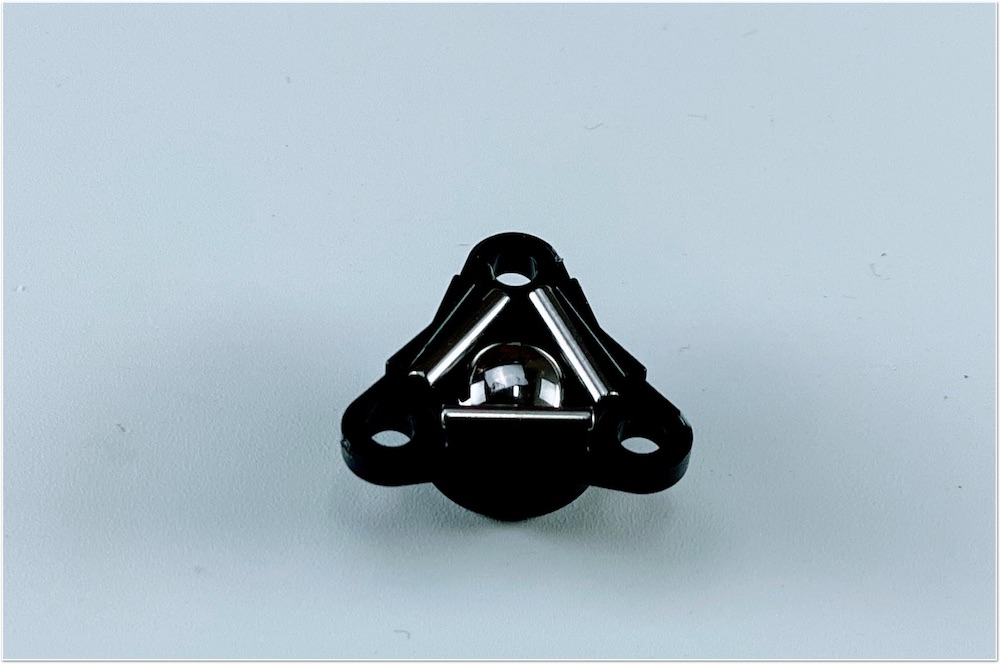

プラスチック部品を取り付けます。

長い方に取り付け、ネジで固定します。

## 4. キャスターの固定

|写真|部品|個数|
|:--|:--|:--|
||2.キャスター固定ネジ袋|1|
||キャスター固定カーボン|4|
||カーボン中段|1|

ボールキャスターをカーボンに取り付けます。

キャスター固定カーボン4枚を重ねて取り付けます。

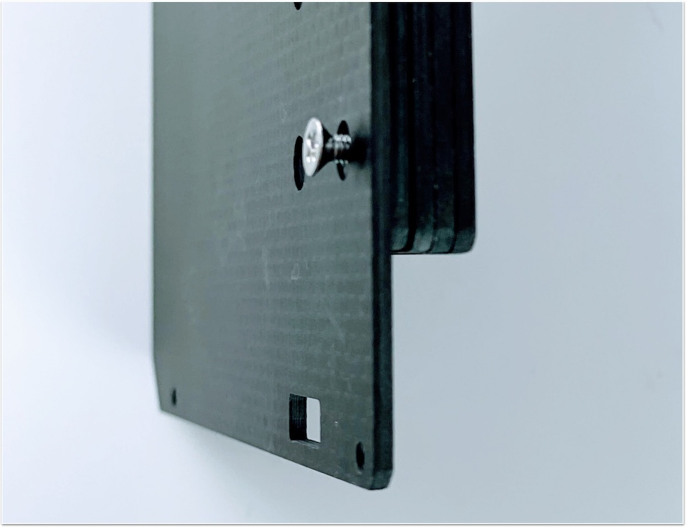

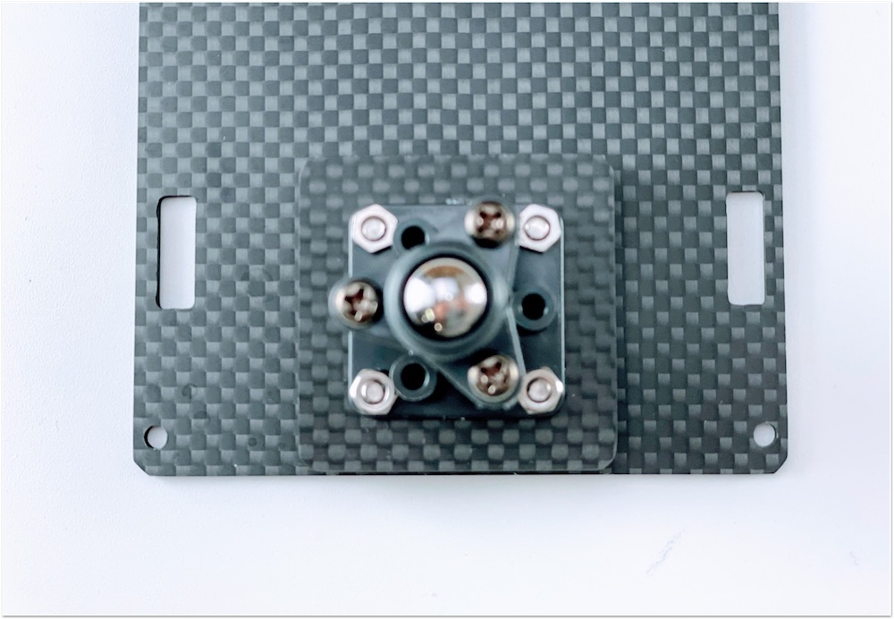

## 5. カーボンの取り付け

|写真|部品|個数|
|:--|:--|:--|
|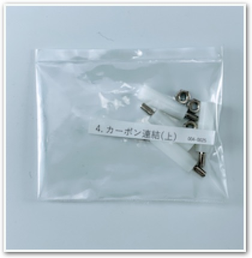|4.カーボン固定ネジ(上)|1|

下段のカーボンと中段のカーボンを連結します。

モーターの線も穴から出しておきます。

白いスペーサーで、4隅を固定します。

## 6. タイヤの取り付け

|写真|部品|個数|
|:--|:--|:--|
||タイヤ|2|

タイヤを装着します。

## 7. バッテリーの取り付け

|写真|部品|個数|
|:--|:--|:--|
||両面テープ袋|1|
||モバイルバッテリー|1|

バッテリーを両面テープで装着します。

## 8. カーボン上段の取り付け

|写真|部品|個数|
|:--|:--|:--|
||6.Jetson固定ネジ袋|1|
||カーボン上段|1|

Jetson固定ネジを取り付けます。

## 9. WiFi Moduleの取り付け

|写真|部品|個数|
|:--|:--|:--|
||Jetson Nano 開発者キット B01,A02|１枚|
||Intel Dual Bandwireless-AC 8265 Desktop Kit（４GBモデルのみ）|１個|
||Jetbot CameraMount　（４GBモデル）|１個|    

Kitに搭載されているJetson Nanoが、``Rev.B01``か``Rev.A02``かを確認します。見分け方として、CSIカメラポートが2つ付いているのが``Rev.B01``で、1つしか付いていないのがRev.A02になります。

Wifi Moduleを取り付けるために、Jetson Nano Moduleを取り外します。

両サイドの留め具を外に開き、Jetson Nano Moduleを取り外します。

Wifi Moduleを取り付けるために、真ん中のネジを外しておきます。

※ネジの山カケには注意しましょう。

Wifi Moduleは、Intel Dual Bandwireless-AC 8265 Desktop Kitを取り付けます。

!!!Info "技適"
	箱の横に技適番号が記載されています。
	

	|項目|認証番号|
	|:--|:--|
	|R|003‐160104|
	|T|D160055003|

箱から取り出し、スパナで金色のアンテナ固定ネジをゆるめ、銀色のプレートから取外しておきます。

外したアンテナ固定ネジは、カメラマウントのパーツに取り付けておきます。

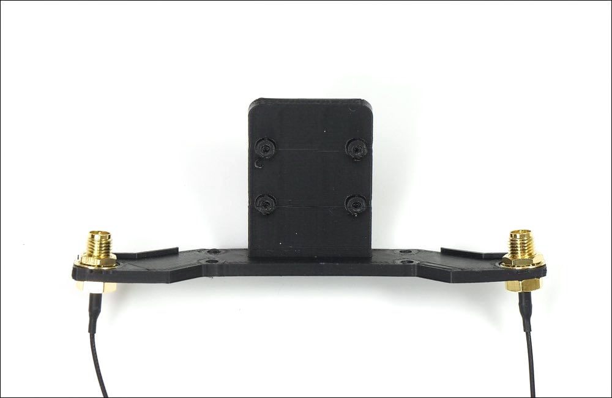

Wifi Moduleの取り付けが完了したら、Jetson Nano Moduleを再び取り付けます。

 

Jetson Nano Moduleを再び装着し、ネジ止めします。

## 10. カメラの取り付け

|写真|部品|個数|
|:--|:--|:--|
||CAM026 IMX219-160°|１個|
|camerakotei001.jpg)|５．カメラ固定部品|１袋|

カメラモジュールを用意します。

カメラモジュールの４つの穴に六角レンチ棒でM2.5のタッピンングビスでカメラを取り付けます。

カメラの取り付けは終了なります。

## 11. 本体に結合

|写真|部品|個数|
|:--|:--|:--|
|camerakotei001.jpg)|５．カメラ固定部品|１袋|

カメラマウントとシャーシと結合します。

シャーシの裏には４箇所皿ネジを使用します。

カメラモジュールには４箇所、M３のナットを使用します・

ナットドライバーでしっかり固定します。

カメラマウント取り付け完了。

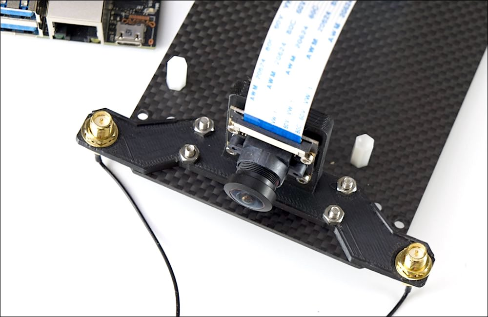

シャーシ最上部と真ん中のシャーシを結合します。

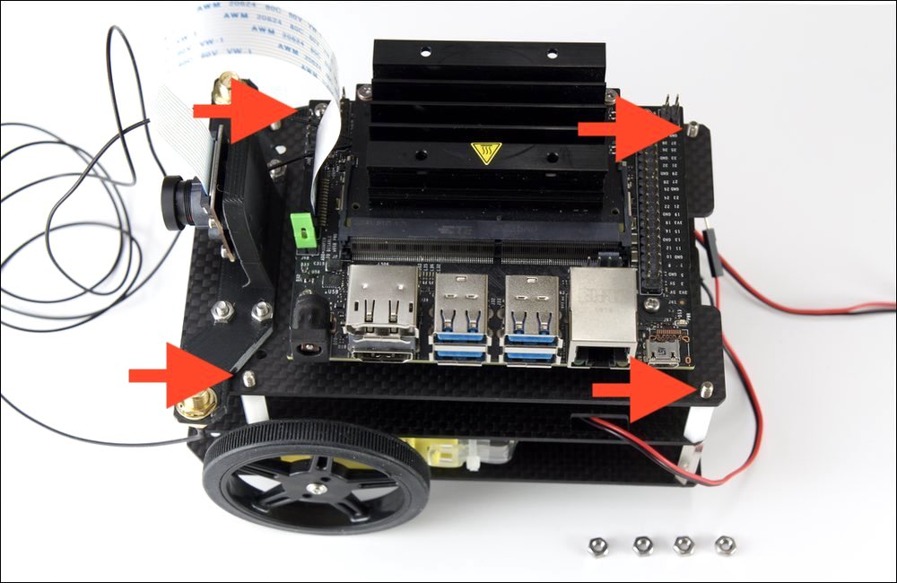

M3のナットで4隅をナットドライバで固定します。

## 12. Jetson取り付け

|写真|部品|個数|
|:--|:--|:--|
||Jetson|1|

## 13. Cameraケーブルの取り付け

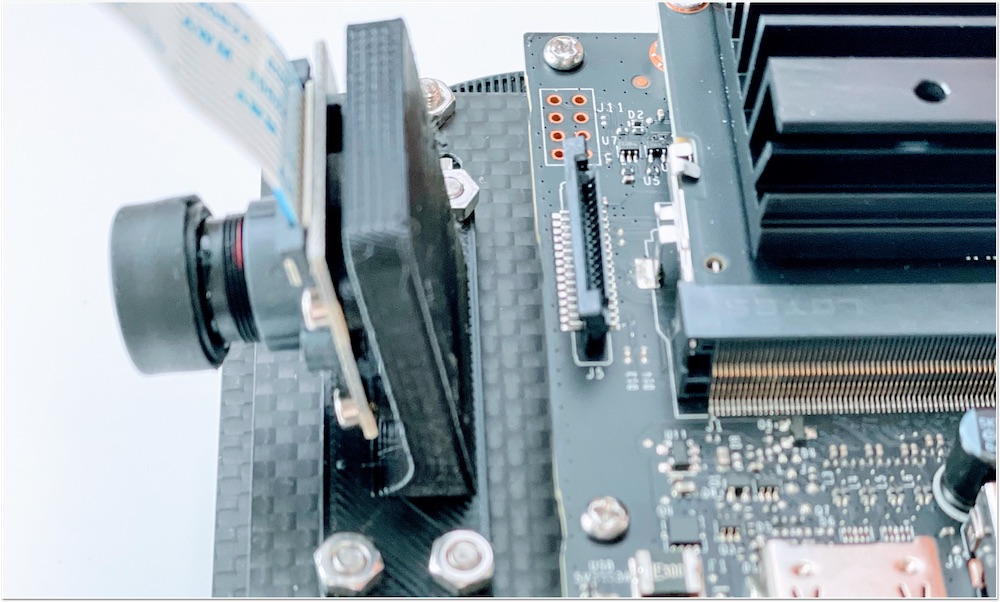

## 14. CPU Fanの取り付け

|写真|部品|個数|
|:--|:--|:--|
||CPU Fanと取り付けジグ|1セット|
||CPU Fan取り付け用ネジ|1|

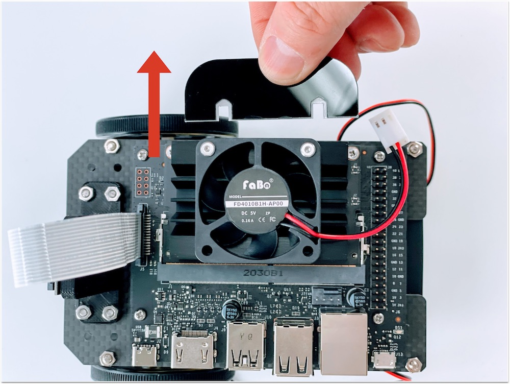

## 15. Controller Boardの取り付け

|写真|部品|個数|
|:--|:--|:--|
||コントローラーボード|1|

## 16. USB Cableの取り付け

...

## 17. SDカードの差し込み

## 18. Jumperピンの設定

使用するJetson Nanoが``Rev.A02``か、``Rev.B01``かを確認します。

DC電源からの給電を有効にするために、``Rev.A02``、``Rev.B01``の場合で、下記の箇所のJumperPinの設定をおこないます。

