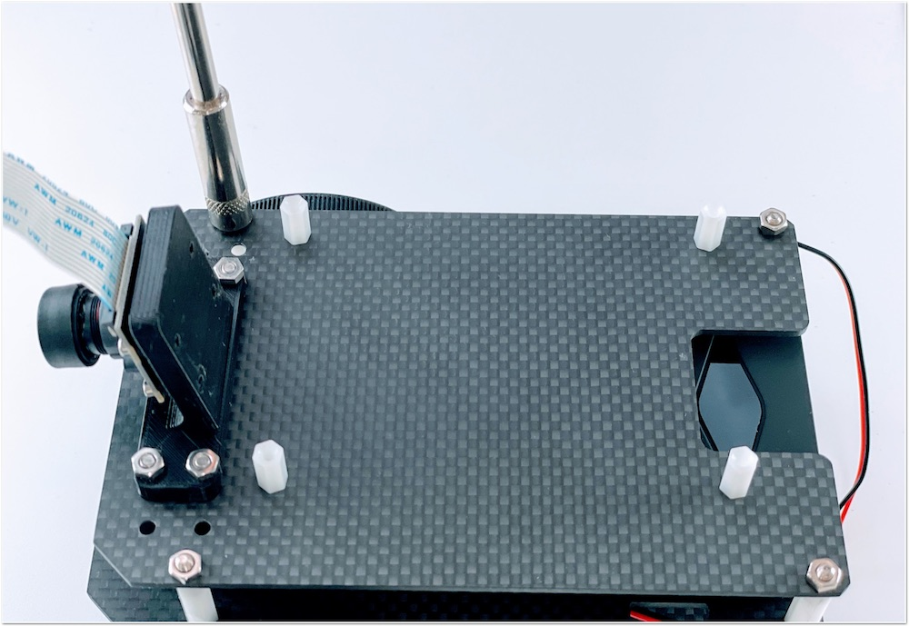
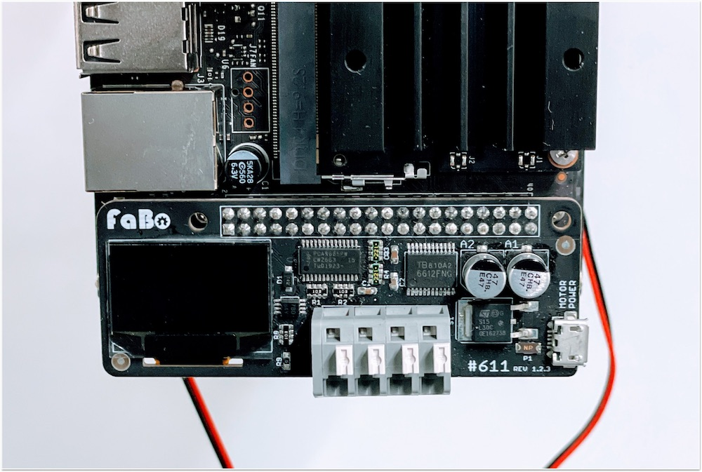
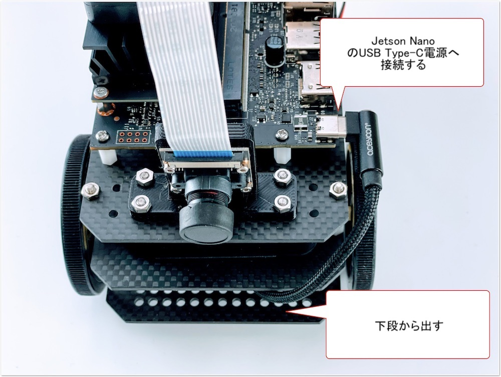

# 組み立てマニュアル(初期型)

対象モデル

|コード番号|
|:--|
|JB-2GB-Carbon-S（初期型）|
|JB-2GB-Carbon-B（初期型ベアボーン）|
|JB-2GB-Carbon-S-WR（初期型）|

## 1. ギヤモーターの取り付け

|写真|種類|個数|
|:--|:--|:--|
||1.ギヤモーター固定ネジ袋|1|
||ギヤモーター|2|

ギヤモーターに固定金具を取り付けていきます。

固定金具を取り付けネジで固定します。

金具は内側にそれぞれ対になる向きに取り付けます。

カーボンプレートに、ギヤモーターを接続します。

## 2. カーボン連結ネジの取り付け

|写真|種類|個数|
|:--|:--|:--|
||3.カーボン連結ネジ袋（下）|1|

カーボン連結用のスペーサーを接続します。

## 3. ボールキャスターの組み立て

|写真|種類|個数|
|:--|:--|:--|
||ボールキャスター|1|

ボールキャスターの組み立てをおこないます。

まず、ボールを取り付けます。

3本の棒をボールのうえに配置します。

プラスチック部品を取り付けます。

長い方に取り付け、ネジで固定します。

## 4. ボールキャスターの取り付け

|写真|種類|個数|
|:--|:--|:--|
||2.ボールキャスター固定ネジ袋|1|
||ボールキャスター固定カーボン ※または、下のスペーサーになります。|4|
||ボールキャスタースペーサー軽量タイプ|1|
||カーボン中段|1|

ボールキャスターをカーボンに取り付けます。

ボールキャスター固定カーボン4枚を重ねて取り付けます。または、ボールキャスターのスペーサを1個取り付けます。

※出荷時期により異なります。

## 5. カーボンの取り付け

|写真|種類|個数|
|:--|:--|:--|
||4.カーボン固定ネジ袋(上)|1|

カーボン下段とカーボン中段を連結します。

モーターの線も穴から出しておきます。

白いスペーサーで、四隅を固定します。

## 6. タイヤの取り付け

|写真|種類|個数|
|:--|:--|:--|
||タイヤ|2|

タイヤを装着します。

## 7. モバイルバッテリーの取り付け

|写真|種類|個数|
|:--|:--|:--|
||両面テープ袋|1|
||モバイルバッテリー|1|

モバイルバッテリーを両面テープで装着します。

## 8. カーボン上段の取り付け

|写真|種類|個数|
|:--|:--|:--|
||6.Jetson固定ネジ袋|1|
||カーボン上段|1|

Jetson固定ネジを取り付けます。

## 9. カメラの取り付け

|写真|種類|個数|
|:--|:--|:--|
||5.カメラ固定ネジ袋|1|
||カメラ|1|
||カメラマウント|1|

## 10. 本体に結合

## 11. Jetsonの取り付け

|写真|種類|個数|
|:--|:--|:--|
||Jetson|1|

## 12. カメラケーブルの取り付け

## 13. CPUファンの取り付け

|写真|種類|個数|
|:--|:--|:--|
||CPUファンと取り付けジグ|1セット|
||CPUファン取り付け用ネジ袋|1|

## 14. コントローラーボードの取り付け

|写真|種類|個数|
|:--|:--|:--|
||コントローラーボード|1|

## 15. USBケーブルの取り付け

|写真|種類|個数|
|:--|:--|:--|
||USBケーブル|1|
||USB Type-C Cable|1|

## 16. Wi-Fiの取り付け

|写真|種類|個数|
|:--|:--|:--|
||USB Wi-Fiドングル|1|
||USB Wi-Fiドングル ハイパワー（JB-2GB-Carbon-S-WRの場合）|1|

## 17. SDカードの差し込み

