# 組み立てマニュアル（Dタイプ）

{: style="height:210px;width:200px"}
 
 

対象モデル

|コード番号|
|:--|
|JB-4GB-Carbon-S-D（標準）|
|JB-4GB-Carbon-B-D（ベアボーン）|

<主な変更点>

Wi-Fi支持パーツ素材の変更

## 1. モーターの取り付け

|写真|部品または工具|個数|
|:--|:--|:--:|
|{: style="height:210px;width:200px"}|1.モーター固定ネジ(袋)|1|
|{: style="height:210px;width:200px"}|ギヤモーター|2|
|{: style="height:210px;width:200px"}|プラスドライバー +2×100|１本|

モーターに固定金具を取り付けていきます。

固定具を取り付けネジで固定します。

金具は内側にそれぞれ対になる向きに取り付けます。

カーボンプレートに、モーターを接続します。

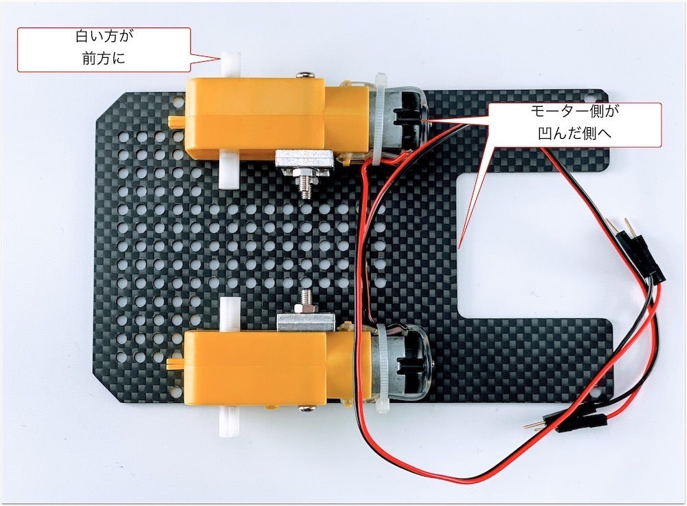

## 2. カーボン連結ネジの取り付け

|写真|部品または工具|個数|
|:--|:--|:--:|
|{: style="height:210px;width:200px"}|3.カーボン連結ネジ袋|1|
|{: style="height:210px;width:200px"}|プラスドライバー +2×100|１本|

カーボン連結用のスペーサーを接続します。

## 3. ボールキャスター組み立て

|写真|部品または工具|個数|
|:--|:--|:--:|
|{: style="height:210px;width:200px"}|ボールキャスター|1|
|_caster_kotei001.jpg){: style="height:210px;width:200px"}|２．キャスター固定|１袋|
|{: style="height:210px;width:200px"}|プラスドライバー +2×100|１本|

キャスターの組み立てをおこないます。

まず、ボールを取り付けます。

3本の棒をボールのうえに配置します。

プラスチック部品または工具を取り付けます。

長い方に取り付け、ネジで固定します。

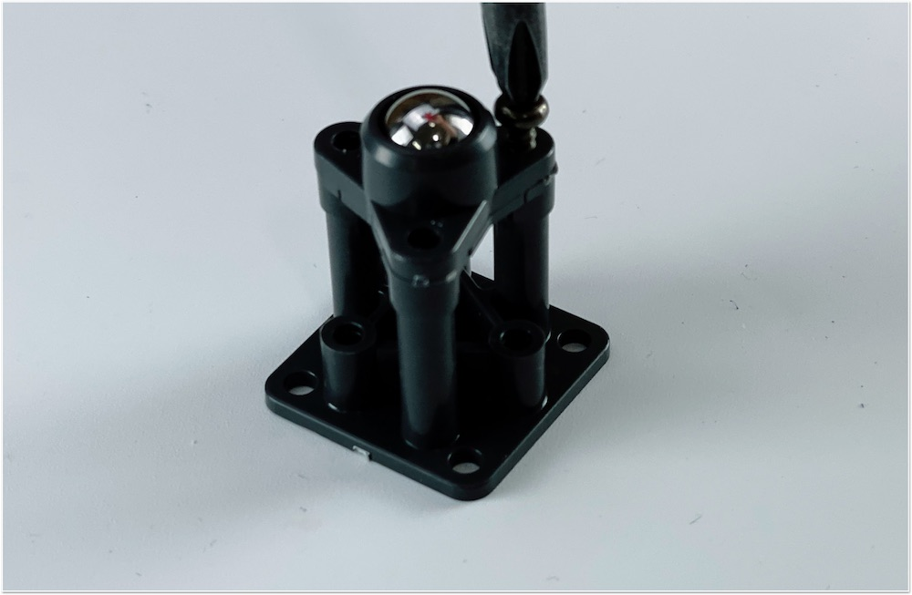

## 4. キャスターの固定

|写真|部品または工具|個数|
|:--|:--|:--:|
|{: style="height:210px;width:200px"}|2.キャスター固定ネジ袋|1|
|{: style="height:210px;width:200px"}|ボールキャスタスペーサー 材質：アルミ|1枚|
|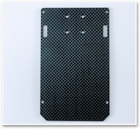{: style="height:210px;width:200px"}|カーボン中段|1|
|{: style="height:210px;width:200px"}|プラスドライバー +2×100|１本|

ボールキャスターをカーボンに取り付けます。

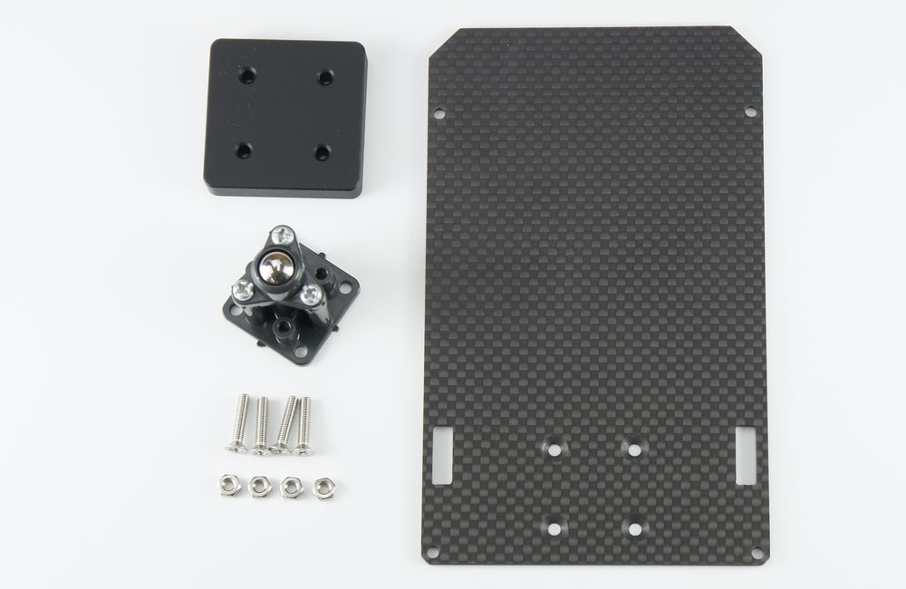

スペーサを挟みねじでキャスター固定します。

M3ナットをはめて、ドライバーで４箇所締め付けます。

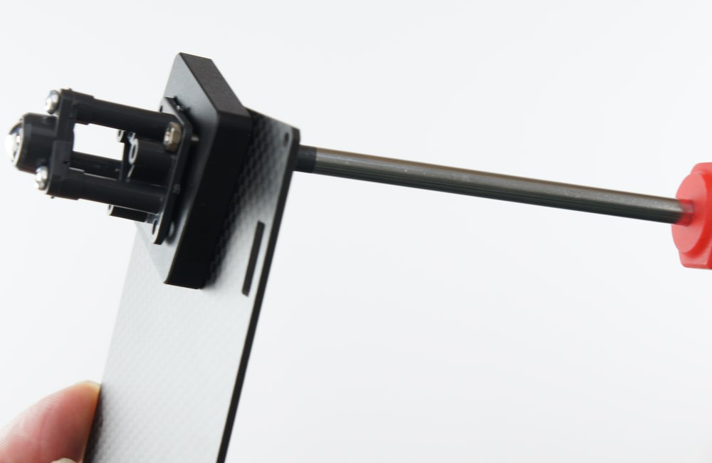

取り付け後　裏

表になります。ボールキャスターが固定できました。

## 5. カーボンの取り付け

|写真|部品または工具|個数|
|:--|:--|:--:|
|{: style="height:210px;width:200px"}|4.カーボン固定ネジ(上)|1|

下段のカーボンと中段のカーボンを連結します。

モーターの線も穴から出しておきます。

白いスペーサーで、4隅を固定します。

## 6. タイヤの取り付け

|写真|部品または工具|個数|
|:--|:--|:--:|
|{: style="height:210px;width:200px"}|タイヤ|2|
|{: style="height:210px;width:200px"}|精密ドライバー|1|

タイヤを装着します。

## 7. バッテリーの取り付け

|写真|部品または工具|個数|
|:--|:--|:--:|
|{: style="height:210px;width:200px"}|両面テープ|1|
|{: style="height:210px;width:200px"}|モバイルバッテリー（旧パッケージの場合）|1|
|{: style="height:210px;width:200px"}|モバイルバッテリー（新パッケージの場合）|1|

バッテリーを両面テープで装着します。

## 8. カーボン上段の取り付け

|写真|部品または工具|個数|
|:--|:--|:--:|
|{: style="height:210px;width:200px"}|6.Jetson固定ネジ袋|1|
|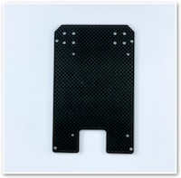{: style="height:210px;width:200px"}|カーボン上段|1|
|{: style="height:210px;width:200px"}|精密ドライバセット　ED−２０|1|

Jetson固定ネジを取り付けます。

## 9. Wi-Fi Moduleの取り付け

|写真|部品または工具|個数|
|:--|:--|:--:|
|{: style="height:210px;width:200px"}|Jetson Nano 開発者キット B01,A02|1|
|{: style="height:210px;width:200px"}|Intel Dual Bandwireless-AC 8265 Desktop Kit|1|
|{: style="height:210px;width:200px"}|カメラマウント|１|
|{: style="height:210px;width:200px"}|Wi-Fiアンテナ支持|1|
|{: style="height:210px;width:200px"}|スパナ|1|
|{: style="height:210px;width:200px"}|精密ドライバセット　ED−２０|1|
|{: style="height:210px;width:200px"}|プラスドライバー +2×100|1|

Kitに搭載されているJetson Nanoが、``Rev.B01``か``Rev.A02``かを確認します。見分け方として、CSIカメラポートが2つ付いているのが``Rev.B01``で、1つしか付いていないのがRev.A02になります。

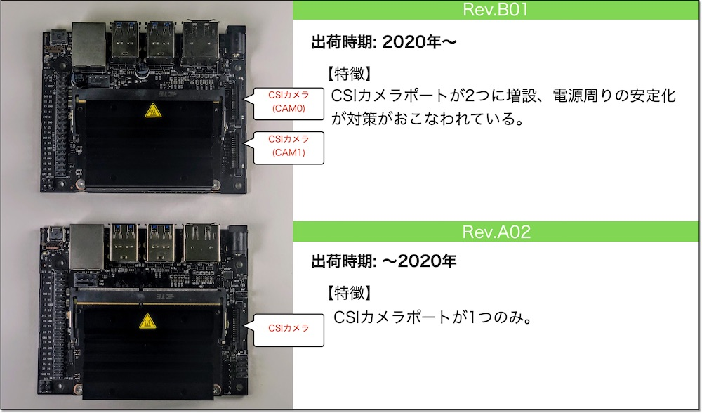

Wi-Fi Moduleを取り付けるために、Jetson Nano Moduleを取り外します。

両側のネジを外します。

両サイドの留め具を外に開き、Jetson Nano Moduleを取り外します。

両サイドに広げると、Jetson Nano Moduleがポップアップします。

Jetson Nano Moduleを取り外すと、ネジが見えます。

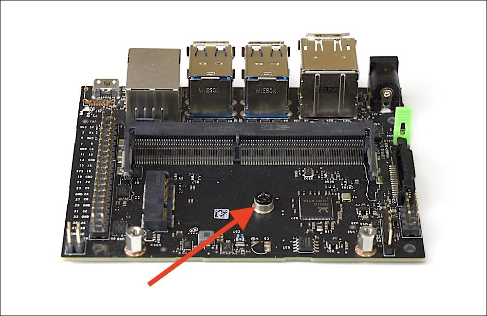

Wifi Moduleを取り付けるために、真ん中のネジを外しておきます。

※ネジの山カケには注意しましょう。

Wi-Fi Moduleは、Intel Dual Bandwireless-AC 8265 Desktop Kitを取り付けます。

!!!Info "技適"
	箱の横に技適番号が記載されています。
	

	|項目|認証番号|
	|:--|:--|
	|R|003‐160104|
	|T|D160055003|

箱から取り出し、スパナで金色のアンテナ固定ネジをゆるめ、銀色のプレートから取外しておきます。

モジュールの端子と接続します。

取り外したアンテナ端子をWi-Fiアンテナ支持金具に取り付けます。Wi-Fiアンテナ支持金具に穴確認し端子を通るようにまわしアンテナ端子を貫通させます。

外したアンテナ固定ネジは、カメラマウントのパーツに取り付け変えます。

スパナで締めます。

Wi-Fiアンテナ支持金具の左右に取り付けます。

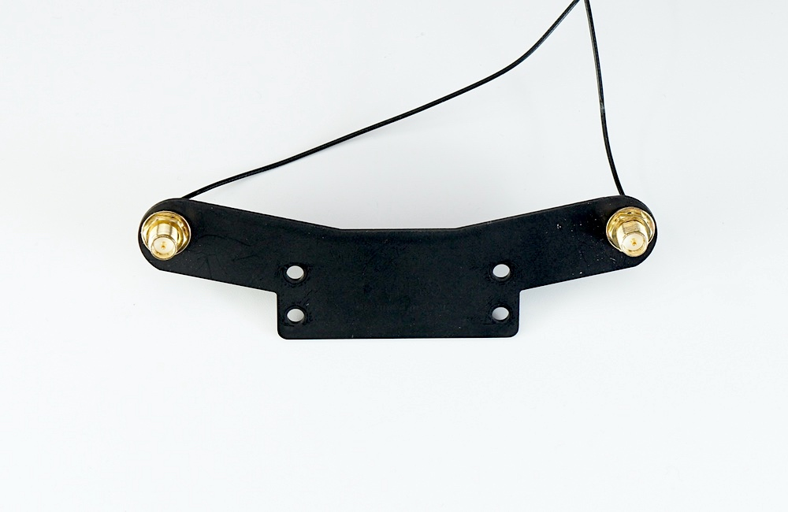

Wi-Fi Moduleの端子に２本のアンテナケーブルを接続します。

以下のようになります。

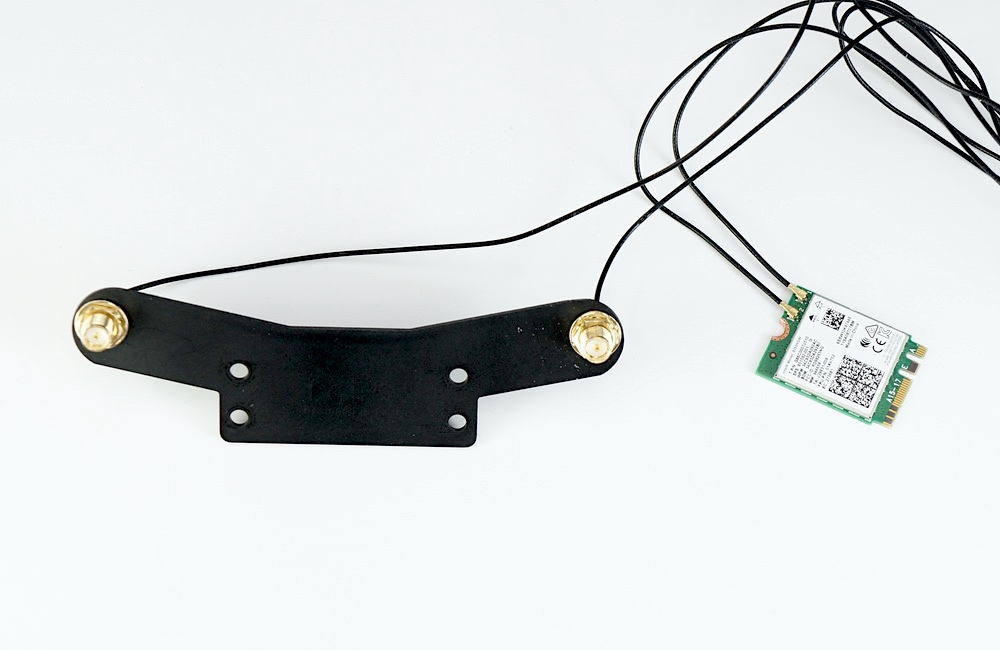

Wi-Fi ModuleをJetsonNano開発者ボードにドライバーで取り付けます。

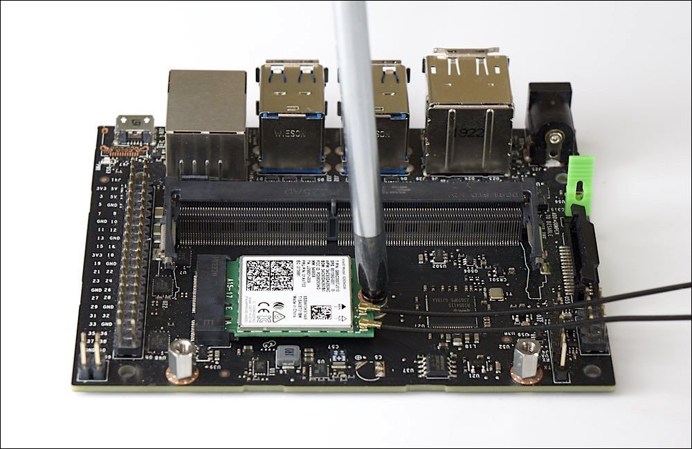

Wi-Fi Moduleの取り付けが完了したら、Jetson Nano Moduleを再び取り付けます。

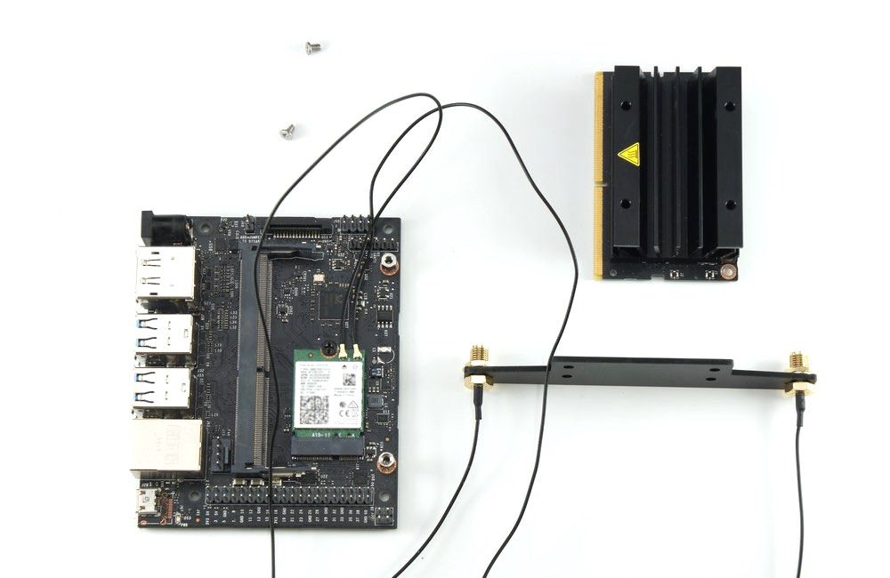

Wi-Fiアンテナケーブルの配線<

Jetson Nano Moduleを再び装着し、２箇所ネジ止めします。

できあがりとなります。

## 10. カメラの取り付け

|写真|部品または工具|個数|
|:--|:--|:--:|
|{: style="height:210px;width:200px"}|CAM026 IMX219-160°|1|
|{: style="height:210px;width:200px"}|５．カメラ固定 六角穴付きボルトセルフタッピングねじ M2.0×5・・・・4 を使用します。|1|
|{: style="height:210px;width:200px"}|六角レンチ|1|

カメラモジュールを用意します。

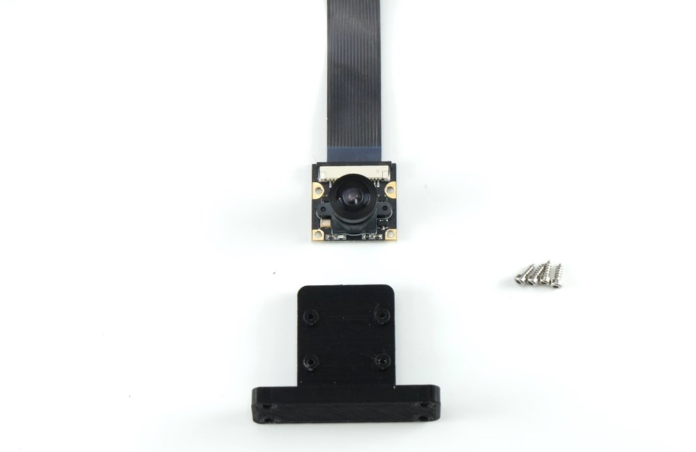

カメラモジュールをカメラマウントに取り付けます。カメラモジュールの４つの穴に六角レンチ棒を使いM2.0のタッピンングビスでカメラを取り付けます。

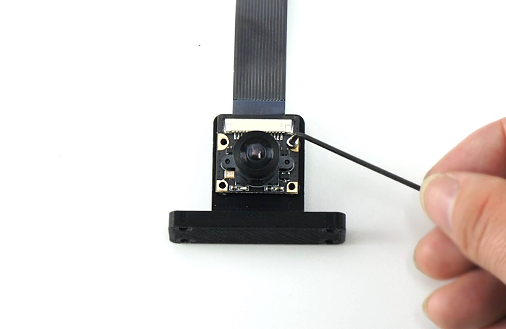

カメラの取り付けは終了となります。

## 11. 本体に結合

|写真|部品または工具|個数|
|:--|:--|:--:|
|{: style="height:210px;width:200px"}|５．カメラ固定 皿ねじ M3.0 × 15・・・・4 ナット M3.0・・・・4 を使用します。|1|
|{: style="height:210px;width:200px"}|プラスドライバー +2×100|1|
|{: style="height:210px;width:200px"}|ナットドライバー ５．５mm|1|

カメラマウント,Wifiアンテナ支持金具とシャーシと結合します。

シャーシの裏には４箇所皿ネジM３＊15を使用します。

カメラモジュールには４箇所、M３のナットを使用し、ナットドライバー5.5で固定します。

カメラマウントとシャーシは、取り付け完了です。

シャーシ最上部と真ん中のシャーシを結合します。

シャーシどおし結合します。M3ナットで4隅を固定します。

ナットドライバでナットを締めます。

## 12. Jetson取り付け

|写真|部品または工具|個数|
|:--|:--|:--:|
|{: style="height:210px;width:200px"}|Jetson Nano 開発者キット B01,A02|１枚|
|{: style="height:210px;width:200px"}|精密ドライバセット　ED−２０|1|

Jetson Nanoとシャーシを取り付けます。

スクリューねじでJetsonNanoを４箇所のねじで固定します。

## 13. Cameraケーブルの取り付け

## 14. CPU Fanの取り付け

|写真|部品または工具|個数|
|:--|:--|:--:|
|{: style="height:210px;width:200px"}|CPU Fanと取り付けジグ|1セット|
|{: style="height:210px;width:200px"}|CPU Fan取り付け用ネジ|1|
|{: style="height:210px;width:200px"}|六角レンチ|1|

## 15. Controller Boardの取り付け

|写真|部品または工具|個数|
|:--|:--|:--:|
|{: style="height:210px;width:200px"}|コントローラーボード|1|

## 16. SDカードの差し込み

|写真|部品または工具|個数|
|:--|:--|:--:|
|{: style="height:210px;width:200px"}|SD Card(64GB),SDカードケース SunDisk|１個|

## 17. Jumperピンの設定

|写真|部品または工具|個数|
|:--|:--|:--:|
|{: style="height:210px;width:200px"}|Jumperピン（JetsonNano開発者キットB01は標準で付属）|１個|

使用するJetson Nanoが``Rev.A02``か、``Rev.B01``かを確認します。

DC電源からの給電を有効にするために、``Rev.A02``、``Rev.B01``の場合で、下記の箇所のJumperPinの設定をおこないます。

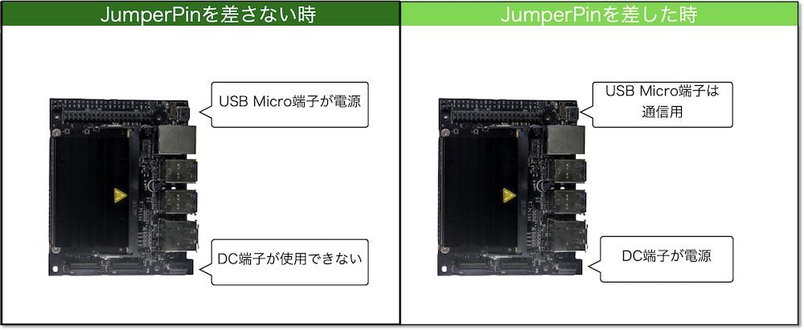

## 18. その他

|写真|部品または工具|個数|
|:--|:--|:--:|
|{: style="height:210px;width:200px"}|結束バンド|1|

Wifiアンテナのケーブルを結束バンドを使用してケーブルを収納します。

結束バンドでWIFI2本のケーブルを束ねます。

束ねたケーブルは、Jetson Nano開発者キットの基板の下へ格納します。

## 19. 完成

|写真|部品または工具|個数|
|:--|:--|:--:|
|{: style="height:210px;width:200px"}|マイクロUSBケーブル | 1|
|{: style="height:210px;width:200px"}|DCプラグ-USBケーブル|1|
|{: style="height:210px;width:200px"}|Intel Dual Bandwireless-AC 8265 Desktop Kit アンテナ２つ|1|

いよいよ完成です。電源接続します。モバイルバッテリーからJetsonNanoのDCジャックとマイクロUSBに接続します。

Wifiのアンテナを立てます。Wifiアンテナを回してねじ込みます。

左右にWifiアンテナを２つ立てます。

マイクロUSBケーブルは下記のようにコントローラーボードと繋ぎます。

次に、DCプラグケーブルをモバイルバッテリーと刺し、DCプラグ側は、モータの間を前方にケーブルを通します。

DCプラグがボディの間を通過した様子。

DCプラグをJetsonNano開発者キットのDCジャックへ接続します。JetsonNanoの電源が入ります。

おめでとうございます。JetBotの完成です。カメラモジュールのレンズキャップを装着している場合は外します。

[SDカードの準備](https://faboplatform.github.io/JetbotDocs/03.Setting%28Nano%29/01.sd/)

[モバイルバッテリーについて](https://faboplatform.github.io/JetbotDocs/03.Setting%28Nano%29/02.battery/)
