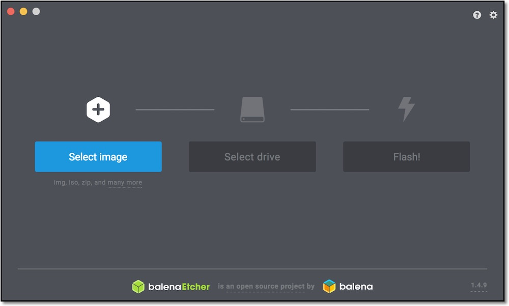

# 1.SDカードの作成

## SDカードのイメージ　

|SDカードの種類|Download|公開元|
|:--|:--|:--|
|JetPack4.3対応版|[SDカードのイメージ](https://drive.google.com/open?id=1G5nw0o3Q6E08xZM99ZfzQAe7-qAXxzHN)|NVIDIA社公開のイメージ|

NVIDIA-AI-IOTの[Wiki](https://github.com/NVIDIA-AI-IOT/jetbot/wiki/software-setup)のページが参考になります。

最新はJetPack4.3対応版です。こちらのイメージをお使いください。

!!!Info "JetPackは最新版を"
	JetPackは最新版を使う事をお勧めします。JetPackのVersionのUpdateにともないCUDAのライブラリもUpdateされます。同じJetson nanoでもCUDAのVersionが上がることで、動作のパフォーマンスが向上します。　

!!!Warning "JetPack4.4で独自構築する場合は注意を"
	JetPack4.4ベースで独自構築する場合は、HDMI経由でDisplayに画面が映らなくなる場合があります。原因はboot imageが古いためです。boot imageを更新する必要があるため、sdkmanagerを経由してJetson nanoのSDカードにイメージを焼き込んでください。その際にboot imageも同時に、更新されます。

## SDカードの焼き込み

SDカードのイメージは、[Etcher](https://www.balena.io/etcher/)を用いて、SDカードに焼き込む。

## JetBotの起動

SDカードをJetson Nanoに差し込み起動します。

本SDカードのidとpassは下記の通りです。ログイン時に使用します。

|項目|内容|
|:--|:--|
|ID|jetbot|
|Pass|jetbot|
