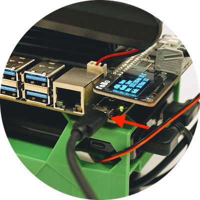

# USB経由でJetBotに接続

!!!warning "一部のノートパソコンではドライバーが未インストール"
	一部のノートパソコンではドライバーが未インストールで、下記接続に失敗します。うまく認識しない場合は、ドライバーのインストールをおこなってください。
	
## Wifiの接続

USBケーブルでPCとJetbotを接続します。

JetBotとPCをUSB接続すると、下記IPアドレスが割り振られます。

|項目|値|
|:--|:--|
|JetBot|192.168.55.1|
|PC|192.168.55.100|

## ブラウザのからの接続

PCのブラウザで、

`http://192.168.55.1:8888`

と入力し、JetBotに接続します。

|Password|
|:--|
|jetbot|

!!!warning "注意事項"
	Chromeブラウザを必ず使うようにしてください。Safariブラウザを使用する場合、キーボードのソースを変更しないとパスワードが入力できない可能性があります。Edgeブラウザを使った場合、Securityの設定でローカルホストに接続できない可能性があります。

## U S B経由で接続できない場合（Mac)

Macのシステム環境設定ー＞　ネットワークを選択し、

画面下の＋ボタンを押して、ダイアログが出てきますので、Linux for Tegraを選択します。

右下の適用ボタンを押します。

成功するとI Pアドレスが割り振られます。
