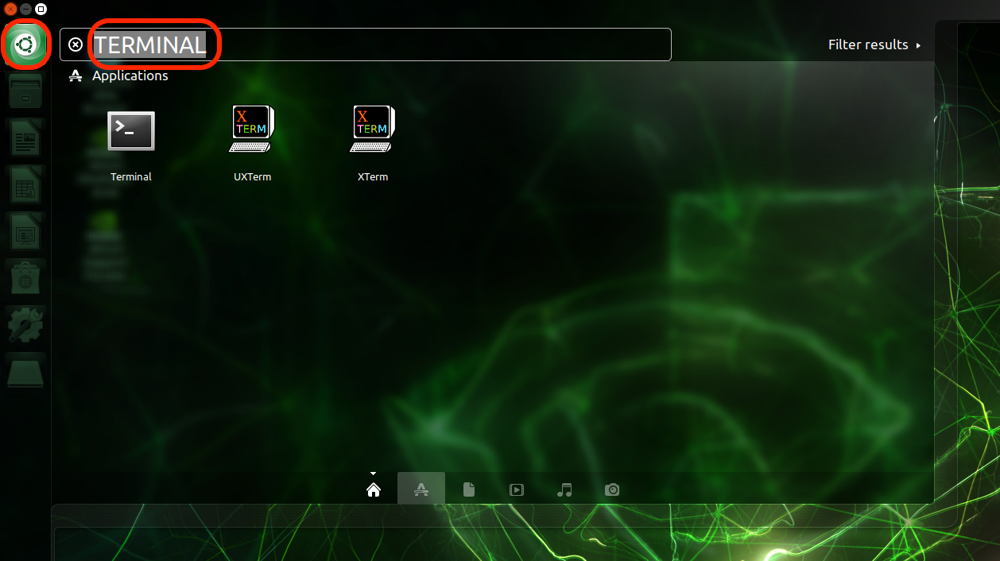
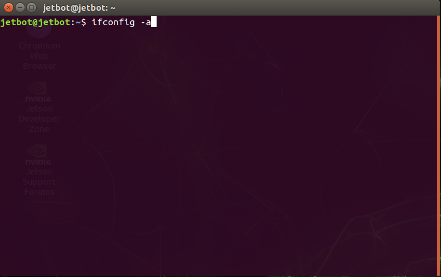
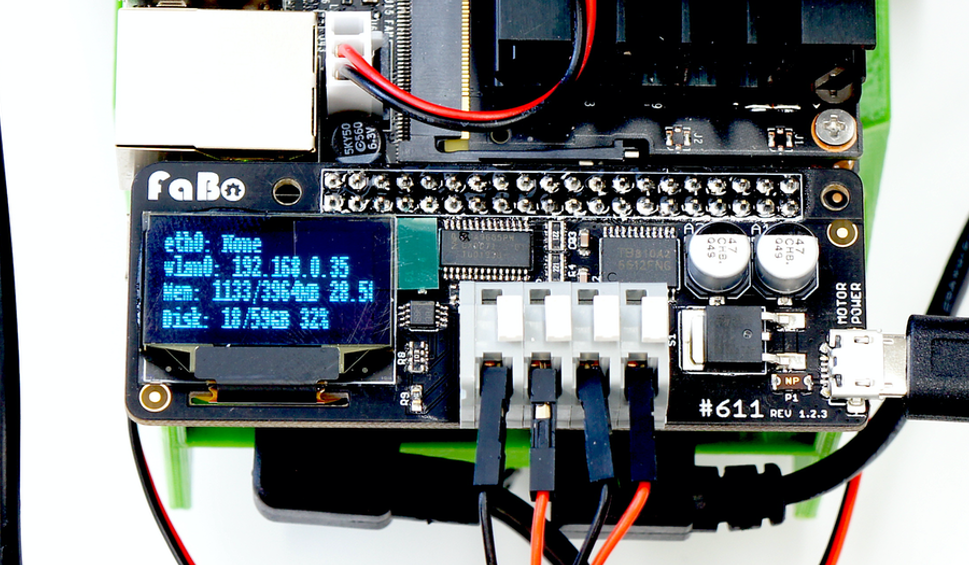

# Wifiへの接続

## コマンドラインでの接続

```
sudo -S nmcli device wifi connect 'アクセスポイント名' password 'パスワード' ifname wlan0
```

sudoのパスワードは、`jetbot`です。

## GUIでの接続

JetbotにHDMIケーブルを接続し、GUIベースでWifiに接続する場合は、下記の手順で接続します。

### Wifi spotへ接続


### TerminalでIPアドレスの確認



ifconfig -a でwlan0のIPアドレスを確認します。




## OLEDでの確認


