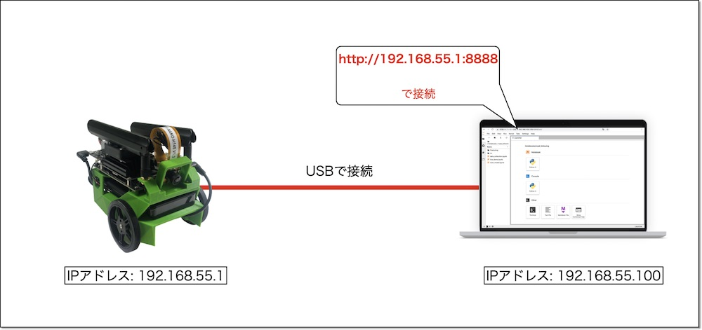
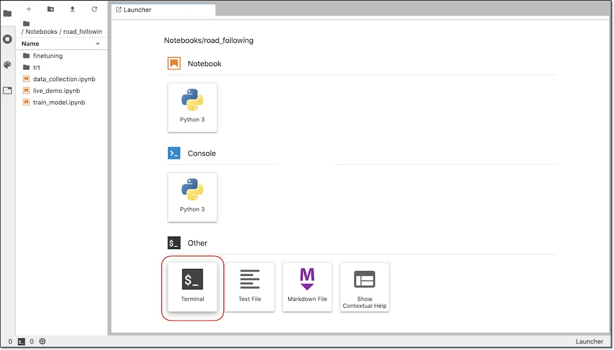
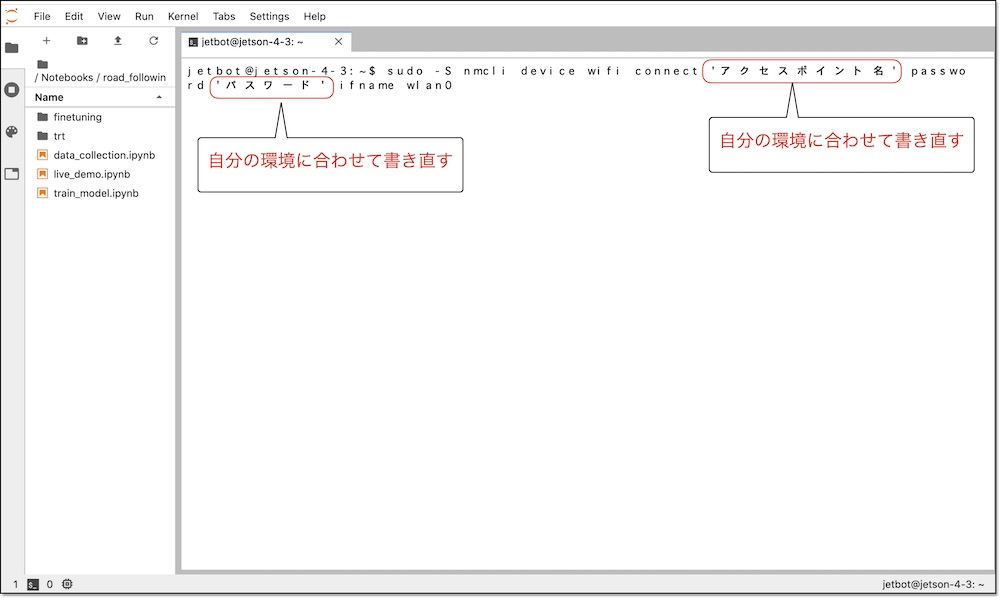
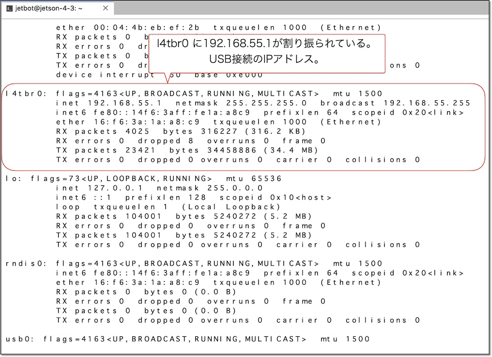
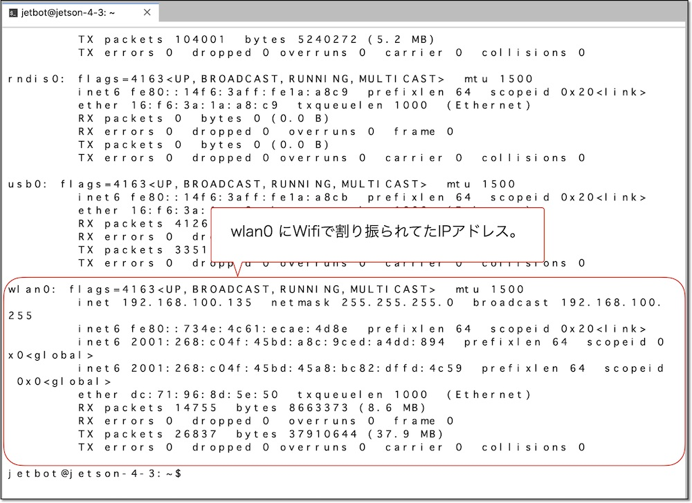
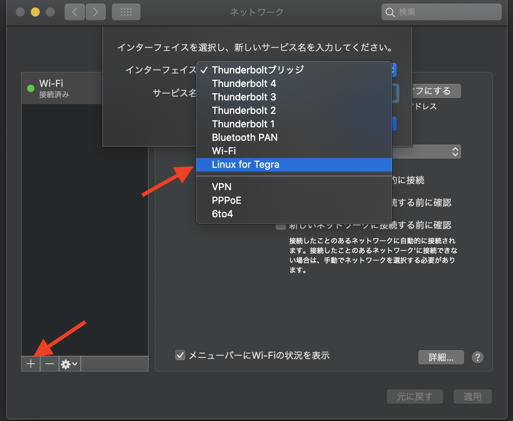
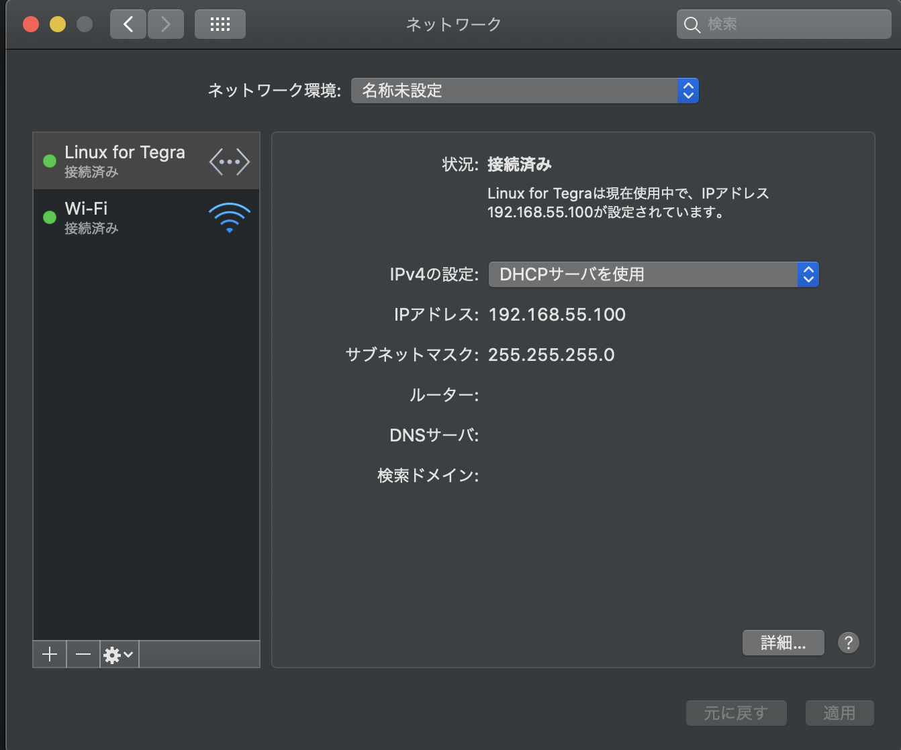

# 4.USB経由でJetbotに接続

!!!warning "一部のノートパソコンではドライバーが未インストール"
	一部のノートパソコンではドライバーが未インストールで、下記接続に失敗します。うまく認識しない場合は、ドライバーのインストールをおこなってください。
	
## Jetbotと接続

USBケーブルでPCとJetbotを接続します。


JetBotとPCをUSB接続すると、下記IPアドレスが割り振られます。

|項目|値|
|:--|:--|
|JetBot|192.168.55.1|
|PC|192.168.55.100|

## PCのブラウザからJetbotに接続

PCのブラウザで、

|接続先|
|:--|
|http://192.168.55.1:8888|

と入力し、Jetbotに接続します。



初回ログイン時に、Tokenを聞いてきますので、``jetbot``と入力します。

|Token|
|:--|
|jetbot|

!!!warning "注意事項"
	Chromeブラウザを必ず使うようにしてください。Safariブラウザを使用する場合、キーボードのソースを変更しないとパスワードが入力できない可能性があります。Edgeブラウザを使った場合、Securityの設定でローカルホストに接続できない可能性があります。

## Wifiに接続

ソフトウェアのパッケージのUpdate等をおこなう時は、Wifiへの接続もおこなっておきます。

``http://192.168.55.1:8888``で接続しているJupyterLabの``Terminal``の機能を使います。



Terminialで、Wifi接続のコマンドを実行します。``アクセスポイント名``と``パスワード``はお使いのネットワーク環境に合わせた値にします。

```
sudo -S nmcli device wifi connect 'アクセスポイント名' password 'パスワード' ifname wlan0
```



sudo実行の際に、パスワードを聞かれますので、下記を入力します。

|password|
|:--|
|jetbot|

## IPアドレスの確認

IPアドレスの確認はifconfigコマンドを用います。

```
ifconfig -a
```






|デバイス名|概要|
|:--|:--|
|l4tbr0|USBでPCと接続した際に使われる|
|wlan0|Wifiで接続した際に使われる|

!!!Warning "USB経由でうまく接続できない場合（Mac偏)"
	
	Macのシステム環境設定ー＞　ネットワークを選択し、
	
	画面下の＋ボタンを押して、ダイアログが出てきますので、Linux for Tegraを選択します。
	右下の適用ボタンを押します。
	
	成功するとI Pアドレスが割り振られます。
