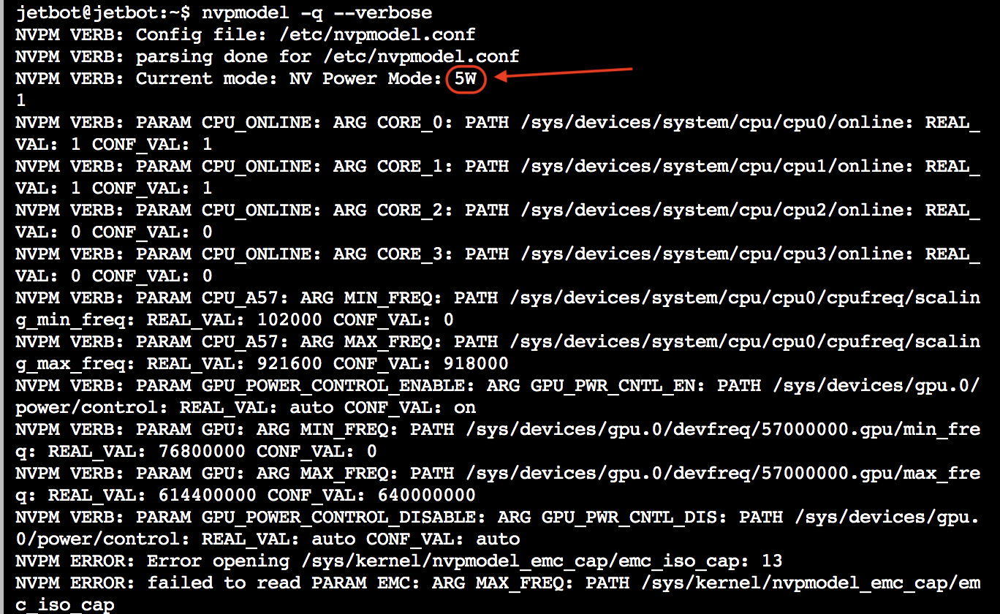

# 電力モード

Jetson Nanoでは、2つの電力モードが存在しています。

|モード|コマンド|
|:--|:--|
|5W|sudo nvpmodel -m 1|
|MAXN|sudo nvpmodel -m 0|

## 5W Powerモードの設定

5Wモードに変更します。

```
sudo nvpmodel -m 1
```

電力モードが変更されたかの確認をおこないます。

```
nvpmodel -q --verbose
```



!!! Tip
	`sudo nvpmodel -m 1` が省電力モードになり、`sudo nvpmodel -m 0`が標準電力モードになります。`sudo nvpmodel -m 0`では電力が4A程度必要になります。