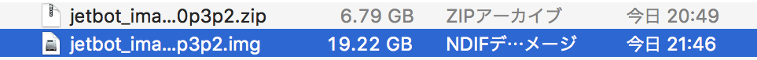

# SDカードの作成

## SDカードのイメージ　

|SDカードの種類|Download|
|:--|:--|
|Samsung 64 EVO Plusを使用の場合|[SDカードのイメージ](https://drive.google.com/open?id=1G5nw0o3Q6E08xZM99ZfzQAe7-qAXxzHN)|

NVIDIA-AI-IOTの[Wiki](https://github.com/NVIDIA-AI-IOT/jetbot/wiki/software-setup)のページが参考になります。

## SDカードの焼き込み

SDカードのイメージは、[Etcher](https://www.balena.io/etcher/)を用いて、SDカードに焼き込む。

## JetBotの起動

SDカードをJetson Nanoに差し込み起動する。

|項目|内容|
|:--|:--|
|ID|jetbot|
|Pass|jetbot|
