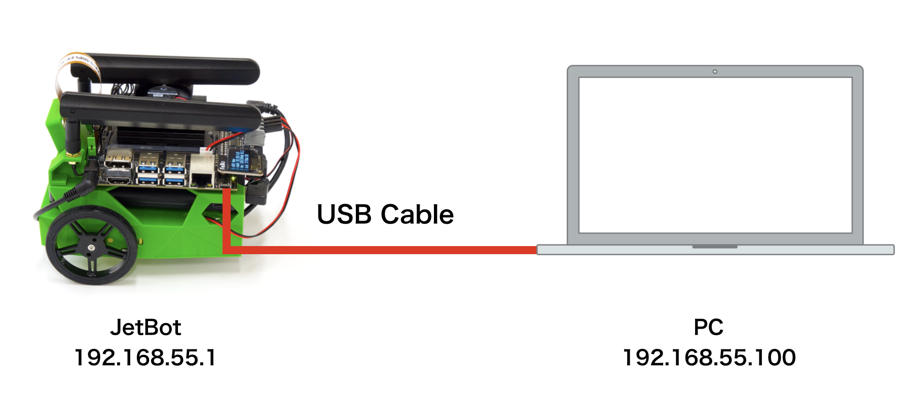

# USB経由でJetBotに接続

!!!warning "最新のOS XやEdgeでは非対応"
	最新版のOSXや、Edgeでは、本接続用のDriverが標準では入っていません。

## Wifiの接続

USBケーブルでPCとJetbotを接続します。

JetBotとPCをUSB接続すると、下記IPアドレスが割り振られます。

|項目|値|
|:--|:--|
|JetBot|192.168.55.1|
|PC|192.168.55.100|

## ブラウザのからの接続

PCのブラウザで、

`http://192.168.55.1:8888`

と入力し、JetBotに接続します。

|Password|
|:--|
|jetbot|
