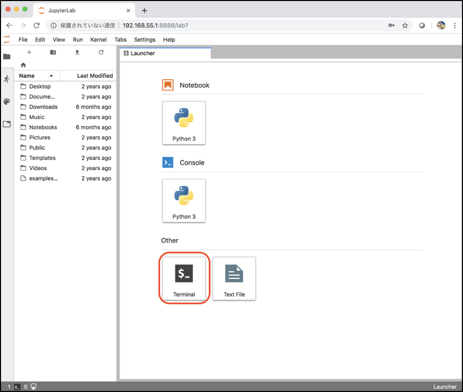

# I2Cの認識確認　

まず、最初にI2Cの認識の確認をおこないます。

## Terminalの起動



```
sudo i2cdetect -r -y 1
```


|I2Cアドレス|チップ|処理|
|:--|:--|:--|
|0x3c|SSD1306|OLEDの制御|
|0x60|PCA9685|PWMでモータードライバーのTB6612を制御|
|0x70|PCA9685|All call用のアドレス|
