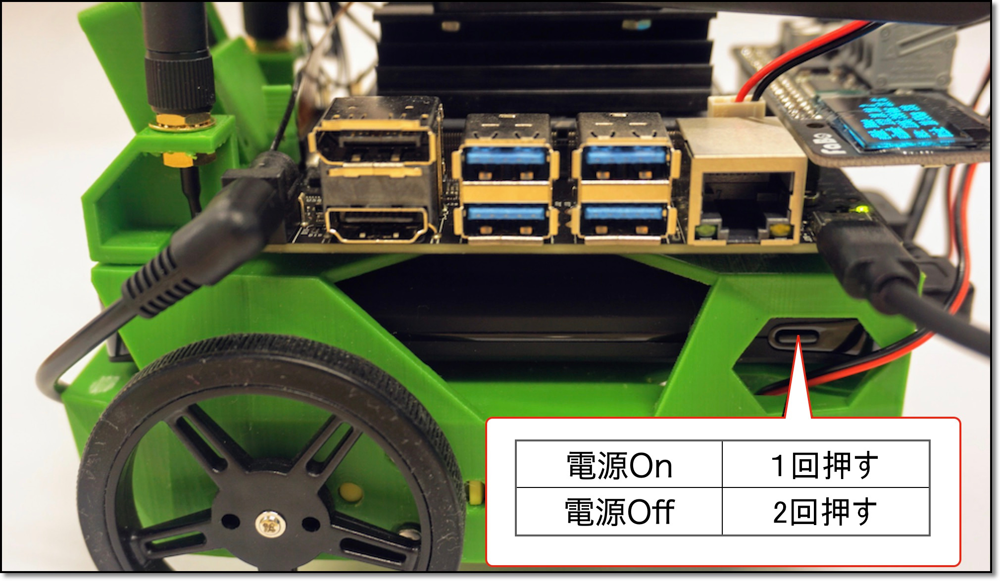
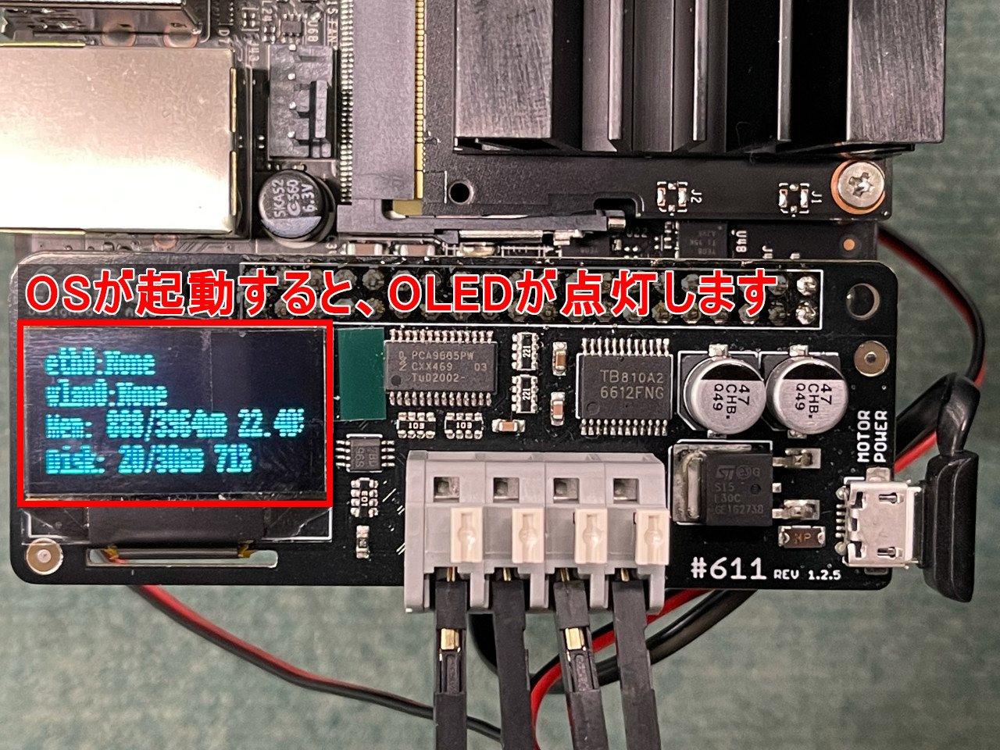

# 01.OS起動

## 付属SDカードに関して

!!! Warning
	FaBo Storeより、JetBotをご購入の方は、付属SDカードにJetPack4.6及びJetBotを焼き込み済み、設定済みです。

## SDカードイメージダウンロード

!!! Warning
	FaBo Storeより、JetBotをご購入の方は、ダウンロード不要です。

もし、SDイメージをダウンロードしたい方は、こちらからダウンロードお願いいたします。

|  対象Jetson  |  JetPack  | リンク先  |
|:-----------|:------------|:------------|
|  JetBot<br>４GBモデル  |Jetpack4.6|  [jetbot-nano-4gb-jp46-2021-12-08.zip](https://drive.google.com/file/d/1kCc8-WzXjfsZwki2hwdwUsTFAujELF6H/view?usp=sharing)|
|  JetBot<br>２GBモデル  |Jetpack4.6|  2022年1月リリース予定  |

NVIDIA-AI-IOTの[Wiki](https://github.com/NVIDIA-AI-IOT/jetbot/wiki/software-setup)のページが参考になります。

## SDカードの焼き込み

!!! Warning
	FaBo Storeより、JetBotをご購入の方は、SDカードへ焼き込みは不要です。

SDカードのイメージは、[Etcher](https://www.balena.io/etcher/)を用いて、SDカードに焼き込む。

セレクトイメージボタンを選択して、


ダウンロードして解凍したimgファイルを選択します。


焼きこむドライブを選択し、


フラッシュボタンを押します。


## JetBotの電源をOnにします



初めて起動した際に、パーティションをSDカード容量まで拡張する処理をおこなっています。  
そのため、OSが起動するまでは電源を落とさないようにお願いします。

## OLEDが点灯したことを確認します

パーティションの拡張が完了していることを確認するために、Disk情報に空き容量があることを確認してください。  
32GB SDカードの場合、  

```
Disk: 20/30GB  
```

と表示されます。



有線LANでネットワークに接続されていれば、eth0の行にIPアドレスが表示されます。
