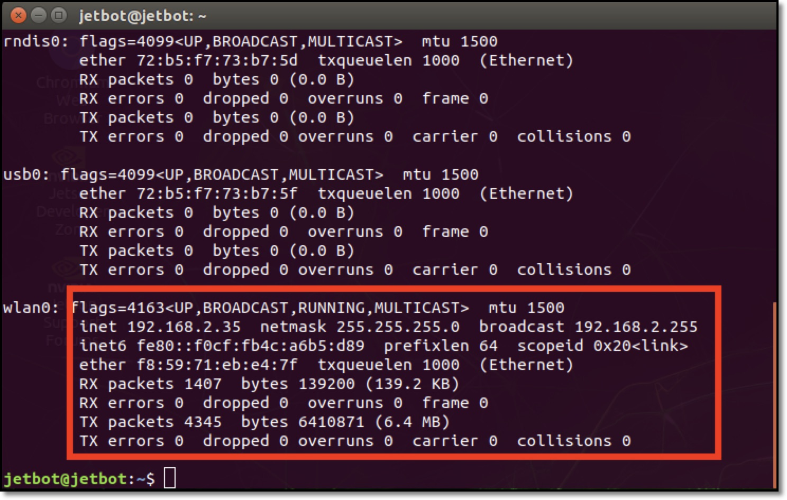

# 01.コンソール接続でのWi-Fi設定方法

JetBotにHDMIケーブルを接続し、キーボードとマウスを装着します。通常のPC同様に、モニターを見ながら設定できます。

## Jetson Nano 4GBの場合

### Wi-Fiアクセスポイントへ接続

### TerminalでIPアドレスの確認
gnome-terminalを検索するか、
もしくはCtrl + Alt + Tキーを押すと、ターミナルが起動します。

ifconfig -a でwlan0のIPアドレスを確認します。

## Jetson Nano 2GBの場合
2GBのデスクトップ画面は4GBと異なります。

### Wi-Fiアクセスポイント設定
画面左下 - Preferences - Network Connectionsを選択します。

新しいネットワーク設定を追加します。

Wi-Fiタブを選択して、WiFiルータのSSIDを入力します。

Wi-Fi Securityタブを選択して、WiFiルータのセキュリティ種類とパスワードを入力します。

### TerminalでIPアドレスの確認
ターミナルのアイコンをダブルクリックするか、  
もしくはCtrl + Alt + Tキーを押すと、ターミナルが起動します。

ifconfig -a でwlan0のIPアドレスを確認します。

