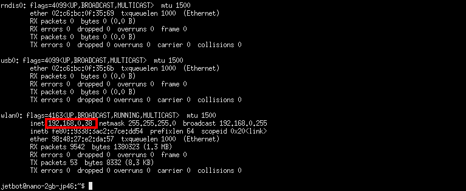

# 01.コンソール接続でのWi-Fi設定方法(GUI無し設定の場合)

JetBotにHDMIケーブルを接続し、キーボードとマウスを装着します。通常のPC同様に、モニターを見ながら設定できます。

## Jetson Nano 2GB/4GB 共通

### コマンド入力でWi-Fiアクセスポイントへ接続
Wi-FiルータのSSIDとパスワードをコマンドラインで設定します。  
MySSIDとMyPasswordを接続したいWi-FiルータのSSIDとパスワードに変更して実行してください。
```
sudo nmcli device wifi connect 'MySSID' password 'MyPassword' ifname wlan0
```


ifconfig -a でwlan0のIPアドレスを確認します。




