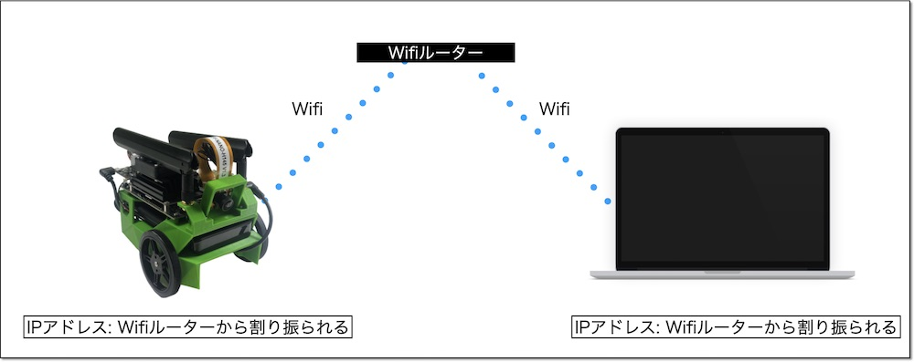

# 4通りの方法

JetBotをPCのブラウザから操作するために、JetBotのWi-Fiを設定する必要があります。  

【目標：JetBotがWi-Fiで接続された状態】

Wi-Fiの設定方法はいくつか方法があります。

*   コンソール接続（HDMIモニタ、キーボード、マウスを接続）してコンソール画面でWi-Fiを設定する(GUI無し設定の場合)
*   コンソール接続（HDMIモニタ、キーボード、マウスを接続）してGUI画面でWi-Fiを設定する(GUI有り設定の場合)
*   有線LANを接続して、PCからsshでJetsonにリモートログインしてコマンドラインでWi-Fiを設定する
*   Jetsonの機能として提供されるUSB device modeの仮想ネットワークを利用して、PCからsshでJetsonにリモートログインしてコマンドラインでWi-Fiを設定する

コンソール接続の場合は「01.コンソール接続でのWi-Fi設定方法（GUI無し）」  「02.コンソール接続でのWi-Fi設定方法（GUI有り）」  
有線LAN接続の場合は「03.有線LAN接続でのWi-Fi設定方法」  
USB device modeの場合は「04.USB device modeでのWi-Fi設定方法」  
を参照してください。

GUIの無効化/有効化に関しては、「10.その他」「GUIを無効化」を参照してください。

