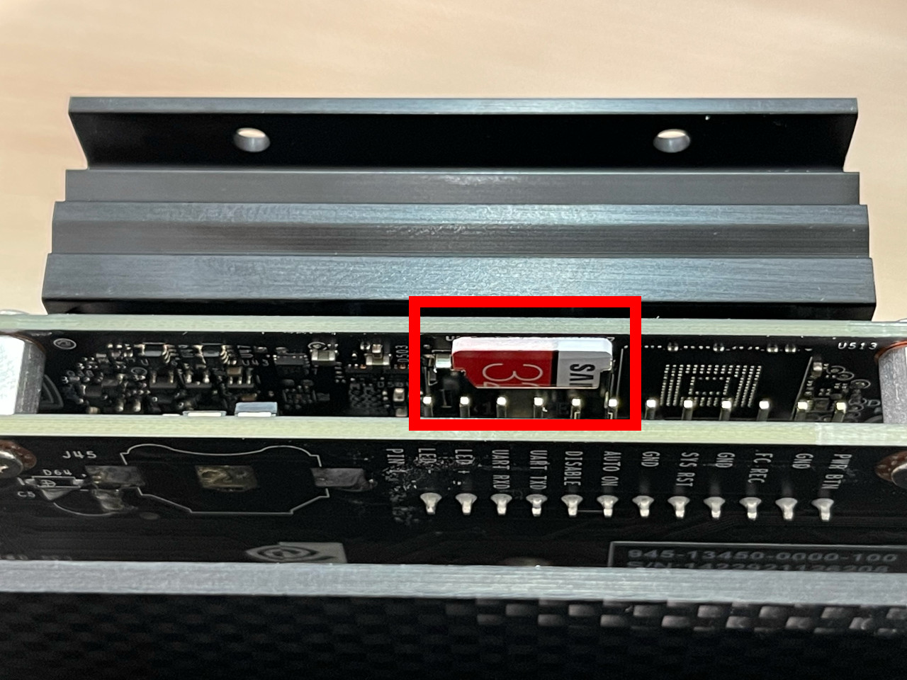

# 03.OS初期設定

## SDカードを入れます

焼き込んだSDカードをJetsonに差し込みます。

## コンソール接続します

HDMIモニタ、キーボード、マウスを接続します。

## Jetsonの電源をOnにします

## OSの初期設定をします

ライセンス許諾

OSの言語設定

キーボードレイアウト

タイムゾーン

ユーザ作成

パーティション拡張(デフォルトのままでOK)

古いbootroderを更新

動作モード

初期化が進みます

OS初期化が終わり、起動が完了すると、GUIログイン済みの画面になります。

