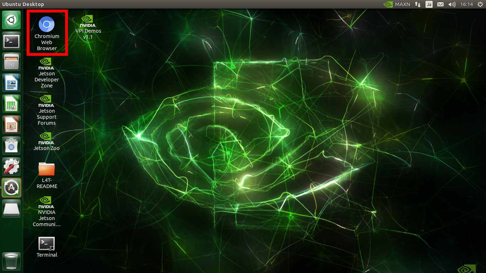
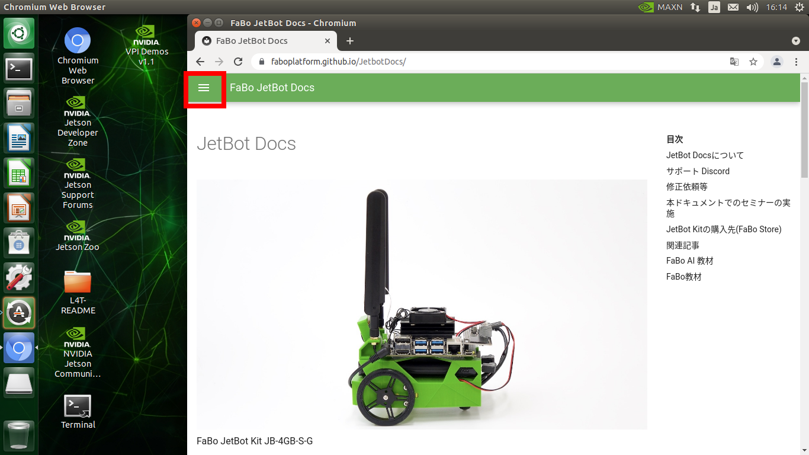
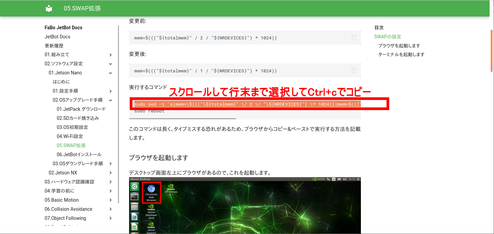
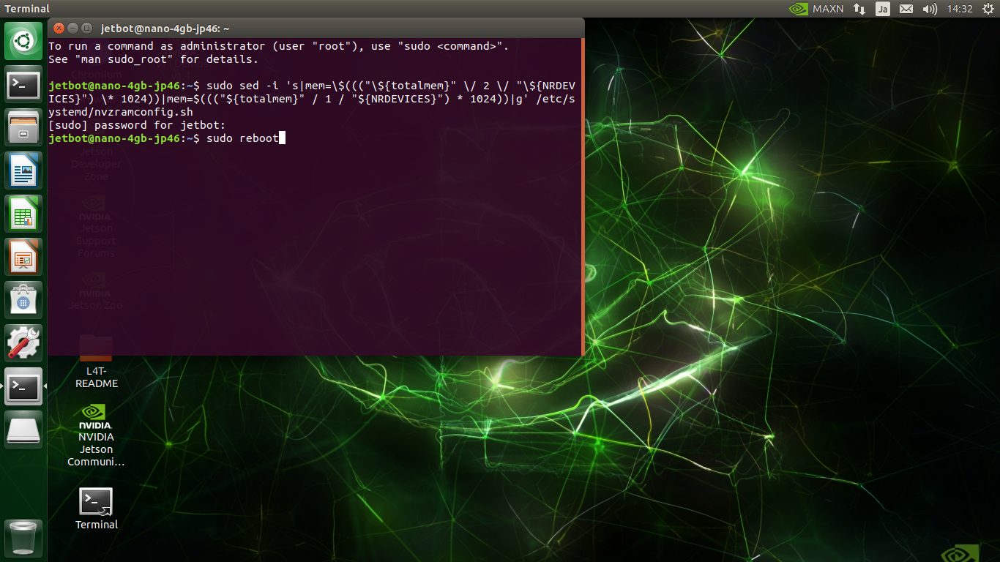
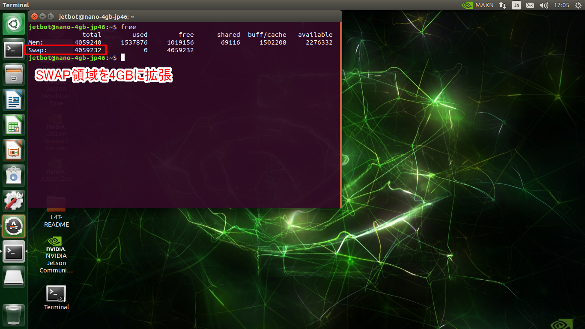

# 05.SWAP拡張

ディープラーニングの実行中に、メモリ不足になることがあります。  
そのため、SWAP領域を拡張しておきます。

## SWAPの設定
SWAPはZRAMで管理されているので、ここを修正します。  
Jetson Nano 4GBの場合、デフォルトで2GBのSWAP領域が確保されていますが、これを4GBに拡張します。  

対象ファイル：`/etc/systemd/nvzramconfig.sh`  

変更前:
```
mem=$((("${totalmem}" / 2 / "${NRDEVICES}") * 1024))
```

変更後:
```
mem=$((("${totalmem}" / 1 / "${NRDEVICES}") * 1024))
```

実行するコマンド  
```
sudo sed -i 's|mem=\$((("\${totalmem}" \/ 2 \/ "\${NRDEVICES}") \* 1024))|mem=$((("${totalmem}" / 1 / "${NRDEVICES}") * 1024))|g' /etc/systemd/nvzramconfig.sh  
sudo reboot
```

このコマンドは長く、タイプミスする恐れがあるため、ブラウザからコピー&ペーストで実行する方法を記載します。

### ブラウザを起動します
デスクトップ画面左上にブラウザがあるので、これを起動します。  


FaBo JetBot Docsのページを開きます。


このコマンドを選択して`Ctrl + c`でコピーします。


### ターミナルを起動します

`Ctrl + Alt + t`を同時に押すと、ターミナルが起動します。  
マウスの中央ボタンをクリックすると、ターミナルにコマンドをペーストできます。  
`Enter`キーを押してコマンドを実行します。  



パスワードを聞かれるので、OS初期化で作成したユーザのパスワードを入力してください。

再起動後にSWAPが拡張されていることを確認します。

```
free
```


