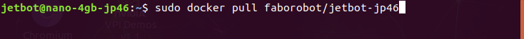
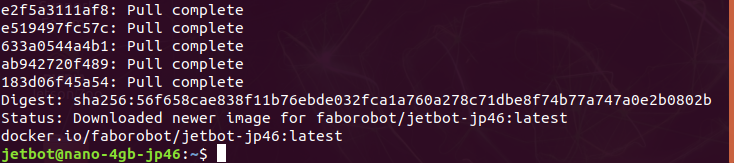
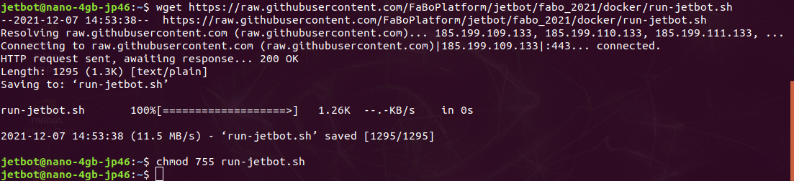
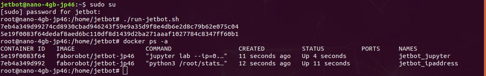
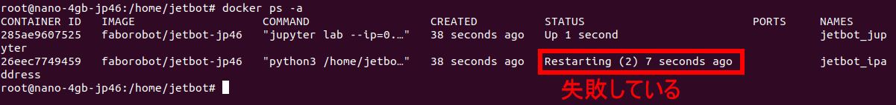
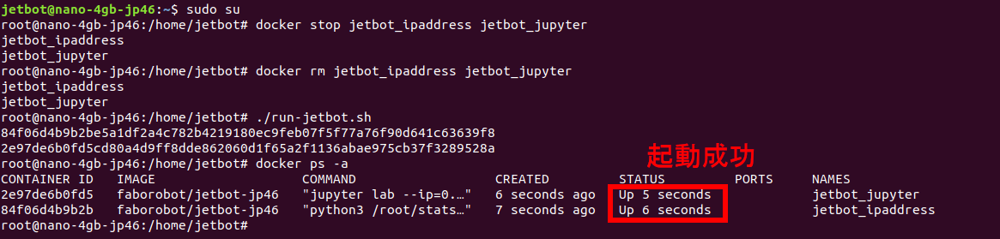

# 06.JetBotインストール

## Dockerイメージをダウンロードします

インターネットに接続されている必要があります。
```
sudo docker pull faborobot/jetbot-jp46
```





## JetBot自動起動スクリプトをダウンロードします
```
cd
wget https://raw.githubusercontent.com/FaBoPlatform/jetbot/fabo_2021/docker/run-jetbot.sh
chmod 755 run-jetbot.sh
```



## JetBotを自動起動します
これを1度実行すると、Jetsonを再起動してもJetBotが自動起動するようになります。  
```
sudo su
./run-jetbot.sh
```

Dockerコンテナが起動していることを確認します。

```
docker ps -a
```




## 起動に失敗したとき

もしここでうまく起動していないようであれば、dockerコンテナを停止して削除し、新しいDockerを起動してください。  



```
sudo su
docker stop jetbot_ipaddress jetbot_jupyter
docker rm jetbot_ipaddress jetbot_jupyter
./run-jetbot.sh
```



