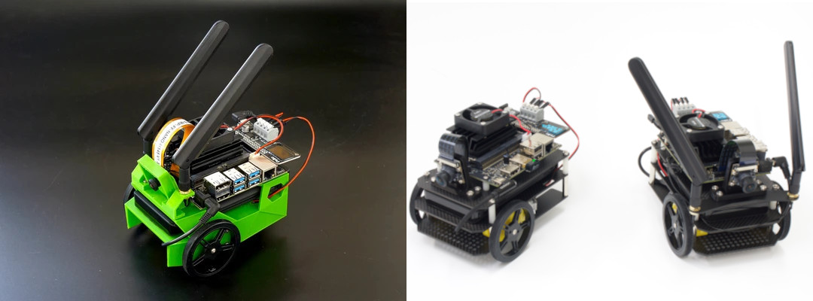
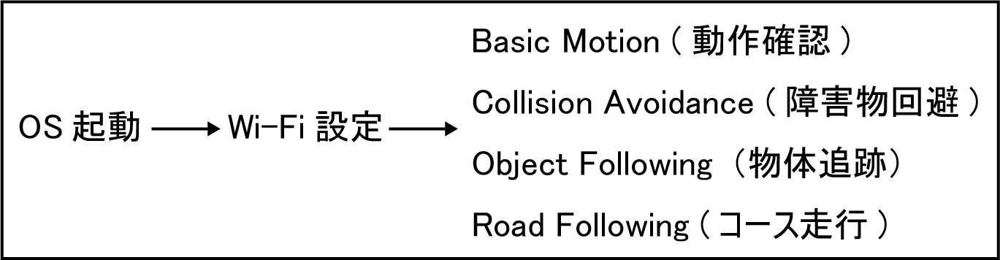

# はじめに

## FaBo JetBot 設定手順
この項目は通常の手順になります。  
最新のFaBo JetBot(2022/03以降)は物体追跡を実行することが可能です。(2GB/4GB共に可能)  
JetBotのソフトウェアが古い場合は、最新のイメージをダウンロードして使うことをお勧めします。  

## FaBo JetBot OSアップグレード手順
この項目は、FaBo JetBotを最新のソフトウェアに更新するための手順になります。  

