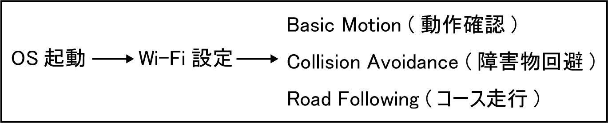
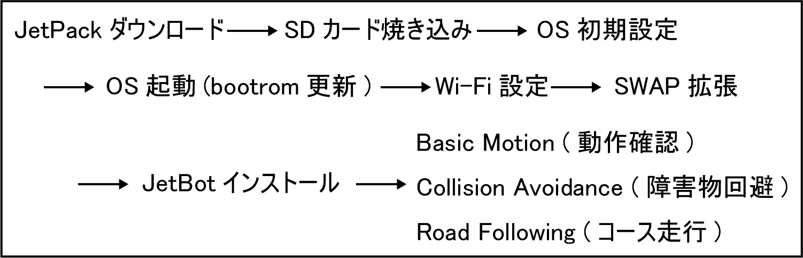
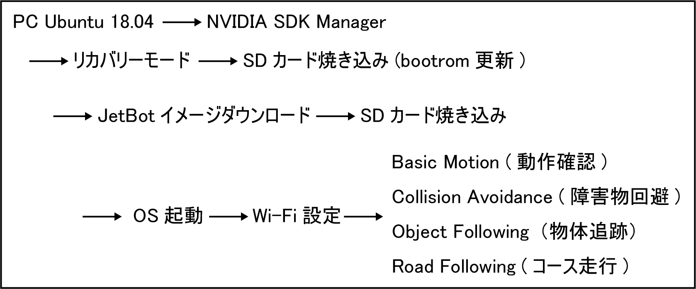

# はじめに

## FaBo JetBot 設定手順
この項目は通常の手順になります。  

## FaBo JetBot OSアップグレード手順
この項目は、FaBo JetBotを最新のソフトウェアに更新するための手順になります。  

## FaBo JetBot OSダウングレード手順
この項目は、FaBo JetBotを特定のバージョンに戻すための手順になります。  
Jetsonは、JetPackのバージョンとbootromのバージョンを一致させる必要があります。  
JetPack 4.5.1以降は、SDカードイメージからbootromを更新するようになりましたが、それ以前のJetPackを使う場合は[NVIDIA SDK Manager](https://developer.nvidia.com/nvidia-sdk-manager)を使ってJetson基盤にあるbootromをflashする必要があります。  

