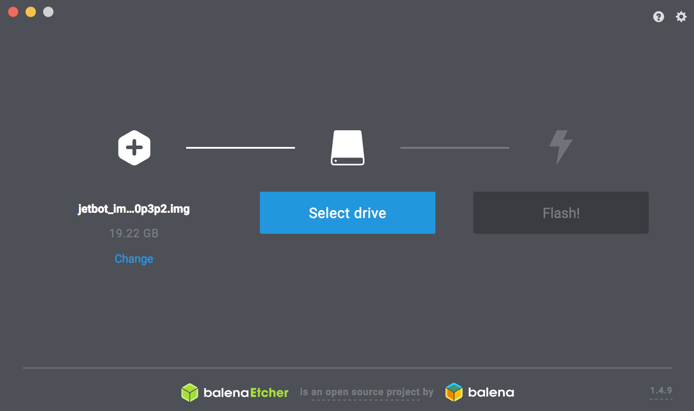
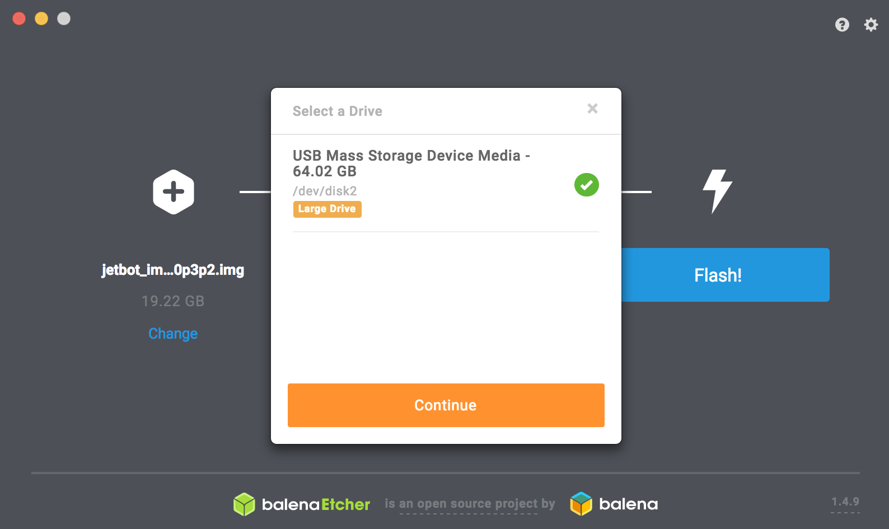
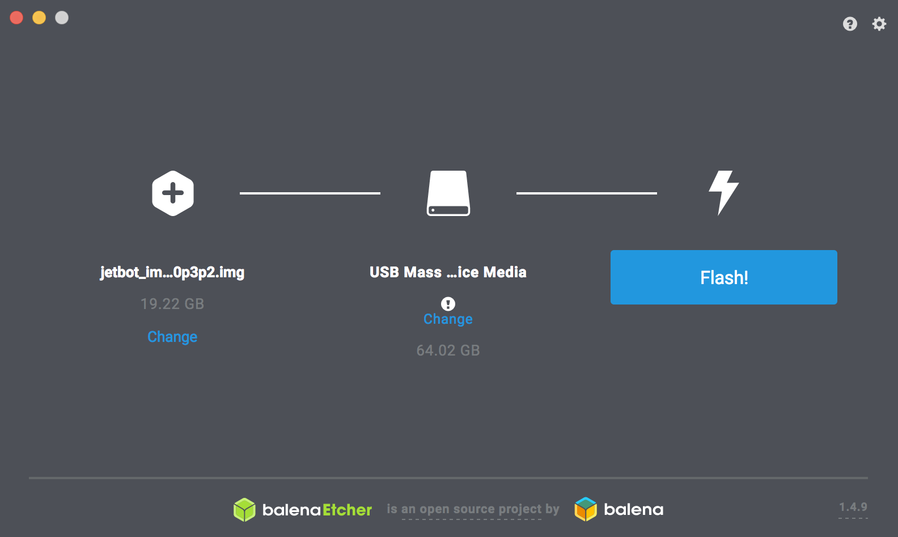

# SDカードの作成

## SDカードのイメージ　

|SDカードの種類|Download|
|:--|:--|
|JetPack4.5.1対応版|[SDカードのイメージ](https://developer.nvidia.com/embedded/jetpack)|

NVIDIA-AI-IOTの[Wiki](https://github.com/NVIDIA-AI-IOT/jetbot/wiki/software-setup)のページが参考になります。

## SDカードの焼き込み

SDカードのイメージは、[Etcher](https://www.balena.io/etcher/)を用いて、SDカードに焼き込む。

## 起動

Jetson NXをHDMIケーブルでDisplayに装着し、ライセンス画面に同意し、初期設定をおこないます。
