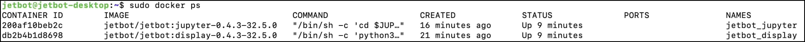
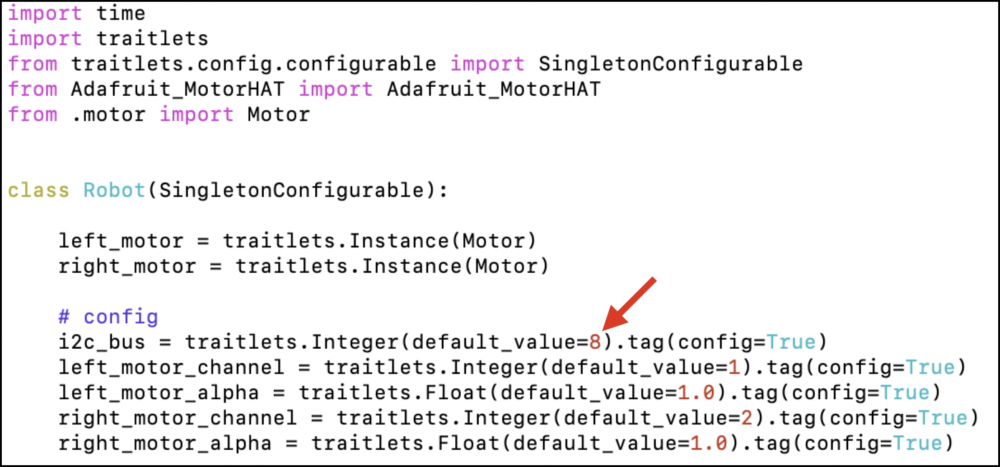
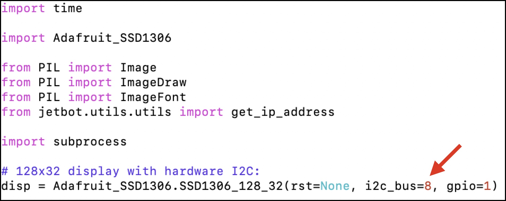

# I2Cアドレスの修正

Jetson Nano 2GB, 4GBではI2Cのバスは1を使用しますが、Jetson Xavier NXではI2Cのバスは8を使用します。

## I2Cアドレスの修正

PCから、SSHでJetBotにログインします。
```
sudo docker ps
```



2つのDockerが起動しています。NAMESのところが、`jetbot_jupyter`の方が走行用、`jetbot_display`の方がOLEDの表示用で、I2Cにアクセスしていますので、I2Cのアドレスをそれぞれ書き直します。

## モーター制御側のI2Cアドレスの修正


`jetbot_jupyter`のコンテナにログインします。
```
sudo docker exec -it コンテナID /bin/bash
```

下記フォルダに移動します。
```
cd /usr/local/lib/python3.6/dist-packages/jetbot-0.4.3-py3.6.egg/jetbot
```

viで編集します。
```
vi robot.py
```


`robot.py`

> i2c_bus = traitlets.Integer(default_value=8).tag(config=True)
を書き直します。



Dockerからログアウトします。

```
exit
```

## OLED表示側のI2Cアドレスの修正


`jetbot_display`のコンテナにログインします。
```
sudo docker exec -it コンテナID /bin/bash
```

下記フォルダに移動します。
```
cd /usr/local/lib/python3.6/dist-packages/jetbot-0.4.3-py3.6.egg/jetbot/apps
```

viで`stats.py`を開きます。
```
vi stats.py
```

`stats.py`


> disp = Adafruit_SSD1306.SSD1306_128_32(rst=None, i2c_bus=8, gpio=1)
を書き直します。



Dockerからログアウトします。
```
exit
```

Jetson NX Xavierを再起動します。
```
sudo reboot
```

