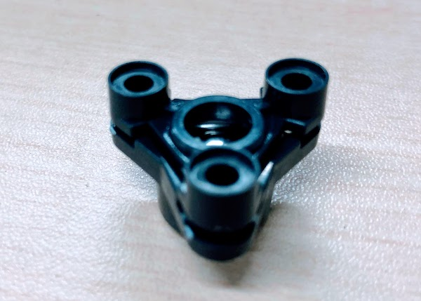
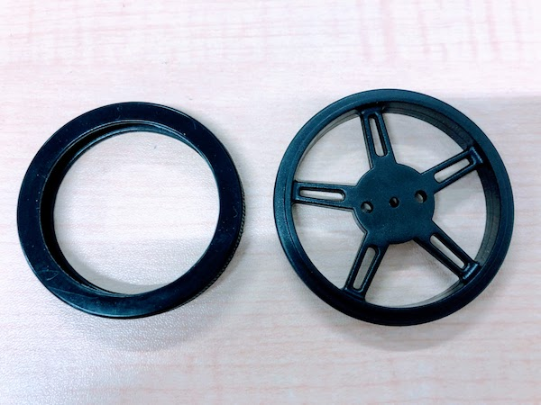
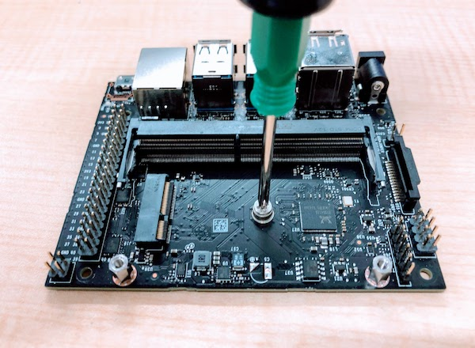
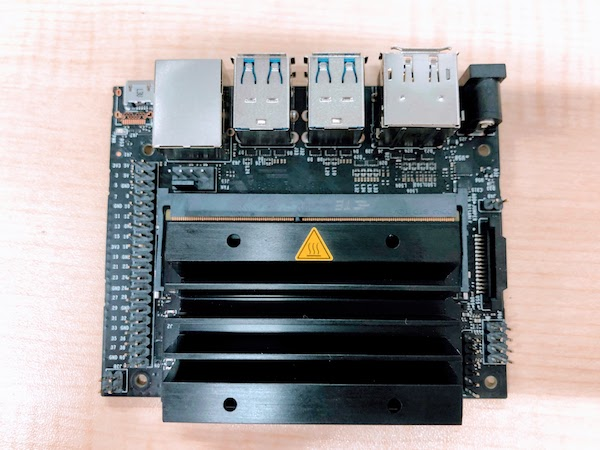
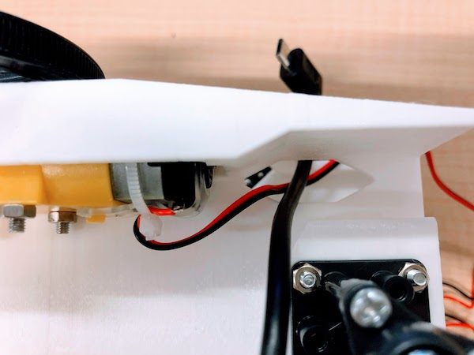
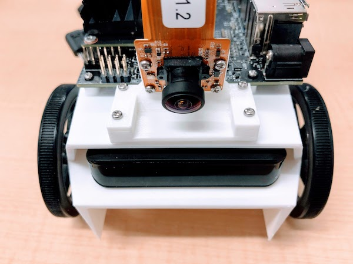
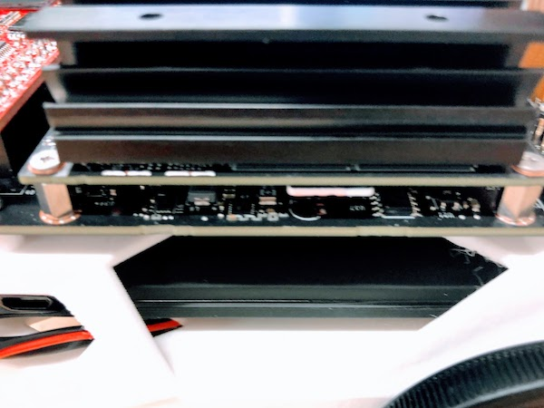
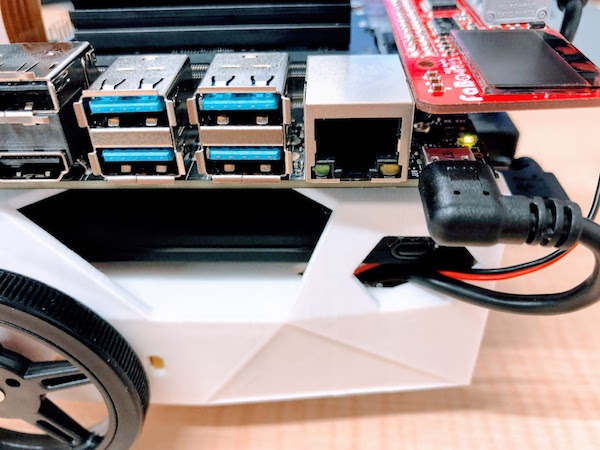

# 組み立てマニュアル

## 0. BOM

|部品|個数|
|:--|:--|
|Jetson Nano|1枚|
|LI-IMX219-MIPI-FF-NANO|1個|
|JetBot Body　（JetBot-B001）|1個|		
|JetBot CameraMount　（JetBot-B002）|1個|	
|JetBot GearMotor　（JetBot-B003）|2個|		
|JetBot タイヤ　（JetBot-B004）|2個|		
|ボールキャスター　（70144）| 1箱|		
|バッテリー　（BI-B3）| 1個|		
|USB Cable|2本|
|ネジ|20本|		
|JetBot　ControllerBoard　（FaBo #611）	|1枚|	
|SD Card（64GB）　（64　EVO Plus）|1枚|		
|WiFi PIC-Express（Intel 8265）|1個|
|両面テープ|2枚|		
|箱　（ワンタッチ式60サイズ）|1個|

## 1. ボールキャスター組み立て

説明書を参考に高さ35mmで組み立てます。

POINT

説明書にはM3-15mmタッピングネジでボールを固定すると書いてありますが、12mmの方が付け易いです。

## 2. ボールキャスター取り付け

シャーシにボールキャスターを取り付けます。

使用ネジ　M３−10mmネジ　ナット　x４（ボールキャスターに付属）

## 3. ギヤモーター取り付け

シャーシにギヤモーターを取り付けます。

まず、ギアモーターの配線を留めている結束バンドの出っ張りを反対側に移動します。

使用ネジ　M３-25mmネジ　ナット　x2　左右２箇所

黒、赤の先を隙間から外に出しておきます。

## 4. タイヤ取り付け

使用ネジ　タイヤ付属タッピングネジ　x１　左右２個

※ネジの回し過ぎに注意しましょう。

## 5. Wifi Moduleの取り付け

Wifi Moduleを取り付けるために、Jetson Nano moduleを取り外します。

両サイドの留め具を外に開き、Jetson Nano moduleを取り外します。

Wifi Moduleを取り付けるために、真ん中のネジを外しておきます。

Wifi Moduleは、8265NGWもしくは、8265NGWMGを取り付けます。

Wifi Moduleの取り付けが完了したら、Jetson Nano Moduleを再び取り付けます。

## 6. Jetson NANO取り付け

使用ネジ　M2-6mmタッピング　x４

## 7. カメラの装着

カメラマウントにカメラを取り付けます。

使用ネジ　M2-6mmタッピングネジ　x4

POINT

ネジとネジ穴が小さいので慎重に取り付けましょう。本体を持たず、テーブルに置けばネジを回し易いです。

回し過ぎには注意しましょう。

カメラマウントをシャーシに取り付けます。

使用ネジ　M2-6mmタッピングネジ　x4

## 8. Controller Boardの取り付け

## 9. 配線

## 10. バッテリー取り付け

両面テープで固定します。

## 11. 接続

## 12. SDカードの挿入

## 13. 電源の投入

