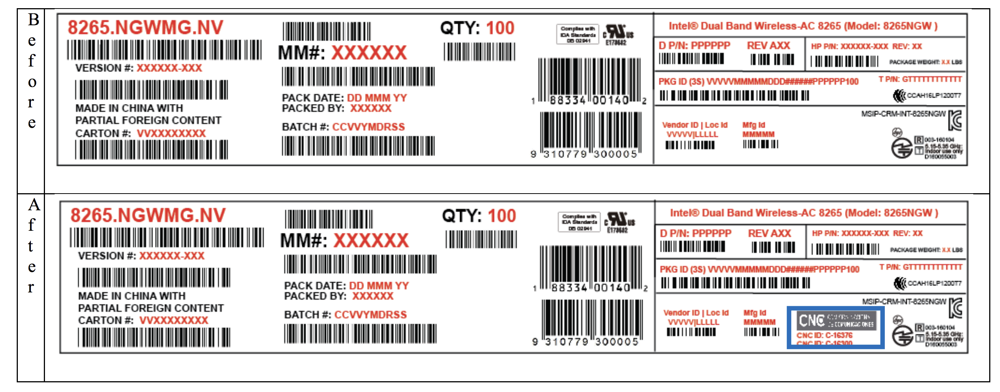

# 対応Wifi

Wifiは、USB Wifi Dongle型は、速度がまったくでないためJetBotのサンプリでは使用できない。mini PCI-Express型のWifi Moduleを使用する。

## USB Wifi Dongle

|型番|メーカー|チップ型番|動作|
|:--|:--|:--|:--|
|[WI-U3-866DS](https://www.buffalo.jp/product/detail/wi-u3-866ds.html)|BUFFALO|RTL8812AU|電力不足|
|[WLI-UC-GNM](https://www.buffalo.jp/product/detail/wli-uc-gnm.html)|BUFFALO|RT2800USB|30-70M/s程度の速度がでるが速度不足|
|[TP-LINK Archer T2U Nano](https://www.tp-link.com/jp/home-networking/adapter/archer-t2u-nano/)|TP-LINK|RTL8811AU|認識しない|
|[WN-G150UM](https://www.iodata.jp/product/network/adp/wn-g150um/)|I/O Data|RTL8192CU|速度はでない(1M/s程度の速度しかでない)|
|[WN-G300UA](https://www.iodata.jp/product/network/adp/wn-g300ua/)|I/O Data|RTL8192CU|速度はでない(うまくつながらない)|
|[WDC-150SU2M](https://www.elecom.co.jp/products/WDC-150SU2MBK.html)|Elecom|RTL8188EU|速度不足|

## mini PCI-Express型のWifi Module

|型番|メーカー|動作|
|:--|:--|:--|
|[8265.NGW](https://www.intel.co.jp/content/www/jp/ja/products/wireless/wireless-products/dual-band-wireless-ac-8265.html)|Intel|安定して動作、速度も400M/s程度でる|
|[8265.NGWMG](https://www.intel.co.jp/content/www/jp/ja/products/wireless/wireless-products/dual-band-wireless-ac-8265.html)|Intel|安定して動作、速度も400M/s程度でる|

技適情報

|項目|認証番号|
|:--|:--|
|R|003‐160104|
|T|D160055003|

日本の工事設計認証(いわゆる技適)では、Moduleとアンテナがセットで申請がおこなわれる。申請時に使用したアンテナを使う必要がある。仮に、他のアンテナを使った場合は、法令違反となり、再認証が必要となる。

技術基準適合証明及び工事設計認証に関するお問合せ [https://www.telec.or.jp/faq/index.html](https://www.telec.or.jp/faq/index.html) よりの転載

!!! note "Q.市販されている認証若しくは技適の証明のある特定小電力機器を弊社が商品として、内蔵で使用した場合、再度、認証若しくは技適の申し込みが必要ですか。"
	A.市販されている認証若しくは技適の証明のある無線設備を購入して、そのままの状態（例えば、アンテナを交換するとか、操作部及び電源部などを変えることはできません。）で使用して販売することは、証明の効力には影響が生じませんので、申し込みの必要はありません。しかしながら、無線設備を変更する場合には、その証明の効力が失われます。
