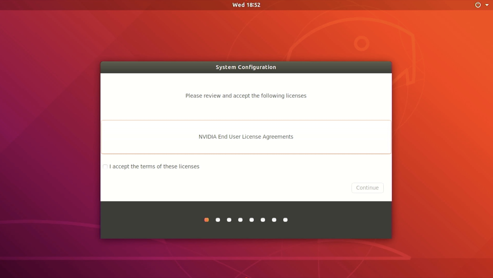

# 1.SDカード


## JetPack 4.6
!!!Info "付属のSDカード"
    2021/12/07以降にFaBo Storeから出荷したJetBotは、付属SDカードにJetPack 4.6を焼き込み済みです。

### SDカードの焼き込み

NVIDIA社の[JetPack 4.6](https://developer.nvidia.com/jetpack-sdk-46)のページからJetson Nano(4GB or 2GB)のSDカードイメージをダウンロードして、SDカードに焼き込みます。  
SDカードは64GBをお勧めします。  
SDカードのイメージは、[Etcher](https://www.balena.io/etcher/)を用いて、SDカードに焼き込みます。


### 初期設定

焼き込んだSDカードをJetsonに差し込み起動

Jetsonを起動し、初期設定をおこないます。設定はDefaultのままで問題ありません。



### WiFiの設定

インターネットに接続可能なWi-Fiアクセスポイントに接続します。


### SWAPの設定
学習中や実行中にメモリ不足になることがあるため、SWAPを拡張します。  
SWAPはZRAMで管理されているので、ここを修正します。  
Jetson Nano 4GBの場合、デフォルトで2GBのSWAP領域が確保されていますが、これを4GBに拡張します。  
対象ファイル：`/etc/systemd/nvzramconfig.sh`  

変更前:
```
mem=$((("${totalmem}" / 2 / "${NRDEVICES}") * 1024))
```

変更後:
```
mem=$((("${totalmem}" / 1 / "${NRDEVICES}") * 1024))
```

実行するコマンド  
```
sudo sed -i 's|mem=\$((("\${totalmem}" \/ 2 \/ "\${NRDEVICES}") \* 1024))|mem=$((("${totalmem}" / 1 / "${NRDEVICES}") * 1024))|g' /etc/systemd/nvzramconfig.sh  
sudo reboot
```

### JetBotをインストールする

Dockerイメージをダウンロードします。(インターネットに接続されている必要があります。)
```
sudo docker pull faborobot/jetbot-jp46
```

JetBot自動起動スクリプトをダウンロードします。
```
cd ~/
wget https://raw.githubusercontent.com/FaBoPlatform/jetbot/fabo_2021/docker/run-jetbot.sh
chmod 755 run-jetbot.sh
```

JetBotを自動起動します。これを1度実行すると、Jetsonを再起動してもJetBotが自動起動するようになります。  
```
sudo ./run-jetbot.sh
```

Dockerコンテナが起動していることを確認します。

```
sudo docker ps -a
```


### GUIを無効化する
メモリ容量を確保するために、GUIログインを無効化します。(オプション)  

```
sudo systemctl set-default multi-user.target
sudo reboot
```

### GUIを有効化する
ネットワークの設定等、GUIで操作したほうが便利なことがあるので、無効化したGUIを有効化します。(オプション)  

```
sudo systemctl set-default graphical.target
sudo reboot
```


## 古いJetPackイメージ

|対象ハードウェア|JetPackバージョン|URL|動作|内容|
|:--|:--|:--|:--|:--|
|Jetson Nano 2GB|JetPack 4.4.1|[FaBoストア](https://fabo.store/collections/jetbot)|basic_motion,collision_avoidance,road_following|docker版、最小限のコード変更、日本語化|
|Jetson Nano 4GB|JetPack 4.4.1|[FaBoストア](https://fabo.store/collections/jetbot)|basic_motion,collision_avoidance,road_following|docker版、最小限のコード変更、日本語化|
|Jetson Nano 4GB|JetPack 4.3|[FaBoストア](https://fabo.store/collections/jetbot)|basic_motion,collision_avoidance,road_following,object_following|コード変更、日本語化|

!!!warning "bootromバージョンとJetPackバージョン"
  Jetsonはbootromバージョン(基盤に保持)とJetPackバージョン(SDカードイメージ)が一致している必要があります。  
  これらのSDカードを利用する前に、bootromバージョンを更新(もしくはダウングレード)するためにリカバリーモードにして[sdkmanager](https://developer.nvidia.com/nvidia-sdk-manager)で対応するJetPackバージョンで一度flashしておく必要があります。  
  bootromとJetPackバージョンが一致しない場合は、起動時にHDMIのエラーで止まったり、電源が入らなくなることがあります。([sdkmanager](https://developer.nvidia.com/nvidia-sdk-manager)でflashすれば直ります)  
  詳しくは[nvidia developer forums](https://forums.developer.nvidia.com/c/agx-autonomous-machines/jetson-embedded-systems/jetson-nano/76)を参照するか、[discord](https://discord.com/invite/fX7UE9R)でお問い合わせください。

### JetBotの起動

SDカードをJetson Nanoに差し込み起動します。

本SDカードのidとpassは下記の通りです。ログイン時に使用します。

|項目|内容|
|:--|:--|
|ID|jetbot|
|Pass|jetbot|

