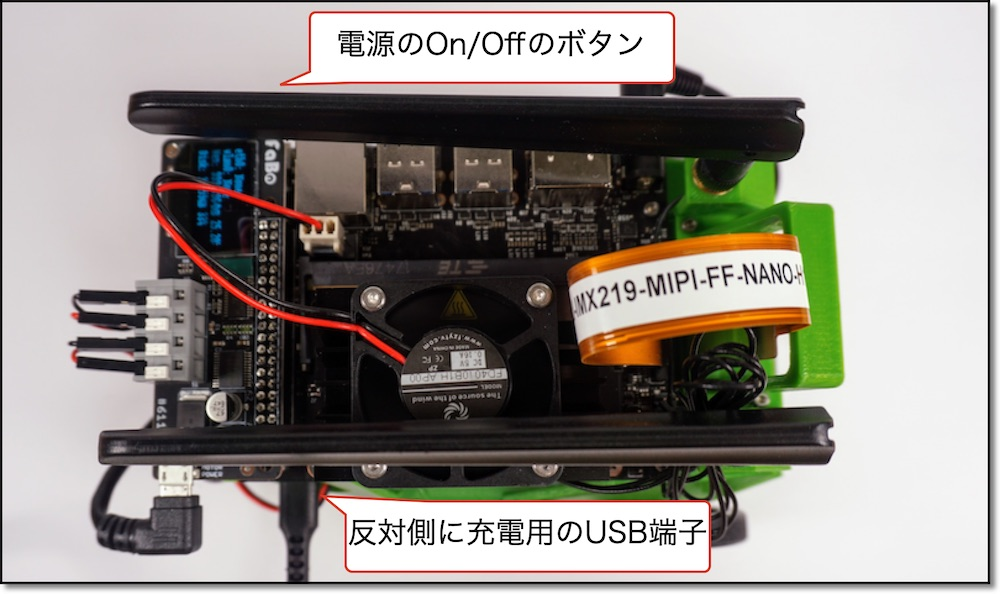
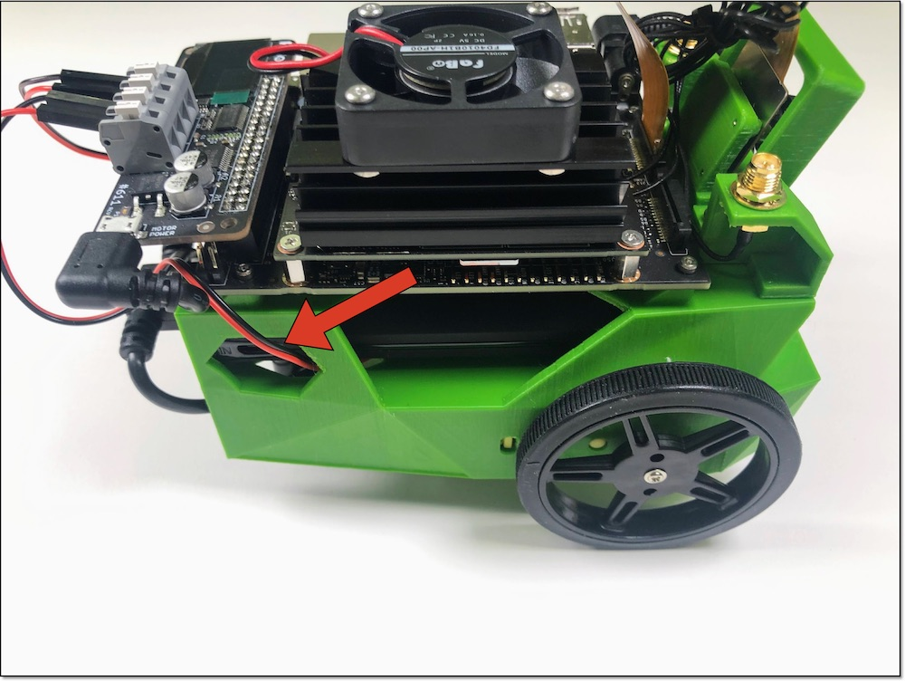
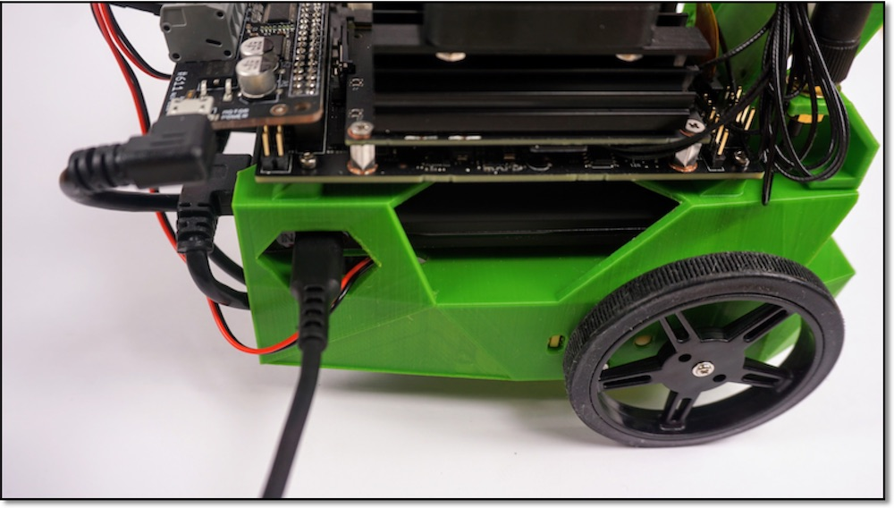
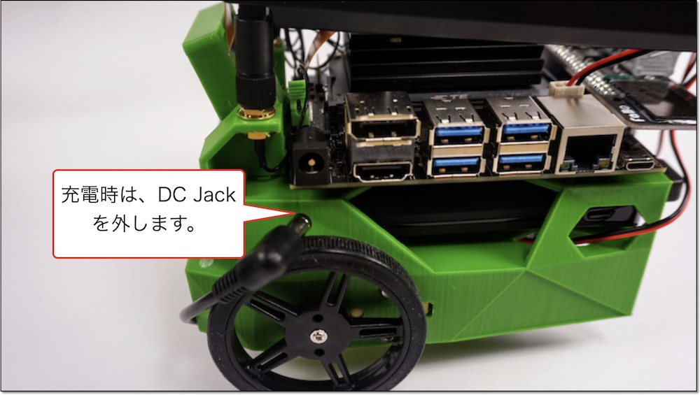

# 2.JetBotの充電と電源

## JetBotのバッテリーのOn/Off

Jetbotの電源をOffにし、再度 Onにします。

!!!Info "電源のOnとOff"
	電源をOnにするとCPUファンも回転し始めます。

# JetBotのバッテリーの充電

データ通信用USBケーブルとは、反対側にバッテリーの充電用のUSBがあります。

充電時は、Fanが回ってしまうので、DC Jackを外してください。

