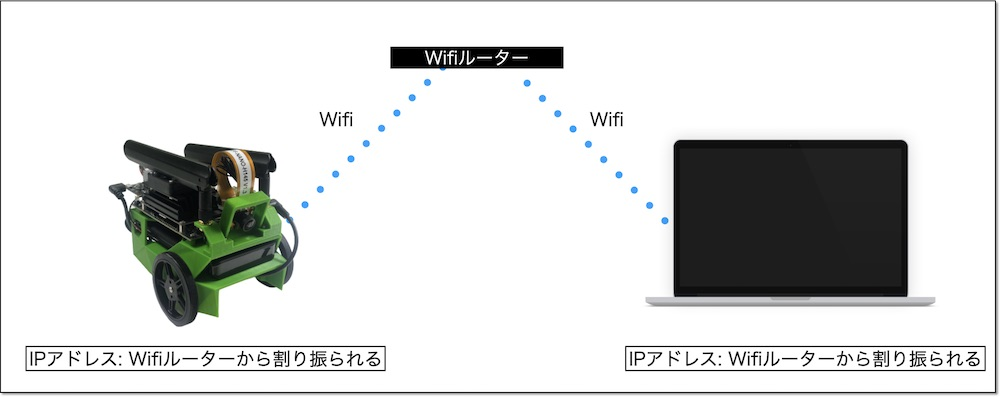

# 3.JetBotのWiFiネットワーク設定

JetBotをPCのブラウザから操作するために、JetBotのWiFiを設定する必要があります。  

【目標：JetBotがWiFiで接続された状態】

WiFiの設定方法はいくつか方法があります。

*   コンソール接続（HDMIモニタとキーボード、マウスを接続）してGUI画面でWiFiを設定する
*   有線LANを接続して、PCからsshでリモートログインしてコマンドラインでWiFiを設定する
*   USB device modeの仮想ネットワークを利用して、PCからsshでリモートログインしてコマンドラインでWiFiを設定する

コンソール接続の場合は「4.コンソール接続でのWiFi設定方法」  
有線LAN接続の場合は「5.有線LAN接続でのWiFi設定方法」  
USB device modeの場合は「6.USB device modeでのWiFi設定方法」  
を参照してください。
