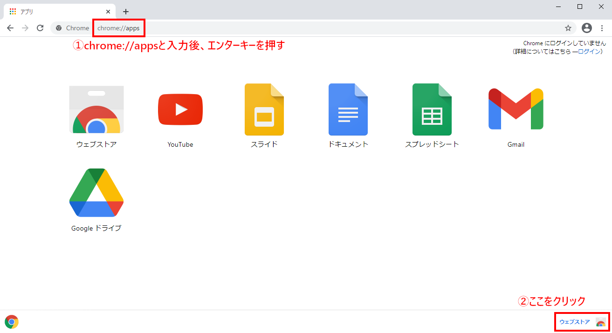
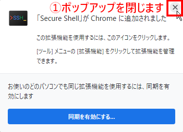
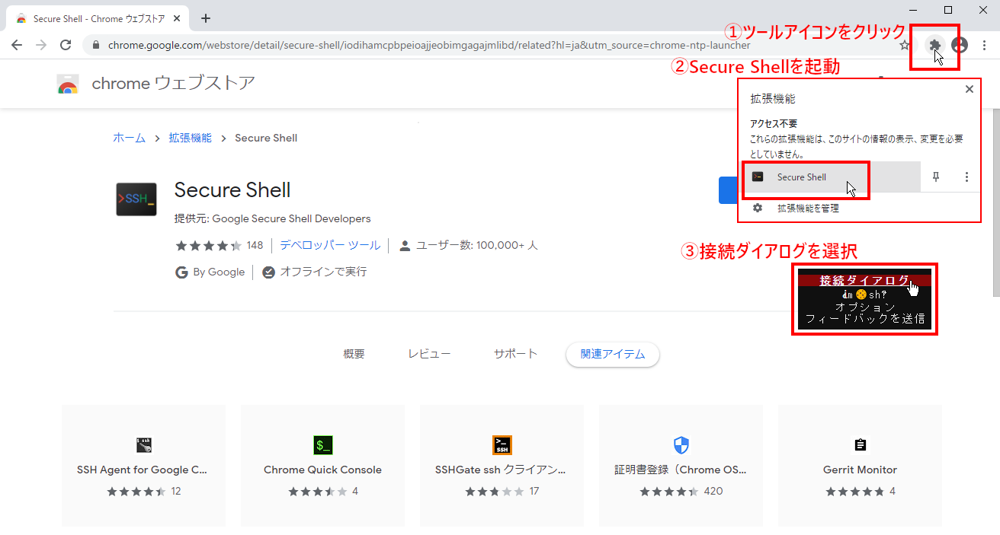
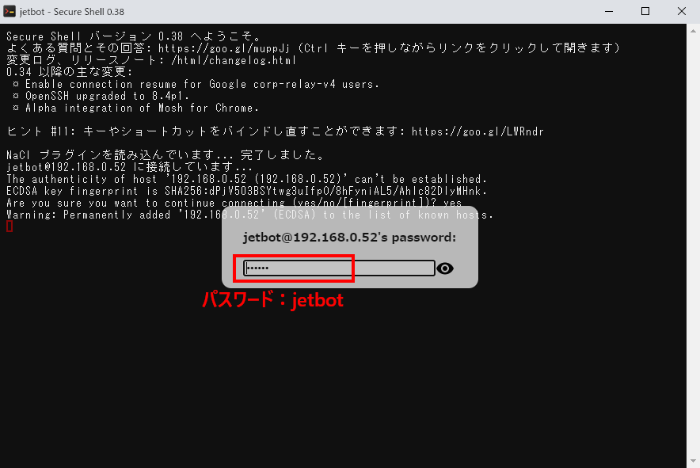
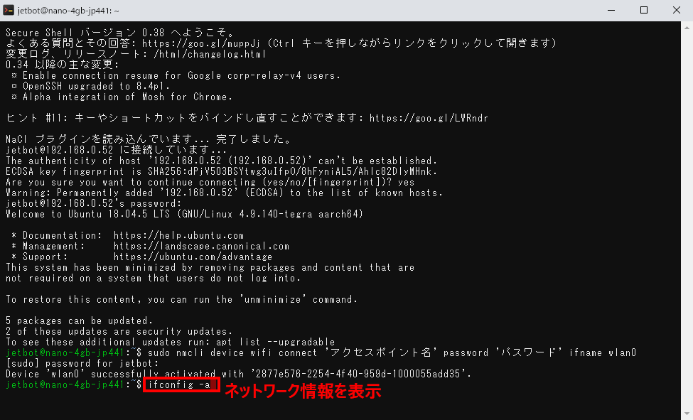
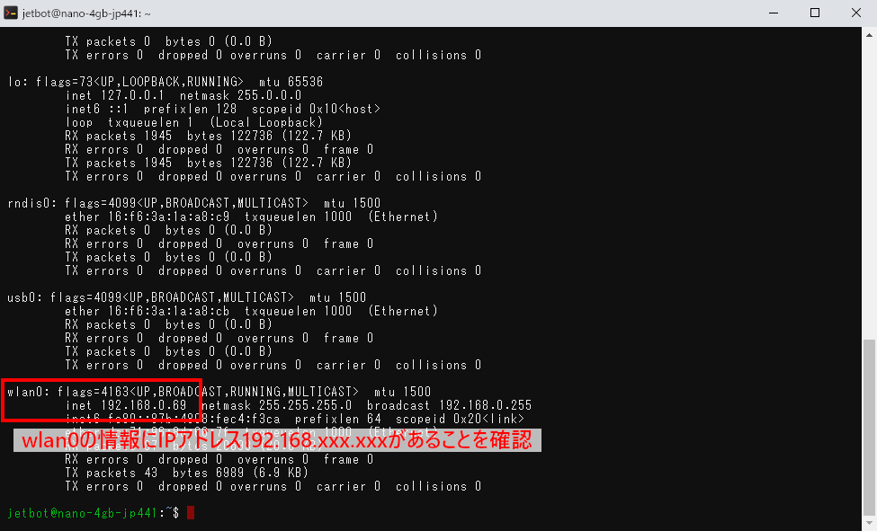

# 5.有線LAN接続でのWiFi設定方法

## PCからsshでJetBotにログインする

sshでJetBotにログインします。ユーザ名は`jetbot`、パスワードは`jetbot`になります。  
sshクライアント環境が整っていない場合は、Secure Shell(Google製)を用いて、Chrome browserからsshでJetBotにログインします。　

## Secure Shellのインストール

Chrome ウェブストアにアクセスし、[Secure Shell](https://chrome.google.com/webstore/detail/secure-shell/iodihamcpbpeioajjeobimgagajmlibd?hl=ja&)をインストールします。


chromeウェブストアでSecure Shellを検索します。


ポップアップ表示が出てくるので、「拡張機能を追加」をクリックしてSecure Shellをインストールします。

同期の有効化は特に必要ありません。


## Secure Shellの実行
ブラウザの右上にあるツールアイコンからSecure Shellを起動します。

## JetBotにログイン
有線LAN接続の場合はOLEDに表示されているJetBotのIPアドレスを確認してください。


|password|
|:-|
|jetbot|


JetBotにsshログイン成功。


## JetBotをWiFiルータに接続

JetBotのターミナルでWiFi接続のコマンドを実行します。``アクセスポイント名``と``パスワード``はお使いのネットワーク環境に合わせた値にします。

```
sudo nmcli device wifi connect 'アクセスポイント名' password 'パスワード' ifname wlan0
```

sudo実行の際に、パスワードを聞かれますので、下記を入力します。

|password|
|:--|
|jetbot|


## IPアドレスの確認

IPアドレスの確認はifconfigコマンドを用います。

```
ifconfig -a
```




