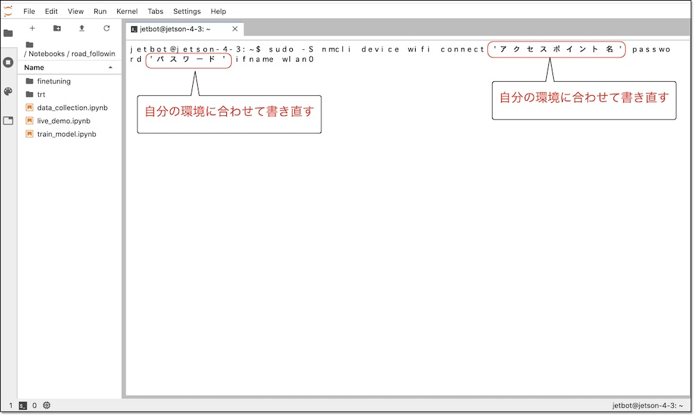
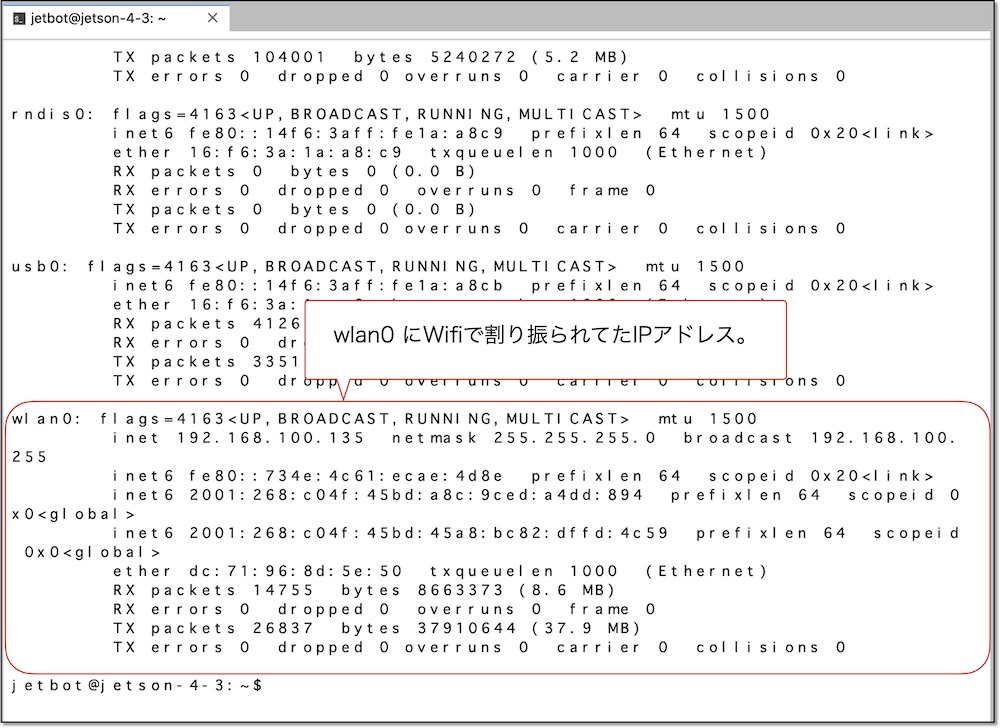

# 5.有線LAN接続でのWiFi設定方法

## PCからsshでJetBotにログインする

sshでJetBotにログインします。ユーザ名は`jetbot`、パスワードは`jetbot`になります。  
sshクライアント環境が整っていない場合は、Secure Shell(Google製)を用いて、Chrome browserからsshでJetBotにログインします。　

## Secure Shellのインストール

Chrome ウェブストアにアクセスし、[Secure Shell](https://chrome.google.com/webstore/detail/secure-shell/iodihamcpbpeioajjeobimgagajmlibd?hl=ja&)をインストールします。


## Secure Shellの実行

Chrome browserのURLフォームに、`chrome://app`と入力し、Chromeアプリの一覧を表示し、Secure Shellを起動します。


## JetBotにログイン


|password|
|:-|
|jetbot|

## JetBotをWiFiルータに接続

JetBotのターミナルでWiFi接続のコマンドを実行します。``アクセスポイント名``と``パスワード``はお使いのネットワーク環境に合わせた値にします。

```
sudo -S nmcli device WiFi connect 'アクセスポイント名' password 'パスワード' ifname wlan0
```



sudo実行の際に、パスワードを聞かれますので、下記を入力します。

|password|
|:--|
|jetbot|

## IPアドレスの確認

IPアドレスの確認はifconfigコマンドを用います。

```
ifconfig -a
```



