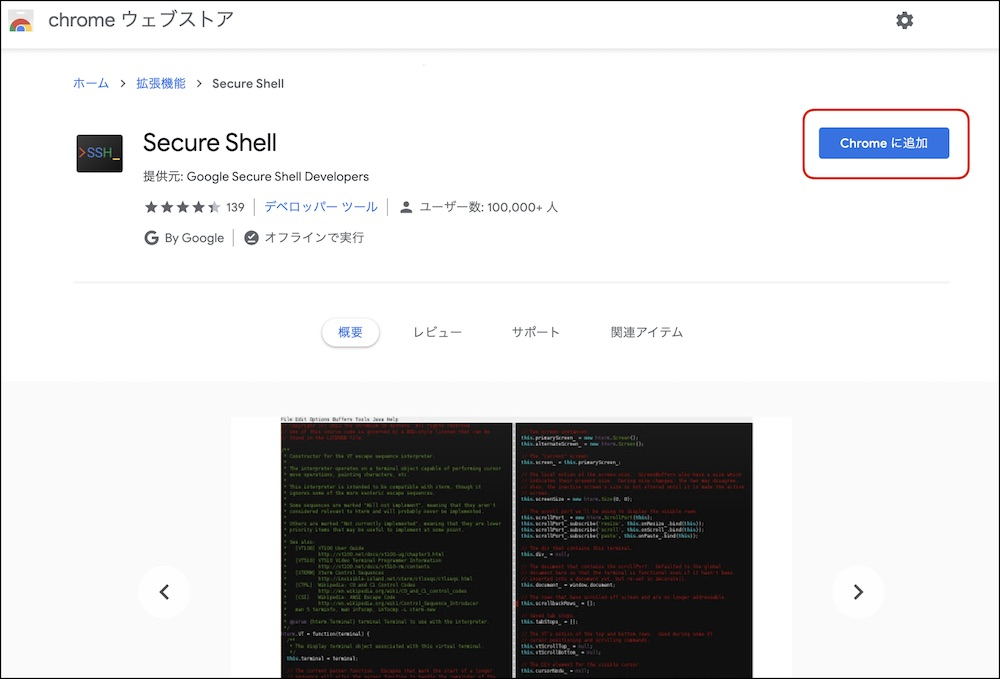
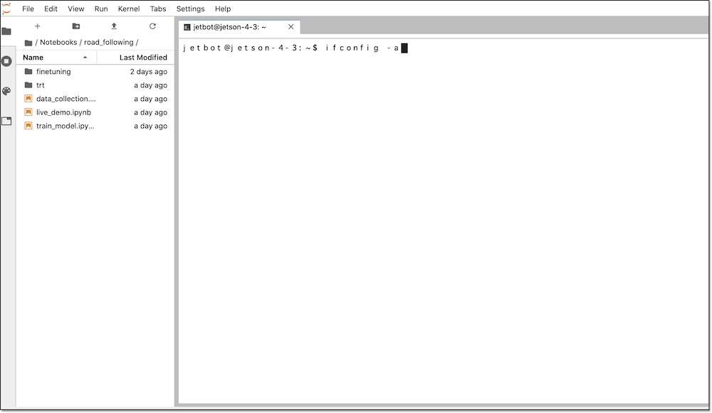
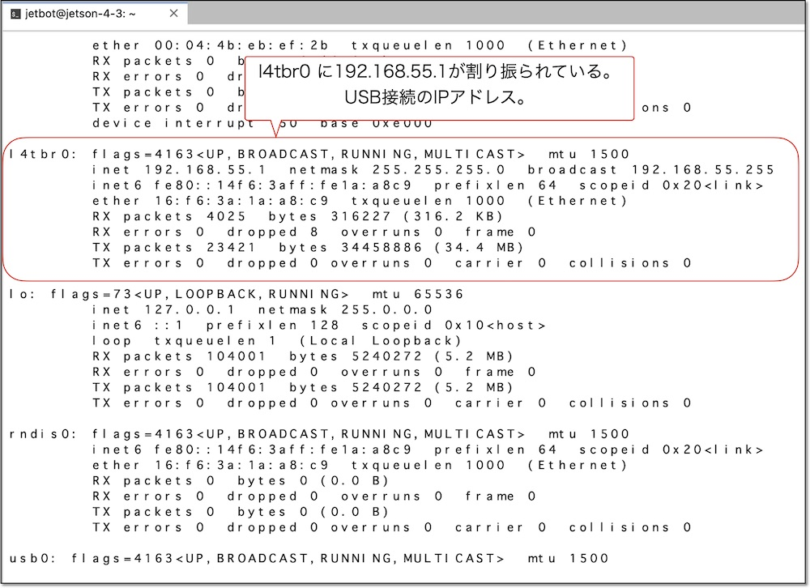

# 6.USB device modeでのWiFi設定方法


!!!Tip "USB device mode"
USB device modeとは、マイクロUSBケーブルでPCとJetsonを接続することで仮想インターネットインターフェースが作成されることです。Jetson Nanoは電源をDCジャックにすることでこの機能を提供します。  
この機能を利用するにはPCがドライバーをサポートしている必要がありますが、ドライバーをサポートしていないPCもあります。その場合は有線LANで接続してWiFiを設定するか、モニタとキーボード、マウスを接続してWiFiを設定する必要があります。

## JetBotとPCをUSBケーブルで接続

マイクロUSBケーブルとPCを接続するとIPアドレスが割り振られます。  
!!!warning "OLEDにIPアドレスは表示されません"
このとき、JetBotは192.168.55.1の固定IPアドレスになります。この仮想インターフェースはOLEDの表示処理に入れていないため、OLEDにIPアドレスは表示されません。


USB経由では下記IPアドレスが割り振られます。

|項目|値|
|:--|:--|
|JetBot|192.168.55.1|
|PC|192.168.55.100|

## PCからsshでJetBotにログインする

sshでJetBotにログインします。ユーザ名は`jetbot`、パスワードは`jetbot`になります。  
sshクライアント環境が整っていない場合は、Secure Shell(Google製)を用いて、Chrome browserからsshでJetBotにログインします。　

## Secure Shellのインストール

Chrome ウェブストアにアクセスし、[Secure Shell](https://chrome.google.com/webstore/detail/secure-shell/iodihamcpbpeioajjeobimgagajmlibd?hl=ja&)をインストールします。



## Secure Shellの実行

Chrome browserのURLフォームに、`chrome://app`と入力し、Chromeアプリの一覧を表示し、Secure Shellを起動します。


## JetBotにログイン


|password|
|:-|
|jetbot|

## JetBotをWiFiルータに接続

JetBotのターミナルでWiFi接続のコマンドを実行します。``アクセスポイント名``と``パスワード``はお使いのネットワーク環境に合わせた値にします。

```
sudo -S nmcli device WiFi connect 'アクセスポイント名' password 'パスワード' ifname wlan0
```


sudo実行の際に、パスワードを聞かれますので、下記を入力します。

|password|
|:--|
|jetbot|

## IPアドレスの確認

IPアドレスの確認はifconfigコマンドを用います。

```
ifconfig -a
```






|デバイス名|概要|
|:--|:--|
|l4tbr0|USBでPCと接続した際に使われる|
|wlan0|WiFiで接続した際に使われる|

!!!Warning "USB経由でうまく接続できない場合（Mac偏)"
	Macのシステム環境設定ー＞　ネットワークを選択し、
	
	画面下の＋ボタンを押して、ダイアログが出てきますので、Linux for Tegraを選択します。
	右下の適用ボタンを押します。
	
	成功するとI Pアドレスが割り振られます。
