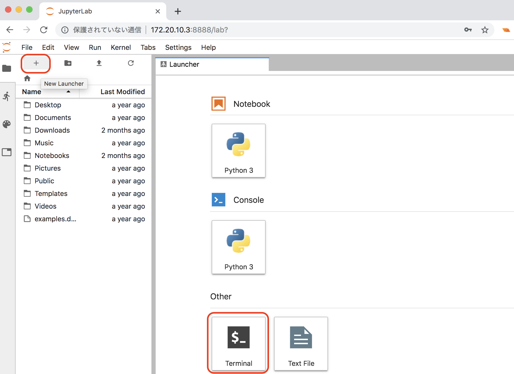
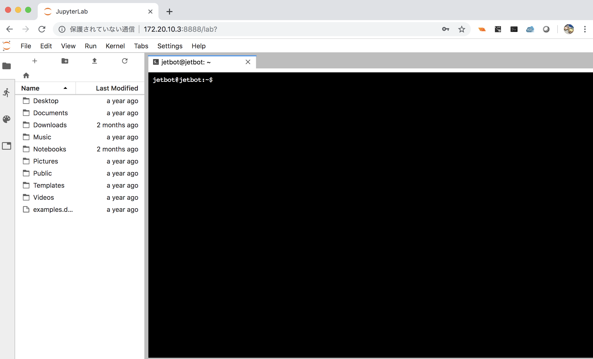

# ソフトウェアの設定

JetBotのIPアドレスに8888版ポートで接続します。

!!! Tip
	Jupyterのpasswordは`jetbot`です。

## Terminalの起動





最新版のjetbotプロジェクトをインストールします。

```
cd ~/
git clone https://github.com/NVIDIA-AI-IOT/jetbot
cd jetbot
sudo python3 setup.py install
```

最新版のJetbotプロジェクトのnotebookを~/Notebooksフォルダにrsyncします。

```
sudo apt-get install rsync
rsync -av ~/jetbot/notebooks/ ~/Notebooks
```

## 5W Powerモードの設定

```
sudo nvpmodel -m 1
sudo nvpmodel -q
```

!!! Tip
	-m 1 が省電力モードになり、-m 0が標準電力モードになります。-m 0では電力が4A程度必要になります。