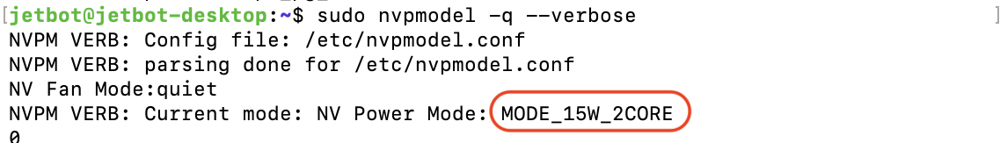

# 電力モード

Jetson NXでは、5つの電力モードが存在しています。

|モード|コマンド|
|:--|:--|
|MODE_15W_2CORE|sudo nvpmodel -m 0|
|MODE_15W_4CORE|sudo nvpmodel -m 1|
|MODE_15W_6CORE|sudo nvpmodel -m 2|
|MODE_10W_2CORE|sudo nvpmodel -m 3|
|MODE_10W_4CORE|sudo nvpmodel -m 4|

## モードの変更

MODE_10W_4COREに変更します。

```
sudo nvpmodel -m 4
```

電力モードが変更されたかの確認をおこないます。

```
nvpmodel -q --verbose
```


