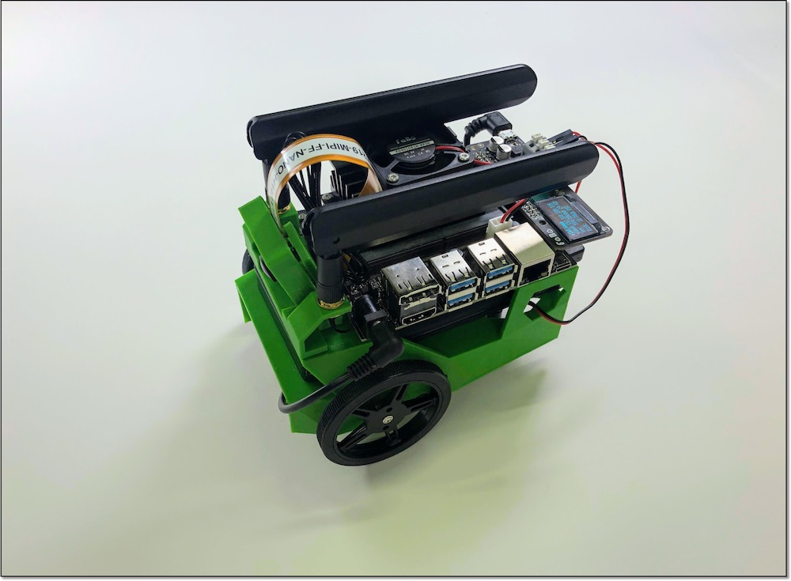
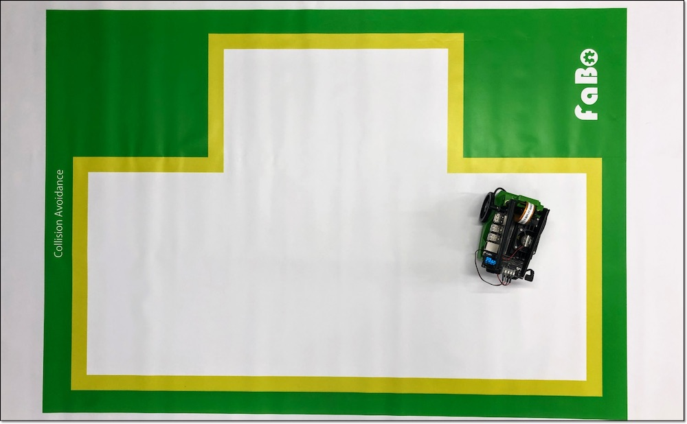
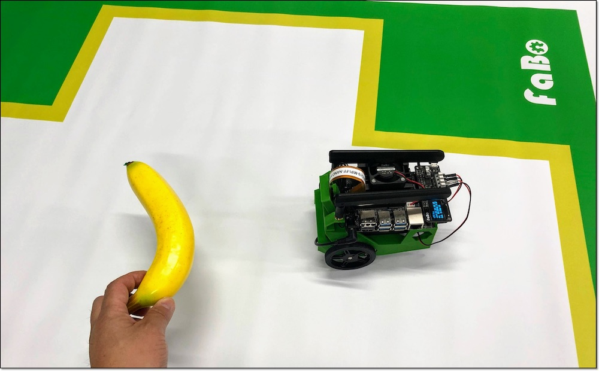
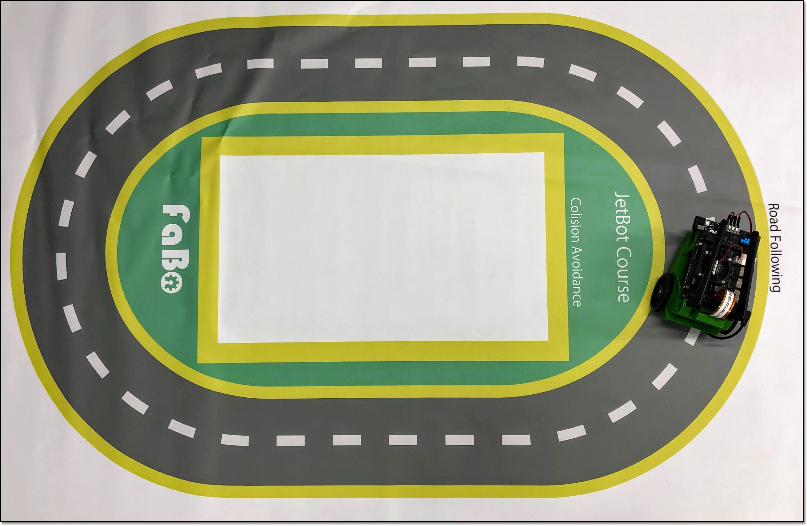

# 3.学習のススメ方

## 用意されている教材

|項目|フォルダ|概要|
|:--|:--|:--|
|1.BasicMotion|/Notebook/basic_motion/|Jetbotの走行サンプル|
|2.Collision Avoidance|/Notebook/collision_avoidance/|指定区域内の走行や障害物の回避等が可能な学習サンプル|
|3.Object Following|/Notebook/object_following/|指定した物体に追従するサンプル|
|4.Road Following|/Notebook/road_following/|道路を認識した自動走行サンプル|
|5.utils|/Notebook/utils/|便利なコマンドサンプル(FaBoオリジナル)|

## 教材のススメ方

1,2,3,4という順番で、教材を進めていきます。

|項目|学習時間|学ぶ事|写真|
|:--|:--|:--|:--|
|1.BasicMotion|10分程度|Jetbotの走行||
|2.Collision Avoidance|30分程度|指定区域内の走行や障害物の回避等||
|3.Object Following|20分程度|指定した物体に追従するサンプル||
|4.Road Following|60分程度|道路を認識した自動走行サンプル||
