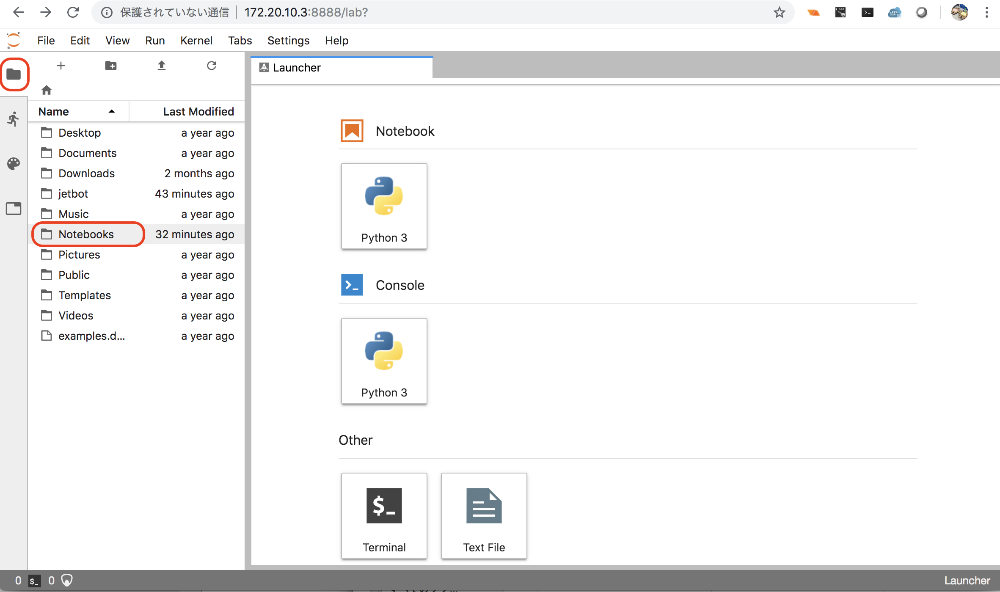
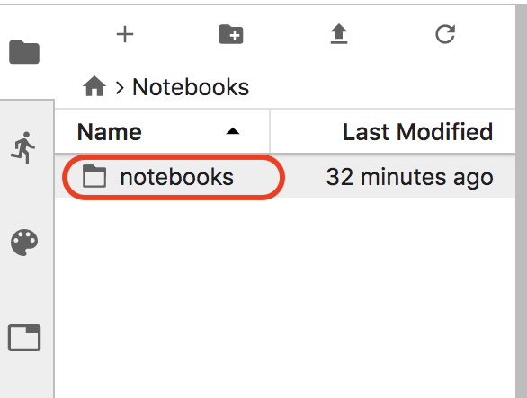
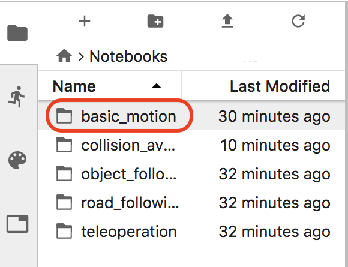
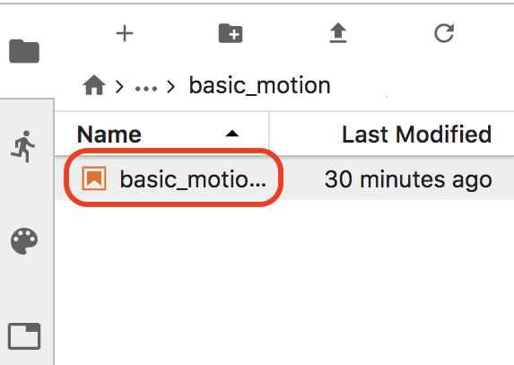
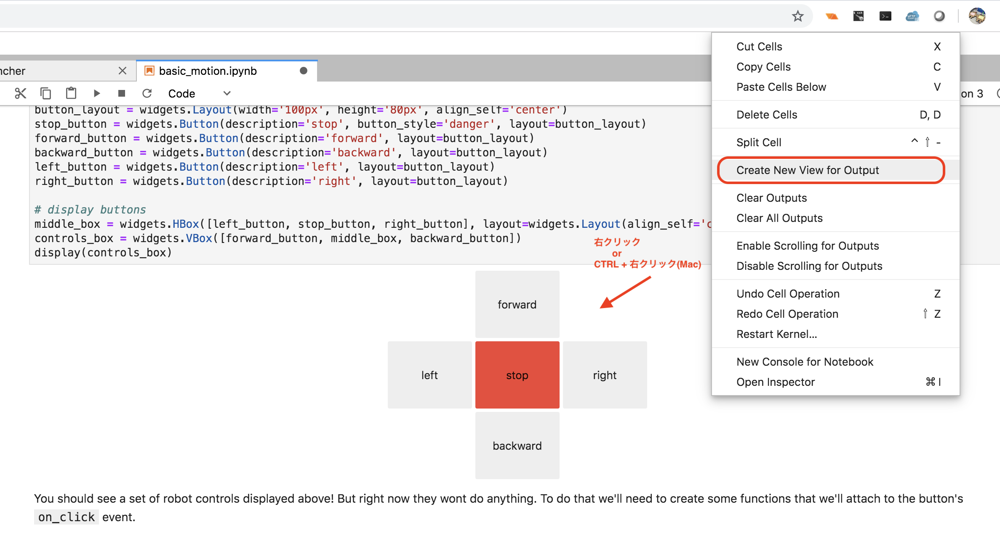
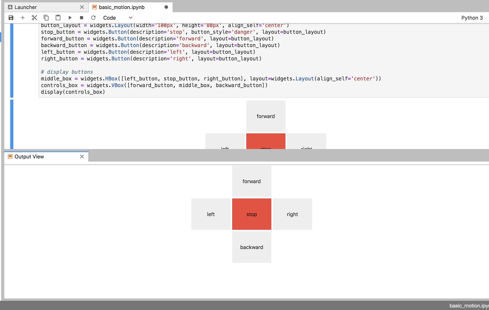
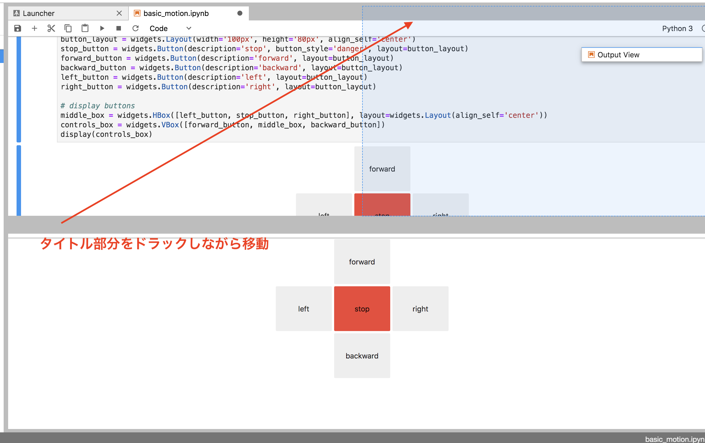

# JetBotの動作確認

JetBotのIPアドレスに8888版ポートで接続します。

!!! Tip
	Jupyterのpasswordは`jetbot`です。

## JetBotの動作確認

`/Notebooks/basic_motion/basic_motion.ipynb` を開きます。

Jupyterで上から順番にCellを実行(shift+enter)していきます。

## Control用のViewの取り出し

